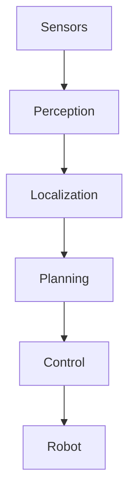

## Prompt

/sp.specify

Module: Module 3 – The AI-Robot Brain (NVIDIA Isaac™)

Introduction:
This module focuses on the AI "brain" of humanoid robots, covering advanced perception, training, and navigation using NVIDIA Isaac technologies. Students learn how photorealistic simulation, hardware-accelerated perception, and navigation stacks enable intelligent robot behavior in physical environments.

Target Audience:
- AI and robotics engineers
- Developers working with NVIDIA Isaac
- Students building autonomous humanoid robots

Learning Outcomes:
- Understand the role of NVIDIA Isaac in Physical AI
- Use Isaac Sim for photorealistic simulation and synthetic data
- Explain Isaac ROS for accelerated perception and VSLAM
- Understand Nav2 for humanoid path planning and navigation

---

### Chapter 1: The AI-Robot Brain Architecture
- Role of perception, localization, and planning
- Interaction between simulation, AI, and control
- NVIDIA Isaac in the Physical AI stack

## Response snapshot

Created comprehensive specification for Module 3 – The AI-Robot Brain (NVIDIA Isaac) with:

**4 User Stories (P1-P4)**:
1. US1: Understand AI-Robot Brain Architecture
2. US2: Use Isaac Sim for Photorealistic Simulation
3. US3: Understand Isaac ROS for Accelerated Perception
4. US4: Use Nav2 for Humanoid Navigation

**13 Functional Requirements (FR-001 to FR-013)**:
- AI-robot brain architecture with perception-localization-planning cycle
- NVIDIA Isaac's role in Physical AI stack
- Isaac Sim capabilities and synthetic data generation
- Isaac ROS perception packages (cuVSLAM, object detection)
- GPU-accelerated inference pipeline
- Nav2 architecture and path planning for humanoids
- Mermaid diagrams and chapter structure requirements

**4 Chapters Defined**:
1. Chapter 1: The AI-Robot Brain Architecture (Mermaid: Sensors→Perception→Localization→Planning→Control→Robot)
2. Chapter 2: Isaac Sim – Photorealistic Simulation (Mermaid: Isaac Sim ecosystem)
3. Chapter 3: Isaac ROS – Accelerated Perception (Mermaid: cuVSLAM + DNN pipeline)
4. Chapter 4: Nav2 for Humanoid Navigation (Mermaid: Nav2 planner architecture)

**Dependencies and Risks Documented**:
- External: NVIDIA Isaac Sim, Isaac ROS, Nav2, ROS 2
- Internal: Module 1 (ROS 2), Module 2 (Digital Twin)
- Risk: RTX GPU requirement mitigated with cloud options

## Outcome

- ✅ Impact: Complete specification for NVIDIA Isaac module with 4 user stories, 13 requirements
- 🧪 Tests: N/A (specification phase)
- 📁 Files: 1 file created (specs/module-3-nvidia-isaac/spec.md)
- 🔁 Next prompts: /sp.plan to create implementation plan, then /sp.tasks
- 🧠 Reflection: Spec builds on Modules 1-2 foundations; Isaac ecosystem has complex dependencies

## Evaluation notes (flywheel)

- Failure modes observed: None
- Graders run and results (PASS/FAIL): N/A
- Prompt variant (if applicable): N/A
- Next experiment (smallest change to try): Validate Mermaid syntax compatibility before implementation
