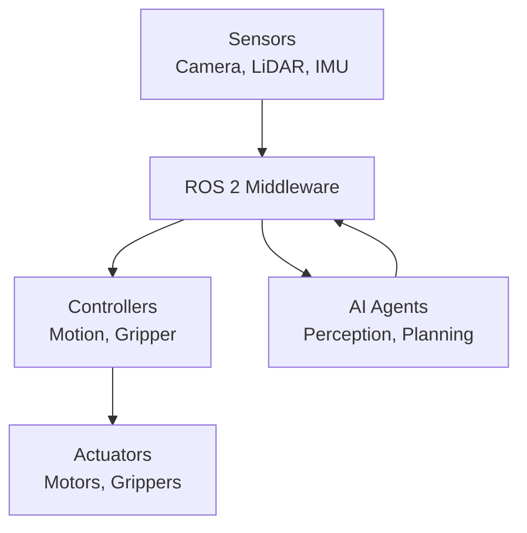
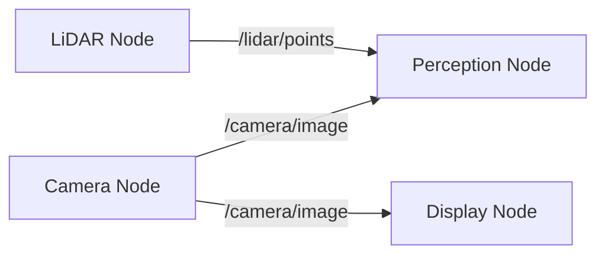
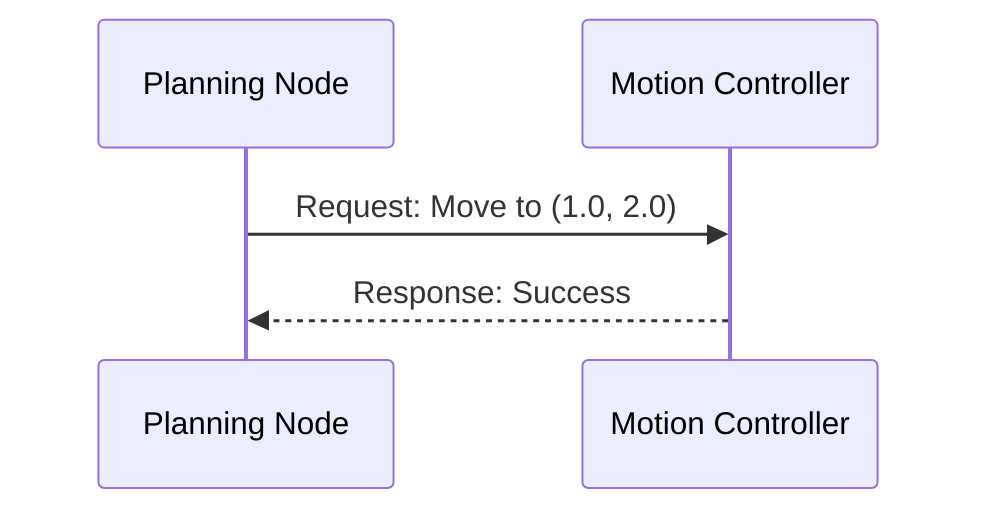

# Chapter 1: ROS 2 as a Robotic Nervous System

## Learning Objectives

By the end of this chapter, you will be able to:

- Explain what ROS 2 is and its role in robot software
- Describe the biological analogy: sensors → brain → actuators
- Define nodes, topics, and services
- Articulate why ROS 2 replaced ROS 1 (DDS, real-time, security, multi-robot)

## The Need for Robot Middleware

Modern robots are complex systems with many components that need to work together:

- **Sensors**: Cameras, LiDAR, IMUs, force sensors
- **Processing**: Perception, planning, decision-making
- **Actuators**: Motors, grippers, displays

Without middleware, developers would need to write custom code to connect each component—a maintenance nightmare as systems grow.

**ROS 2** provides a standardized way for these components to communicate, discover each other, and share data. Think of it as the "operating system" for robots (though technically it's middleware, not an OS).

## Historical Context: From ROS 1 to ROS 2

### ROS 1 (2007-present)

The original Robot Operating System revolutionized robotics research by providing:
- Standardized message formats
- Tools for visualization and debugging
- A massive ecosystem of packages

However, ROS 1 had limitations for production use:
- Single point of failure (roscore)
- No real-time guarantees
- Limited security
- Poor multi-robot support

### ROS 2 (2017-present)

ROS 2 was designed from the ground up for production robotics:

| Feature | ROS 1 | ROS 2 |
|---------|-------|-------|
| Real-time | No | Yes (with proper setup) |
| Security | None | DDS Security |
| Multi-robot | Difficult | Native support |
| Single point of failure | Yes (roscore) | No (distributed) |
| Middleware | Custom | DDS standard |

:::tip ROS 1 to ROS 2 Migration
If you're coming from ROS 1, the core concepts (nodes, topics, services) remain the same. The main changes are in the underlying architecture and API syntax.
:::

## The Nervous System Analogy

Just as the human nervous system connects sensors to the brain and brain to muscles, ROS 2 connects robot components:



| Biological System | ROS 2 Equivalent |
|-------------------|------------------|
| Sensory neurons | Sensor nodes (camera, LiDAR) |
| Brain | Processing nodes (perception, planning) |
| Motor neurons | Controller nodes |
| Muscles | Actuators |
| Nervous signals | Topics and services |

## Core Concepts

### Nodes

A **node** is a single-purpose process that performs one specific task. Examples:
- `camera_node`: Publishes images from a camera
- `perception_node`: Processes images to detect objects
- `motion_controller`: Sends commands to motors

Nodes are designed to be small and focused—this modularity makes the system easier to debug, test, and maintain.

```python
# Example: Minimal ROS 2 node
import rclpy
from rclpy.node import Node

class MinimalNode(Node):
    def __init__(self):
        super().__init__('minimal_node')
        self.get_logger().info('Node started!')

def main():
    rclpy.init()
    node = MinimalNode()
    rclpy.spin(node)
    rclpy.shutdown()
```

### Topics

A **topic** is a named channel for streaming data between nodes using publish/subscribe:

- **Publisher**: Node that sends messages to a topic
- **Subscriber**: Node that receives messages from a topic
- **Many-to-many**: Multiple publishers and subscribers per topic

Topics are ideal for continuous data streams like sensor readings.



### Services

A **service** is a request/response mechanism for synchronous communication:

- **Server**: Node that provides the service
- **Client**: Node that calls the service
- **One-to-one**: Single server, multiple clients

Services are ideal for discrete operations like "move to position" or "get current state."



### When to Use Topics vs. Services

| Use Case | Topics | Services |
|----------|--------|----------|
| Continuous data (images, sensor readings) | ✅ | ❌ |
| Discrete commands (move, grab) | ❌ | ✅ |
| Multiple receivers | ✅ | ❌ |
| Need confirmation | ❌ | ✅ |

## Summary

In this chapter, you learned:

1. **ROS 2** is middleware that connects robot components using standardized communication
2. **Why ROS 2**: Addresses ROS 1 limitations—real-time, security, multi-robot, no single point of failure
3. **Nervous system analogy**: Sensors → ROS 2 → Controllers → Actuators
4. **Nodes**: Single-purpose processes that communicate via topics and services
5. **Topics**: Publish/subscribe for streaming data
6. **Services**: Request/response for discrete operations

## Key Takeaways

- Think of nodes as "microservices for robots"—small, focused, composable
- Use topics for continuous data, services for discrete operations
- ROS 2's distributed architecture eliminates single points of failure
- The DDS middleware provides real-time and security features needed for production

## Next Steps

In the next chapter, you'll learn how to design multi-node communication patterns for a complete robot perception-planning-control pipeline.
