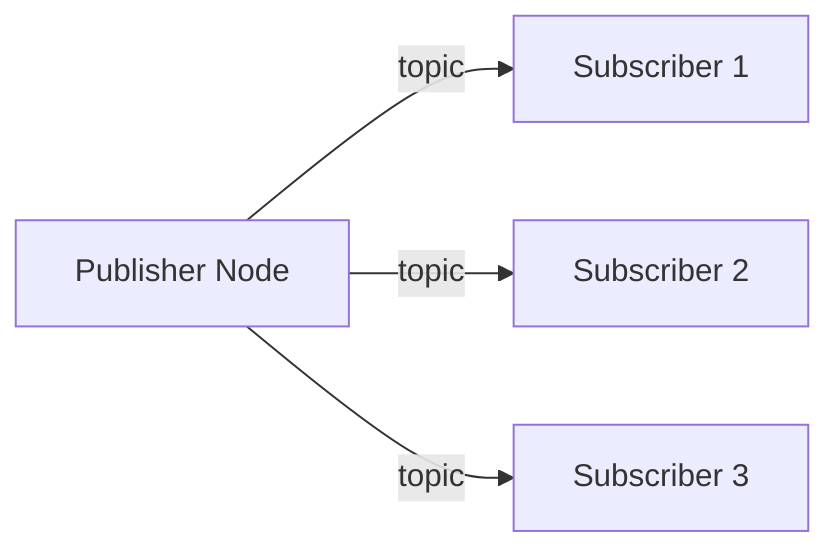
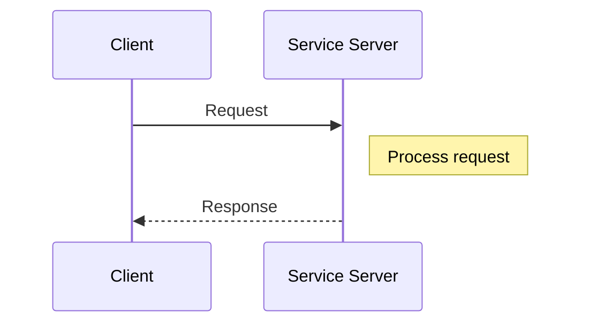
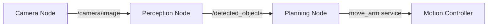
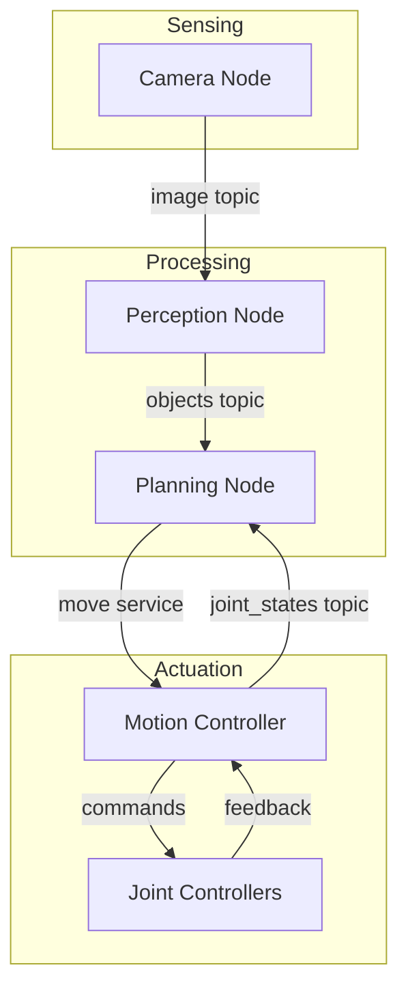
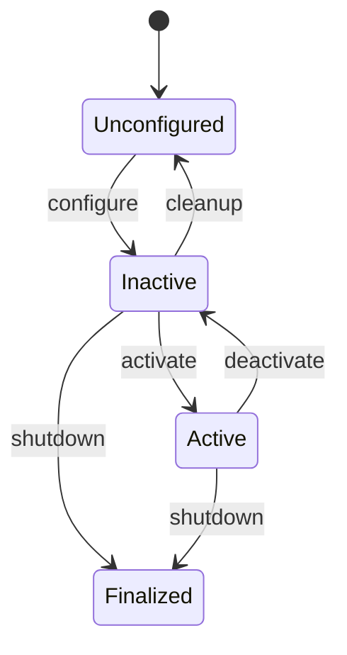
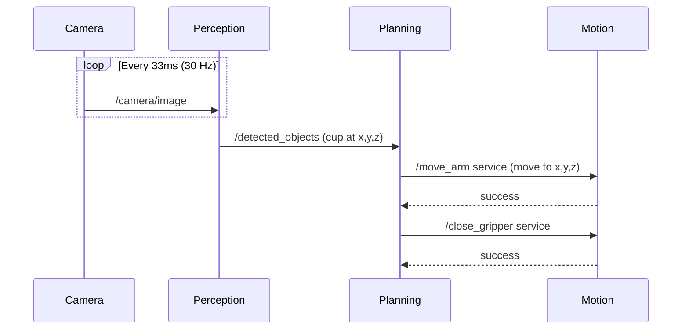

# Chapter 2: Designing Node Communication Patterns

## Learning Objectives

By the end of this chapter, you will be able to:

- Design multi-node ROS 2 architectures
- Choose between topics (pub/sub) and services (request/response)
- Trace data flow through a perception-planning-control pipeline
- Apply best practices for node design

## Topics vs. Services: When to Use Which

Understanding when to use topics versus services is fundamental to good ROS 2 architecture design.

### Topics (Publish/Subscribe)

**Best for**: Continuous, streaming data



**Characteristics**:
- Decoupled: Publishers don't know about subscribers
- Asynchronous: Publisher sends data regardless of receiver state
- Many-to-many: Multiple publishers and subscribers
- No confirmation: Fire-and-forget

**Use cases**:
- Sensor data (camera images, LiDAR points)
- Robot state (joint positions, velocities)
- Perception outputs (detected objects, poses)

### Services (Request/Response)

**Best for**: Discrete, synchronous operations



**Characteristics**:
- Coupled: Client must know about the service
- Synchronous: Client blocks until response
- One-to-one: Single server per service name
- Confirmed: Client knows if operation succeeded

**Use cases**:
- Configuration changes
- Discrete commands (move to pose, grab object)
- State queries (get current position)

### Decision Matrix

| Criteria | Topic | Service |
|----------|-------|---------|
| Data is continuous | ✅ | ❌ |
| Need confirmation | ❌ | ✅ |
| Multiple receivers | ✅ | ❌ |
| Blocking acceptable | ❌ | ✅ |
| Decoupled design | ✅ | ❌ |

## Designing a Perception-Planning-Control Pipeline

A typical robot system follows a perception-planning-control pipeline. Let's design one for a humanoid robot picking up objects.

### System Overview



### Component Breakdown

#### 1. Camera Node
**Role**: Capture and publish images

```
Publishes:
  - /camera/image (sensor_msgs/Image) @ 30 Hz
  - /camera/depth (sensor_msgs/Image) @ 30 Hz
```

#### 2. Perception Node
**Role**: Detect objects in images

```
Subscribes:
  - /camera/image
  - /camera/depth

Publishes:
  - /detected_objects (custom_msgs/ObjectArray)
  - /object_poses (geometry_msgs/PoseArray)
```

#### 3. Planning Node
**Role**: Decide what to do and plan motions

```
Subscribes:
  - /detected_objects
  - /object_poses

Calls Services:
  - /move_arm (motion_interfaces/MoveArm)
  - /close_gripper (motion_interfaces/GripperCommand)
```

#### 4. Motion Controller
**Role**: Execute motion commands

```
Provides Services:
  - /move_arm
  - /close_gripper

Publishes:
  - /joint_states (sensor_msgs/JointState) @ 100 Hz
```

### Data Flow Diagram



## Best Practices for Node Design

### 1. Single Responsibility

Each node should do one thing well:

```
✅ Good:
  - camera_driver_node: Only captures images
  - object_detector_node: Only detects objects

❌ Bad:
  - vision_node: Captures images AND detects objects AND plans paths
```

### 2. Clear Naming Conventions

Use descriptive, hierarchical names:

```
Topics:
  /camera/front/image_raw
  /camera/front/image_compressed
  /robot/joint_states
  /perception/detected_objects

Services:
  /motion/move_arm
  /gripper/open
  /gripper/close
```

### 3. Appropriate QoS Settings

Choose Quality of Service based on your needs:

| QoS Setting | Use Case |
|-------------|----------|
| Best Effort | Sensor data (missing frames OK) |
| Reliable | Commands (must arrive) |
| Transient Local | Late-joining subscribers need history |

### 4. Error Handling

Always handle communication failures:

```python
# Service client with timeout
future = client.call_async(request)
rclpy.spin_until_future_complete(node, future, timeout_sec=5.0)

if future.result() is None:
    node.get_logger().error('Service call failed!')
```

### 5. Lifecycle Nodes

For production systems, use managed lifecycle nodes:



## Example: Complete Pipeline

Here's how messages flow through our object-picking pipeline:



## Summary

In this chapter, you learned:

1. **Topics**: Use for continuous, streaming data (sensors, state)
2. **Services**: Use for discrete operations requiring confirmation
3. **Pipeline design**: Perception → Planning → Control
4. **Best practices**: Single responsibility, clear naming, appropriate QoS

## Key Takeaways

- Match communication pattern to data characteristics
- Topics for streams, services for commands
- Design nodes with single responsibilities
- Use descriptive hierarchical naming
- Consider QoS settings for reliability requirements

## Next Steps

In the next chapter, you'll learn how to implement a Python AI agent that communicates with ROS 2 controllers using rclpy.
