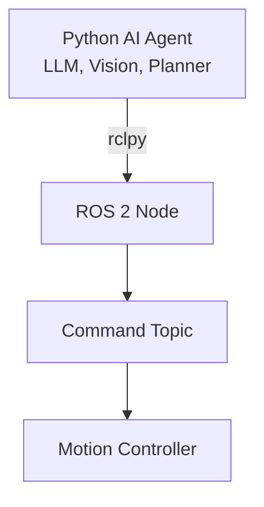
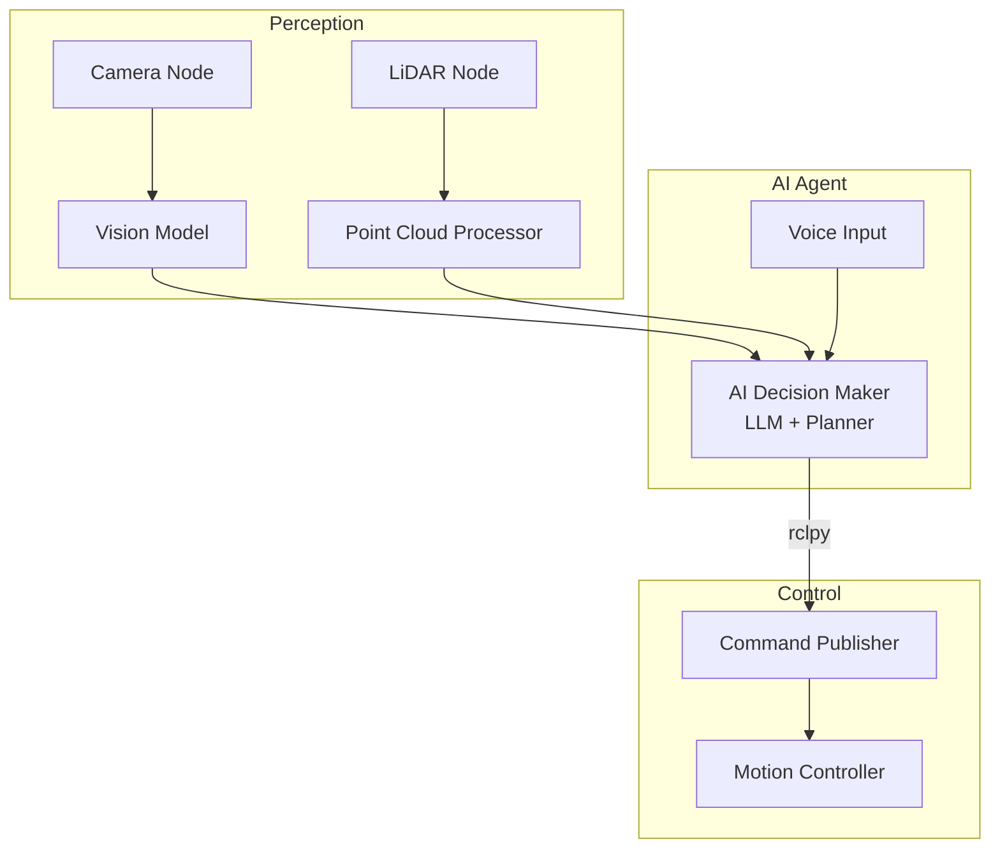

# Chapter 3: Bridging Python AI Agents to ROS 2

## Learning Objectives

By the end of this chapter, you will be able to:

- Understand rclpy (ROS 2 Python client library)
- Create a minimal ROS 2 node in Python
- Publish commands from an AI agent to a ROS 2 topic
- Integrate an AI decision-maker with robot controllers

## Introduction to rclpy

**rclpy** is the official Python client library for ROS 2. It provides:

- Node creation and lifecycle management
- Publishers and subscribers
- Service clients and servers
- Timers and callbacks
- Parameter handling

### Why Python for AI Agents?

Python is the dominant language for AI/ML development:

- **Rich ecosystem**: PyTorch, TensorFlow, Hugging Face
- **Rapid prototyping**: Quick iteration on agent behavior
- **Integration**: Easy to connect with LLMs, vision models, planners

With rclpy, you can bridge your Python AI code to ROS 2 robot controllers.



## Creating Your First ROS 2 Node in Python

### Basic Node Structure

```python
import rclpy
from rclpy.node import Node

class MyNode(Node):
    def __init__(self):
        # Initialize the node with a name
        super().__init__('my_node_name')
        self.get_logger().info('Node has started!')

def main(args=None):
    # Initialize the ROS 2 Python client library
    rclpy.init(args=args)

    # Create an instance of your node
    node = MyNode()

    # Keep the node running and processing callbacks
    rclpy.spin(node)

    # Clean up when done
    node.destroy_node()
    rclpy.shutdown()

if __name__ == '__main__':
    main()
```

### Key Components

| Component | Purpose |
|-----------|---------|
| `rclpy.init()` | Initialize the ROS 2 communication layer |
| `Node.__init__()` | Create a node with a unique name |
| `rclpy.spin()` | Process callbacks (keeps node alive) |
| `rclpy.shutdown()` | Clean up resources |

## Publishing to Topics

To send commands to a robot, you'll publish messages to topics.

### Creating a Publisher

```python
from std_msgs.msg import String

class PublisherNode(Node):
    def __init__(self):
        super().__init__('publisher_node')

        # Create a publisher
        # Parameters: message type, topic name, queue size
        self.publisher = self.create_publisher(
            String,           # Message type
            'command_topic',  # Topic name
            10                # Queue size
        )

        # Create a timer to publish periodically
        self.timer = self.create_timer(1.0, self.publish_callback)

    def publish_callback(self):
        msg = String()
        msg.data = 'move_forward'
        self.publisher.publish(msg)
        self.get_logger().info(f'Published: {msg.data}')
```

### Common Message Types

| Message Type | Package | Use Case |
|--------------|---------|----------|
| `String` | std_msgs | Text commands |
| `Twist` | geometry_msgs | Velocity commands |
| `Pose` | geometry_msgs | Position/orientation |
| `JointState` | sensor_msgs | Joint positions |

## Integrating an AI Agent

Now let's create a complete example: an AI agent node that sends commands to a robot controller.

### AI Agent Node (Complete Example)

```python
#!/usr/bin/env python3
"""
AI Agent Node for ROS 2
Demonstrates integrating a Python AI decision-maker with ROS 2 controllers.
"""

import rclpy
from rclpy.node import Node
from std_msgs.msg import String
from geometry_msgs.msg import Twist

class AIAgentNode(Node):
    """
    An AI agent that makes decisions and publishes commands to a robot.

    In a real system, this would integrate with:
    - LLM for natural language understanding
    - Vision model for perception
    - Planning algorithm for motion
    """

    def __init__(self):
        super().__init__('ai_agent_node')

        # Publisher for high-level commands (text)
        self.command_publisher = self.create_publisher(
            String,
            'command_topic',
            10
        )

        # Publisher for velocity commands
        self.velocity_publisher = self.create_publisher(
            Twist,
            'cmd_vel',
            10
        )

        # Timer for periodic decision-making
        self.decision_timer = self.create_timer(1.0, self.make_decision)

        # Internal state
        self.decision_count = 0

        self.get_logger().info('AI Agent Node initialized')

    def make_decision(self):
        """
        AI decision-making loop.

        In a real system, this would:
        1. Gather sensor data (subscribe to perception topics)
        2. Run inference (LLM, vision model, planner)
        3. Publish commands based on decisions
        """
        self.decision_count += 1

        # Example: Simple decision logic
        # In reality, this would be your AI model
        if self.decision_count % 3 == 0:
            self.send_command('turn_left')
            self.send_velocity(0.0, 0.5)  # Rotate left
        elif self.decision_count % 3 == 1:
            self.send_command('move_forward')
            self.send_velocity(0.5, 0.0)  # Move forward
        else:
            self.send_command('stop')
            self.send_velocity(0.0, 0.0)  # Stop

    def send_command(self, command: str):
        """Publish a text command."""
        msg = String()
        msg.data = command
        self.command_publisher.publish(msg)
        self.get_logger().info(f'Command: {command}')

    def send_velocity(self, linear: float, angular: float):
        """Publish velocity commands."""
        msg = Twist()
        msg.linear.x = linear
        msg.angular.z = angular
        self.velocity_publisher.publish(msg)


def main(args=None):
    rclpy.init(args=args)
    node = AIAgentNode()

    try:
        rclpy.spin(node)
    except KeyboardInterrupt:
        node.get_logger().info('Shutting down AI Agent')
    finally:
        node.destroy_node()
        rclpy.shutdown()


if __name__ == '__main__':
    main()
```

### Running the Node

Save the code as `ai_agent_node.py` and run:

```bash
# Source ROS 2 (Humble or newer)
source /opt/ros/humble/setup.bash

# Run the node
python3 ai_agent_node.py
```

### Expected Output

```
[INFO] [ai_agent_node]: AI Agent Node initialized
[INFO] [ai_agent_node]: Command: move_forward
[INFO] [ai_agent_node]: Command: stop
[INFO] [ai_agent_node]: Command: turn_left
[INFO] [ai_agent_node]: Command: move_forward
...
```

## Integrating with LLMs

Here's how you might integrate an LLM (Large Language Model) for natural language commands:

```python
from openai import OpenAI  # Example: OpenAI API

class LLMAgentNode(Node):
    def __init__(self):
        super().__init__('llm_agent_node')
        self.client = OpenAI()  # Initialize LLM client
        self.publisher = self.create_publisher(String, 'command_topic', 10)

        # Subscribe to voice commands
        self.subscription = self.create_subscription(
            String,
            'voice_input',
            self.process_voice_command,
            10
        )

    def process_voice_command(self, msg):
        """Convert natural language to robot command using LLM."""
        voice_text = msg.data

        # Query LLM for command interpretation
        response = self.client.chat.completions.create(
            model="gpt-4",
            messages=[
                {"role": "system", "content": "Convert to robot command: move_forward, turn_left, turn_right, stop"},
                {"role": "user", "content": voice_text}
            ]
        )

        command = response.choices[0].message.content
        self.send_command(command)
```

## Architecture: AI Agent in the Pipeline



## Summary

In this chapter, you learned:

1. **rclpy**: The Python client library for ROS 2
2. **Node creation**: Initialize, spin, and shutdown
3. **Publishers**: Send commands to topics
4. **AI integration**: Connect LLMs and models to robot controllers

## Key Takeaways

- rclpy bridges Python AI code to ROS 2 robot systems
- Use publishers to send commands, subscribers to receive sensor data
- Structure your AI agent as a ROS 2 node for seamless integration
- LLMs can interpret natural language into robot commands

## Code Repository

The complete code example is available and can be run in any ROS 2 Humble environment.

## Next Steps

In the next chapter, you'll learn about URDF files—how humanoid robot geometry and joints are defined for simulation and control.
