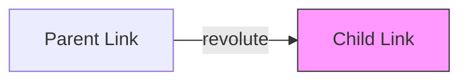
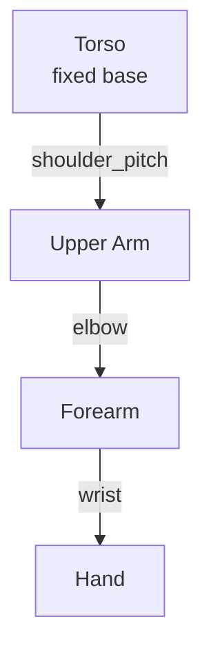

# Chapter 4: Understanding Humanoid URDF Files

## Learning Objectives

By the end of this chapter, you will be able to:

- Understand URDF structure (links, joints, visual, collision)
- Read and interpret a humanoid robot URDF
- Identify joint types and kinematic chains
- Visualize URDF models in RViz

## What is URDF?

**URDF** (Unified Robot Description Format) is an XML format for describing robot geometry:

- **Physical structure**: Links (rigid bodies) connected by joints
- **Visual representation**: How the robot looks (meshes, colors)
- **Collision geometry**: Simplified shapes for physics simulation
- **Inertial properties**: Mass and moments of inertia

```xml
<!-- Basic URDF structure -->
<robot name="my_robot">
  <link name="base_link">
    <!-- Visual, collision, inertial -->
  </link>
  <joint name="joint1" type="revolute">
    <!-- Connection between links -->
  </joint>
  <link name="link1">
    <!-- Another link -->
  </link>
</robot>
```

## URDF Structure: Links and Joints

### Links

A **link** represents a rigid body with:

| Element | Purpose | Required |
|---------|---------|----------|
| `<visual>` | How it looks (meshes, colors) | Optional |
| `<collision>` | Shape for physics (simplified) | Optional |
| `<inertial>` | Mass and inertia | Required for simulation |

```xml
<link name="upper_arm">
  <visual>
    <origin xyz="0 0 0.15" rpy="0 0 0"/>
    <geometry>
      <cylinder radius="0.05" length="0.3"/>
    </geometry>
    <material name="blue">
      <color rgba="0 0 1 1"/>
    </material>
  </visual>

  <collision>
    <origin xyz="0 0 0.15" rpy="0 0 0"/>
    <geometry>
      <cylinder radius="0.05" length="0.3"/>
    </geometry>
  </collision>

  <inertial>
    <origin xyz="0 0 0.15" rpy="0 0 0"/>
    <mass value="2.0"/>
    <inertia ixx="0.01" ixy="0" ixz="0" iyy="0.01" iyz="0" izz="0.005"/>
  </inertial>
</link>
```

### Joints

A **joint** connects two links and defines their relative motion:

```xml
<joint name="shoulder_joint" type="revolute">
  <parent link="torso"/>
  <child link="upper_arm"/>
  <origin xyz="0.2 0 0.5" rpy="0 0 0"/>
  <axis xyz="0 1 0"/>
  <limit lower="-1.57" upper="1.57" effort="100" velocity="1.0"/>
</joint>
```

| Element | Purpose |
|---------|---------|
| `<parent>` | The link this joint attaches to |
| `<child>` | The link that moves |
| `<origin>` | Position/orientation of joint in parent frame |
| `<axis>` | Axis of rotation/translation |
| `<limit>` | Motion limits, max effort, max velocity |

## Joint Types

ROS 2 supports several joint types:

### Revolute (Rotating)

Rotation around a single axis with limits.



```xml
<joint name="elbow" type="revolute">
  <axis xyz="0 1 0"/>  <!-- Rotate around Y axis -->
  <limit lower="-2.0" upper="2.0" effort="50" velocity="1.0"/>
</joint>
```

**Use case**: Elbows, knees, finger joints

### Prismatic (Sliding)

Translation along a single axis with limits.

```xml
<joint name="gripper_slide" type="prismatic">
  <axis xyz="1 0 0"/>  <!-- Slide along X axis -->
  <limit lower="0" upper="0.1" effort="20" velocity="0.5"/>
</joint>
```

**Use case**: Grippers, linear actuators

### Fixed

No motion—rigidly connects two links.

```xml
<joint name="camera_mount" type="fixed">
  <!-- No axis or limits needed -->
</joint>
```

**Use case**: Sensors, mounting brackets

### Continuous

Rotation without limits (can spin forever).

```xml
<joint name="wheel" type="continuous">
  <axis xyz="0 0 1"/>
</joint>
```

**Use case**: Wheels, rotating sensors

### Joint Type Summary

| Type | Motion | Limits | Example |
|------|--------|--------|---------|
| revolute | Rotation | Yes | Elbow, knee |
| prismatic | Translation | Yes | Gripper |
| fixed | None | N/A | Camera mount |
| continuous | Rotation | No | Wheel |
| floating | 6 DOF | No | Free body |
| planar | 2D translation | No | Mobile base |

## Example: Humanoid Arm URDF

Here's a complete URDF for a simple humanoid arm:

```xml
<?xml version="1.0"?>
<robot name="humanoid_arm">

  <!-- Base/Torso (fixed world reference) -->
  <link name="torso">
    <visual>
      <geometry>
        <box size="0.4 0.3 0.6"/>
      </geometry>
      <material name="gray">
        <color rgba="0.5 0.5 0.5 1"/>
      </material>
    </visual>
  </link>

  <!-- Shoulder Joint -->
  <joint name="shoulder_pitch" type="revolute">
    <parent link="torso"/>
    <child link="upper_arm"/>
    <origin xyz="0.2 0 0.25" rpy="0 0 0"/>
    <axis xyz="0 1 0"/>
    <limit lower="-3.14" upper="1.57" effort="100" velocity="2.0"/>
  </joint>

  <!-- Upper Arm -->
  <link name="upper_arm">
    <visual>
      <origin xyz="0 0 -0.15" rpy="0 0 0"/>
      <geometry>
        <cylinder radius="0.04" length="0.3"/>
      </geometry>
      <material name="blue">
        <color rgba="0.2 0.2 0.8 1"/>
      </material>
    </visual>
    <inertial>
      <mass value="1.5"/>
      <inertia ixx="0.01" ixy="0" ixz="0" iyy="0.01" iyz="0" izz="0.002"/>
    </inertial>
  </link>

  <!-- Elbow Joint -->
  <joint name="elbow" type="revolute">
    <parent link="upper_arm"/>
    <child link="forearm"/>
    <origin xyz="0 0 -0.3" rpy="0 0 0"/>
    <axis xyz="0 1 0"/>
    <limit lower="0" upper="2.5" effort="50" velocity="2.0"/>
  </joint>

  <!-- Forearm -->
  <link name="forearm">
    <visual>
      <origin xyz="0 0 -0.125" rpy="0 0 0"/>
      <geometry>
        <cylinder radius="0.035" length="0.25"/>
      </geometry>
      <material name="blue"/>
    </visual>
    <inertial>
      <mass value="1.0"/>
      <inertia ixx="0.005" ixy="0" ixz="0" iyy="0.005" iyz="0" izz="0.001"/>
    </inertial>
  </link>

  <!-- Wrist Joint -->
  <joint name="wrist" type="revolute">
    <parent link="forearm"/>
    <child link="hand"/>
    <origin xyz="0 0 -0.25" rpy="0 0 0"/>
    <axis xyz="0 1 0"/>
    <limit lower="-1.57" upper="1.57" effort="20" velocity="3.0"/>
  </joint>

  <!-- Hand -->
  <link name="hand">
    <visual>
      <origin xyz="0 0 -0.05" rpy="0 0 0"/>
      <geometry>
        <box size="0.08 0.12 0.1"/>
      </geometry>
      <material name="gray"/>
    </visual>
    <inertial>
      <mass value="0.5"/>
      <inertia ixx="0.001" ixy="0" ixz="0" iyy="0.001" iyz="0" izz="0.0005"/>
    </inertial>
  </link>

</robot>
```

### Kinematic Chain

The arm forms a kinematic chain:



## Visualizing URDF in RViz

RViz is the standard ROS 2 visualization tool. To view your URDF:

### 1. Create a Launch File

```python
# launch/display.launch.py
from launch import LaunchDescription
from launch_ros.actions import Node
from launch.substitutions import Command
from ament_index_python.packages import get_package_share_directory
import os

def generate_launch_description():
    urdf_file = os.path.join(
        get_package_share_directory('my_robot'),
        'urdf',
        'humanoid_arm.urdf'
    )

    return LaunchDescription([
        Node(
            package='robot_state_publisher',
            executable='robot_state_publisher',
            parameters=[{'robot_description': Command(['cat ', urdf_file])}]
        ),
        Node(
            package='joint_state_publisher_gui',
            executable='joint_state_publisher_gui'
        ),
        Node(
            package='rviz2',
            executable='rviz2',
            arguments=['-d', 'config/arm.rviz']
        ),
    ])
```

### 2. Launch RViz

```bash
ros2 launch my_robot display.launch.py
```

You'll see:
- The robot model in 3D
- Joint sliders to move each joint
- TF frames showing coordinate systems

## Summary

In this chapter, you learned:

1. **URDF**: XML format describing robot structure
2. **Links**: Rigid bodies with visual, collision, and inertial properties
3. **Joints**: Connections between links (revolute, prismatic, fixed, continuous)
4. **Kinematic chains**: How links connect from base to end-effector
5. **Visualization**: Using RViz to view and interact with URDF models

## Key Takeaways

- URDF defines the physical structure of a robot
- Links are rigid bodies; joints define how they move relative to each other
- Revolute joints (rotation with limits) are most common for humanoid arms/legs
- Visualize and validate URDFs in RViz before deploying

## Further Reading

- [ROS 2 URDF Documentation](https://docs.ros.org/en/humble/Tutorials/Intermediate/URDF/URDF-Main.html)
- [URDF XML Specification](http://wiki.ros.org/urdf/XML)
- [Xacro](https://docs.ros.org/en/humble/Tutorials/Intermediate/URDF/Using-Xacro-to-Clean-Up-a-URDF-File.html) - Macros for cleaner URDFs

## Module 1 Complete

Congratulations! You've completed Module 1: The Robotic Nervous System. You now understand:

- ROS 2 as middleware connecting robot components
- Node communication via topics and services
- Integrating Python AI agents with rclpy
- Defining robot structure with URDF

You're ready to move on to the next module and start building more sophisticated Physical AI systems!
