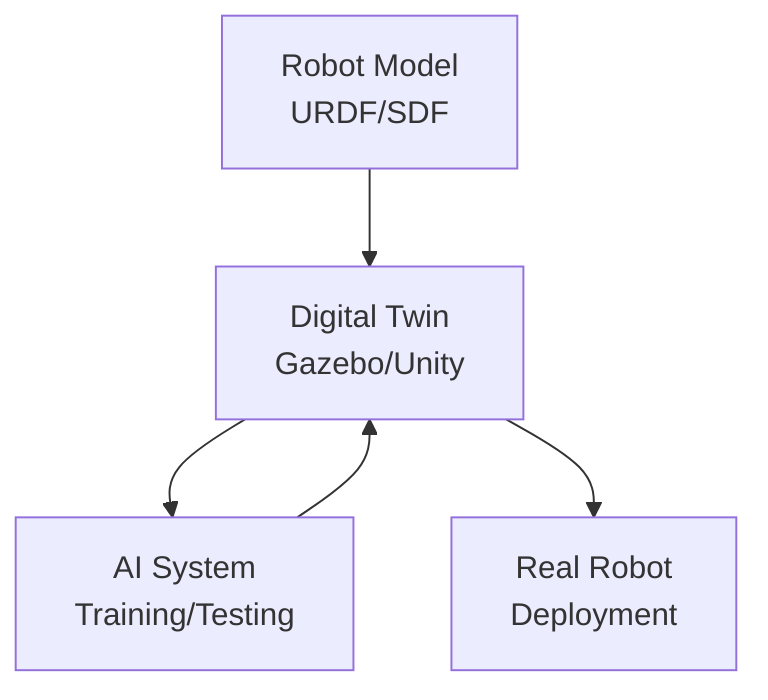
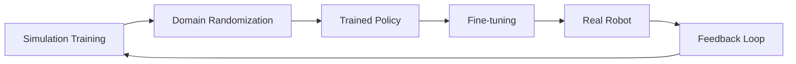

# Chapter 1: Digital Twins for Physical AI

## Learning Objectives

By the end of this chapter, you will be able to:

- Define **digital twin** and explain its role in robotics
- Describe why simulation is essential for Physical AI development
- Compare **Gazebo** and **Unity** for different use cases
- Understand the simulation-to-reality (sim-to-real) pipeline

## What is a Digital Twin?

A **digital twin** is a virtual replica of a physical system that mirrors its real-world counterpart in real-time or near-real-time. In robotics, this means creating a simulated version of your robot and its environment that behaves like the physical system.

### Key Characteristics

| Characteristic | Description |
|----------------|-------------|
| **Fidelity** | Accuracy of physics, sensors, and visuals |
| **Synchronization** | Real-time or batch updates with physical system |
| **Bidirectional** | Data flows both ways (simulation ↔ reality) |
| **Predictive** | Can forecast behavior before physical execution |

### The Digital Twin Architecture

This diagram shows the core workflow:

1. **Robot Model**: Your URDF or SDF file defines the robot's structure
2. **Digital Twin**: Gazebo or Unity simulates the robot in a virtual world
3. **AI System**: Trains and tests using the simulation
4. **Real Robot**: Receives policies trained in simulation

## Why Simulate? The Four Pillars

### 1. Cost Reduction

Physical robots are expensive. A humanoid robot can cost $50,000-$500,000+. Simulation lets you:

- Test thousands of scenarios without wear
- Avoid repair costs from failed experiments
- Scale training across multiple virtual robots simultaneously

### 2. Safety

Untested AI behaviors can be dangerous:

- A robot arm moving unexpectedly can injure humans
- A mobile robot might fall down stairs
- Manipulation tasks might break objects

Simulation provides a **safe sandbox** where failure has no physical consequences.

### 3. Speed

Real-world training is limited by physics:

- A 1-second action takes 1 second
- Data collection happens at real-time speed
- Hardware maintenance creates downtime

Simulation can run **faster than real-time**:

- 10x-1000x speedup for physics-light scenarios
- Parallel simulation across multiple GPUs
- No maintenance downtime

### 4. Data Generation

Modern AI requires massive datasets. Simulation enables:

- **Infinite labeled data**: Every frame is automatically annotated
- **Domain randomization**: Vary textures, lighting, physics parameters
- **Edge cases**: Generate rare scenarios that are hard to find in reality

## Gazebo vs. Unity: When to Use Which

Both Gazebo and Unity are powerful simulators, but they excel in different areas.

### Gazebo Sim (Formerly Ignition)

**Best for**: Physics-accurate robotics simulation with ROS 2 integration

| Strength | Details |
|----------|---------|
| **Physics** | ODE, Bullet, DART physics engines |
| **ROS 2** | Native integration via `ros_gz_bridge` |
| **Open Source** | Free, community-driven development |
| **Sensors** | Accurate camera, LiDAR, IMU simulation |

**Use Gazebo when**:
- You need accurate physics for manipulation or locomotion
- ROS 2 integration is essential
- You're working with standard robotics sensors
- Budget is limited (fully open-source)

### Unity

**Best for**: High-fidelity visuals and perception training

| Strength | Details |
|----------|---------|
| **Rendering** | Photorealistic graphics, ray tracing |
| **Assets** | Huge marketplace of 3D models and environments |
| **ML Tools** | Unity ML-Agents, Perception package |
| **VR/AR** | Strong XR support for human-robot interaction |

**Use Unity when**:
- You need photorealistic images for computer vision
- Domain randomization for perception training is key
- Human-robot interaction in VR/AR is required
- You want rich, diverse environments quickly

### Comparison Table

| Feature | Gazebo | Unity |
|---------|--------|-------|
| Physics Accuracy | ★★★★★ | ★★★☆☆ |
| Visual Fidelity | ★★★☆☆ | ★★★★★ |
| ROS 2 Integration | ★★★★★ | ★★★☆☆ |
| Learning Curve | ★★★☆☆ | ★★★★☆ |
| Cost | Free | Free (Personal) |
| Best For | Control & Physics | Perception & Rendering |

## The Sim-to-Real Pipeline

Training in simulation is only useful if the learned behaviors transfer to reality. This is called **sim-to-real transfer**.

### The Reality Gap

The "reality gap" refers to differences between simulation and reality:

- **Physics mismatch**: Simulated friction, inertia, contact differ from reality
- **Sensor noise**: Real sensors have noise patterns not captured in simulation
- **Visual differences**: Rendered images look different from camera images

### Bridging the Gap

Strategies to improve transfer:

1. **Domain Randomization**: Vary simulation parameters (textures, physics, lighting)
2. **System Identification**: Measure real-world parameters and match in simulation
3. **Fine-tuning**: Adjust policies with limited real-world data
4. **Residual Learning**: Learn corrections on top of simulation-trained policies

## Practical Example: Choosing Your Simulator

**Scenario**: You're building a pick-and-place robot arm that needs to:
- Grasp objects of various shapes
- Be controlled via ROS 2
- Use a camera for object detection

**Recommendation**: Start with **Gazebo** for physics and control development, then optionally use **Unity** to generate diverse training images for the vision model.

## Summary

### Key Takeaways

1. **Digital twins** are virtual replicas that enable safe, fast, and cheap robot development
2. **Simulation** solves four key problems: cost, safety, speed, and data generation
3. **Gazebo** excels at physics accuracy and ROS 2 integration
4. **Unity** excels at visual fidelity and perception training
5. **Sim-to-real transfer** requires strategies like domain randomization to bridge the reality gap

### What's Next

In [Chapter 2](./chapter-2-gazebo-physics), we'll dive into Gazebo and learn how to:
- Create simulation worlds with SDF
- Spawn your URDF robot
- Configure physics properties
- Bridge Gazebo to ROS 2
