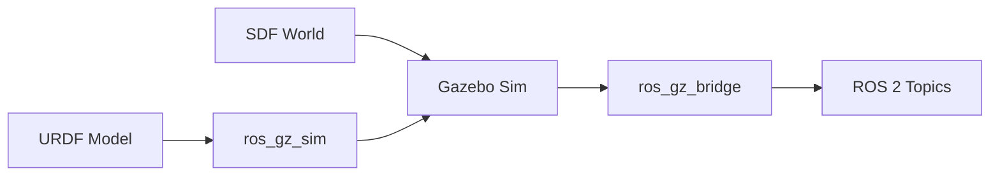

# Chapter 2: Physics Simulation with Gazebo

## Learning Objectives

By the end of this chapter, you will be able to:

- Understand the **Gazebo Sim** architecture (formerly Ignition)
- Create a simulation **world** with SDF format
- **Spawn** a URDF robot in Gazebo
- Configure **physics properties** (gravity, friction, collisions)
- Use the **Gazebo-ROS 2 bridge** for communication

## Introduction to Gazebo Sim

**Gazebo Sim** (formerly known as Ignition Gazebo) is the next-generation robotics simulator. It's the default simulator for ROS 2 and provides:

- Multiple physics engines (DART, Bullet, ODE)
- Plugin-based architecture for extensibility
- Native ROS 2 integration via `ros_gz` packages
- Sensor simulation (cameras, LiDAR, IMU, GPS)

### Gazebo-ROS 2 Architecture



**Key components**:

1. **URDF Model**: Your robot description from Module 1
2. **SDF World**: Defines the environment (ground, objects, lighting)
3. **ros_gz_sim**: Spawns robots into the simulation
4. **ros_gz_bridge**: Translates Gazebo messages to ROS 2

## World Files and SDF Format

**SDF (Simulation Description Format)** is the native format for Gazebo worlds. Unlike URDF which describes robots, SDF describes entire simulation environments.

### Basic World Structure

```xml
<?xml version="1.0" ?>
<sdf version="1.8">
  <world name="simple_world">
    <!-- Physics configuration -->
    <physics name="1ms" type="dart">
      <max_step_size>0.001</max_step_size>
      <real_time_factor>1.0</real_time_factor>
    </physics>

    <!-- Lighting -->
    <light type="directional" name="sun">
      <cast_shadows>true</cast_shadows>
      <pose>0 0 10 0 0 0</pose>
      <diffuse>0.8 0.8 0.8 1</diffuse>
      <specular>0.2 0.2 0.2 1</specular>
      <direction>-0.5 0.1 -0.9</direction>
    </light>

    <!-- Ground plane -->
    <model name="ground_plane">
      <static>true</static>
      <link name="link">
        <collision name="collision">
          <geometry>
            <plane>
              <normal>0 0 1</normal>
              <size>100 100</size>
            </plane>
          </geometry>
        </collision>
        <visual name="visual">
          <geometry>
            <plane>
              <normal>0 0 1</normal>
              <size>100 100</size>
            </plane>
          </geometry>
          <material>
            <ambient>0.8 0.8 0.8 1</ambient>
          </material>
        </visual>
      </link>
    </model>
  </world>
</sdf>
```

### SDF vs. URDF

| Feature | URDF | SDF |
|---------|------|-----|
| Purpose | Robot description | World + robot description |
| Lighting | Not supported | Full support |
| Multiple robots | One per file | Multiple models |
| Sensors | Limited | Comprehensive |
| Physics | Basic | Advanced configuration |

## Spawning a Robot from URDF

To use your URDF robot in Gazebo, you need to spawn it into a running simulation.

### Method 1: Launch File Spawning

```python
from launch import LaunchDescription
from launch.actions import IncludeLaunchDescription
from launch.launch_description_sources import PythonLaunchDescriptionSource
from launch_ros.actions import Node
from ament_index_python.packages import get_package_share_directory
import os

def generate_launch_description():
    # Get the Gazebo launch file
    pkg_ros_gz_sim = get_package_share_directory('ros_gz_sim')

    # Launch Gazebo with an empty world
    gazebo = IncludeLaunchDescription(
        PythonLaunchDescriptionSource(
            os.path.join(pkg_ros_gz_sim, 'launch', 'gz_sim.launch.py')
        ),
        launch_arguments={'gz_args': '-r empty.sdf'}.items()
    )

    # Spawn the robot
    spawn_robot = Node(
        package='ros_gz_sim',
        executable='create',
        arguments=[
            '-name', 'my_robot',
            '-file', '/path/to/robot.urdf',
            '-x', '0',
            '-y', '0',
            '-z', '0.5'
        ],
        output='screen'
    )

    return LaunchDescription([gazebo, spawn_robot])
```

### Method 2: Command Line Spawning

```bash
# Start Gazebo
ros2 launch ros_gz_sim gz_sim.launch.py gz_args:="-r empty.sdf"

# In another terminal, spawn the robot
ros2 run ros_gz_sim create -name my_robot -file /path/to/robot.urdf
```

## Physics Configuration

Gazebo provides fine-grained control over physics simulation.

### Gravity

By default, gravity is set to Earth's value (-9.8 m/s² on Z-axis). You can modify it:

```xml
<world name="custom_gravity_world">
  <gravity>0 0 -9.8</gravity>

  <!-- For lunar simulation -->
  <!-- <gravity>0 0 -1.62</gravity> -->

  <!-- For Mars simulation -->
  <!-- <gravity>0 0 -3.71</gravity> -->
</world>
```

### Friction and Contact

Configure surface properties for realistic interactions:

```xml
<collision name="collision">
  <geometry>
    <box><size>1 1 1</size></box>
  </geometry>
  <surface>
    <friction>
      <ode>
        <mu>0.8</mu>      <!-- Friction coefficient -->
        <mu2>0.8</mu2>    <!-- Secondary friction -->
      </ode>
    </friction>
    <contact>
      <ode>
        <kp>1e6</kp>      <!-- Contact stiffness -->
        <kd>100</kd>      <!-- Contact damping -->
      </ode>
    </contact>
  </surface>
</collision>
```

### Physics Engine Selection

Gazebo supports multiple physics engines:

| Engine | Strengths | Best For |
|--------|-----------|----------|
| **DART** | Accurate, stable | Humanoids, manipulation |
| **Bullet** | Fast, good contacts | Mobile robots, games |
| **ODE** | Mature, well-tested | General purpose |

```xml
<physics name="physics_config" type="dart">
  <max_step_size>0.001</max_step_size>
  <real_time_factor>1.0</real_time_factor>
  <real_time_update_rate>1000</real_time_update_rate>
</physics>
```

## Gazebo-ROS 2 Bridge

The `ros_gz_bridge` package connects Gazebo and ROS 2, allowing you to:

- Publish sensor data to ROS 2 topics
- Subscribe to ROS 2 commands (velocity, joint positions)
- Synchronize clocks between simulation and ROS 2

### Bridge Configuration

Create a bridge config YAML file:

```yaml
# bridge_config.yaml
- ros_topic_name: "/cmd_vel"
  gz_topic_name: "/model/my_robot/cmd_vel"
  ros_type_name: "geometry_msgs/msg/Twist"
  gz_type_name: "gz.msgs.Twist"
  direction: ROS_TO_GZ

- ros_topic_name: "/odom"
  gz_topic_name: "/model/my_robot/odometry"
  ros_type_name: "nav_msgs/msg/Odometry"
  gz_type_name: "gz.msgs.Odometry"
  direction: GZ_TO_ROS
```

### Launching the Bridge

```python
bridge = Node(
    package='ros_gz_bridge',
    executable='parameter_bridge',
    arguments=[
        '/cmd_vel@geometry_msgs/msg/Twist@gz.msgs.Twist',
        '/odom@nav_msgs/msg/Odometry@gz.msgs.Odometry'
    ],
    output='screen'
)
```

## Complete Example: Robot in Gazebo

Here's a complete launch file that starts Gazebo, spawns a robot, and sets up the ROS 2 bridge:

```python
from launch import LaunchDescription
from launch.actions import IncludeLaunchDescription, DeclareLaunchArgument
from launch.launch_description_sources import PythonLaunchDescriptionSource
from launch.substitutions import LaunchConfiguration, PathJoinSubstitution
from launch_ros.actions import Node
from launch_ros.substitutions import FindPackageShare

def generate_launch_description():
    # Declare arguments
    use_sim_time = LaunchConfiguration('use_sim_time', default='true')

    # Gazebo launch
    gazebo = IncludeLaunchDescription(
        PythonLaunchDescriptionSource([
            PathJoinSubstitution([
                FindPackageShare('ros_gz_sim'),
                'launch',
                'gz_sim.launch.py'
            ])
        ]),
        launch_arguments={'gz_args': '-r empty.sdf'}.items()
    )

    # Spawn robot
    spawn = Node(
        package='ros_gz_sim',
        executable='create',
        arguments=['-name', 'robot', '-topic', 'robot_description'],
        output='screen'
    )

    # Bridge
    bridge = Node(
        package='ros_gz_bridge',
        executable='parameter_bridge',
        arguments=[
            '/clock@rosgraph_msgs/msg/Clock[gz.msgs.Clock',
            '/cmd_vel@geometry_msgs/msg/Twist@gz.msgs.Twist'
        ],
        parameters=[{'use_sim_time': use_sim_time}],
        output='screen'
    )

    return LaunchDescription([
        DeclareLaunchArgument('use_sim_time', default_value='true'),
        gazebo,
        spawn,
        bridge
    ])
```

## Troubleshooting

### Common Issues

| Problem | Cause | Solution |
|---------|-------|----------|
| Robot falls through floor | Missing collision geometry | Add `<collision>` to all links |
| Robot spawns at wrong position | Transform issues | Check spawn coordinates |
| No sensor data in ROS 2 | Bridge not configured | Add topic to bridge config |
| Simulation runs slowly | Step size too small | Increase `max_step_size` |

### Gazebo Classic Migration

If you're migrating from Gazebo Classic (Gazebo 11 and earlier):

- Replace `<gazebo>` tags with proper SDF plugins
- Update package names: `gazebo_ros` → `ros_gz_sim`
- Update topic syntax: `/gazebo/...` → `/world/.../...`

## Summary

### Key Takeaways

1. **Gazebo Sim** is the modern robotics simulator with native ROS 2 support
2. **SDF format** defines worlds with physics, lighting, and multiple models
3. **Spawning robots** can be done via launch files or command line
4. **Physics configuration** controls gravity, friction, and collision behavior
5. **ros_gz_bridge** connects Gazebo topics to ROS 2 topics

### What's Next

In [Chapter 3](./chapter-3-unity-rendering), we'll explore Unity for high-fidelity rendering and learn:
- Why Unity matters for perception training
- How to integrate Unity with ROS 2
- Domain randomization techniques
