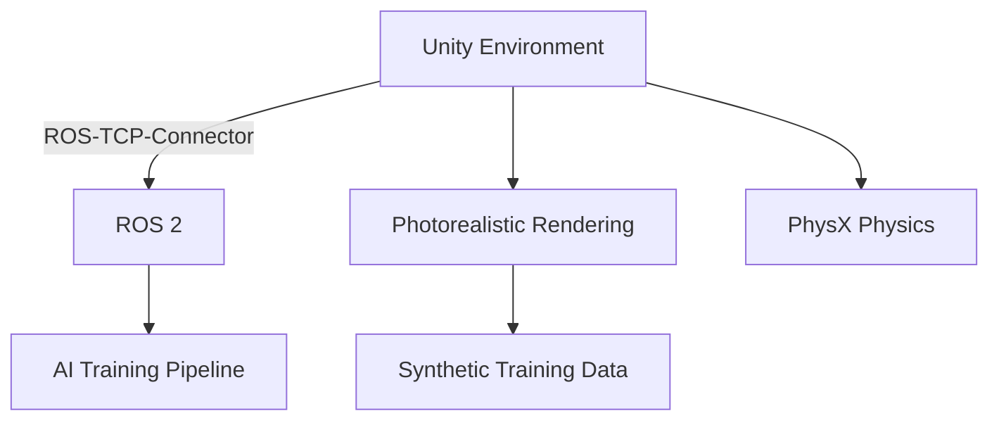
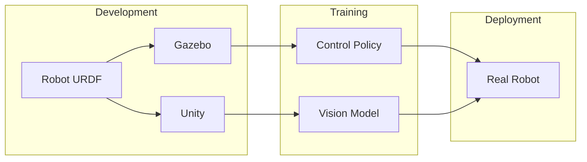

# Chapter 3: High-Fidelity Rendering with Unity

## Learning Objectives

By the end of this chapter, you will be able to:

- Understand **Unity's role** in robotics simulation
- Learn **ROS-Unity integration** via Unity Robotics Hub
- Recognize use cases for **high-fidelity rendering**
- Compare rendering quality between **Gazebo and Unity**
- Understand **domain randomization** for perception training

## Why Unity for Robotics?

Unity is a powerful game engine that has become increasingly important for robotics and AI development. While Gazebo excels at physics simulation, Unity provides capabilities that are essential for modern AI systems:

### Key Advantages

| Capability | Benefit for Robotics |
|------------|----------------------|
| **Photorealistic Rendering** | Train vision models on realistic images |
| **Ray Tracing** | Accurate lighting and reflections |
| **Asset Marketplace** | Thousands of ready-to-use 3D models |
| **ML-Agents** | Built-in reinforcement learning framework |
| **Cross-Platform** | Deploy to various platforms and devices |
| **VR/AR Support** | Human-robot interaction studies |

### Unity-ROS Architecture



## Unity Robotics Hub and ROS-TCP-Connector

The **Unity Robotics Hub** is a collection of tools and packages that enable robotics simulation in Unity:

### Core Components

1. **ROS-TCP-Connector**: Bidirectional communication between Unity and ROS 2
2. **URDF Importer**: Import robot models from URDF files
3. **Perception Package**: Generate labeled training data
4. **Articulation Bodies**: Physics-accurate joint simulation

### ROS-TCP-Connector Architecture

The connector establishes a TCP connection between Unity and a ROS 2 node:

```
Unity (C#) ←→ ROS-TCP-Endpoint (Python) ←→ ROS 2 Topics
```

**Setup Overview**:

1. Install the Unity package via Package Manager
2. Run the ROS-TCP-Endpoint node in your ROS 2 environment
3. Configure publishers and subscribers in Unity scripts
4. Messages are automatically serialized/deserialized

### Example: Publishing from Unity to ROS 2

```csharp
using Unity.Robotics.ROSTCPConnector;
using RosMessageTypes.Geometry;

public class VelocityPublisher : MonoBehaviour
{
    ROSConnection ros;
    public string topicName = "/cmd_vel";

    void Start()
    {
        ros = ROSConnection.GetOrCreateInstance();
        ros.RegisterPublisher<TwistMsg>(topicName);
    }

    void Update()
    {
        TwistMsg msg = new TwistMsg
        {
            linear = new Vector3Msg { x = 1.0, y = 0, z = 0 },
            angular = new Vector3Msg { x = 0, y = 0, z = 0.5 }
        };
        ros.Publish(topicName, msg);
    }
}
```

## Creating Robot Environments in Unity

Unity's strength lies in creating rich, diverse environments quickly.

### URDF Import Process

1. **Install URDF Importer** from Unity Robotics Hub
2. **Import URDF file** into Unity project
3. **Configure joints** and collision properties
4. **Add controllers** for movement

### Environment Design Best Practices

| Aspect | Recommendation |
|--------|----------------|
| **Lighting** | Use HDRI skyboxes for realistic lighting |
| **Materials** | Apply PBR materials for accurate reflections |
| **Scale** | Verify real-world scale (1 Unity unit = 1 meter) |
| **Physics** | Use Articulation Bodies for robot joints |
| **Colliders** | Simplify collision meshes for performance |

### Sample Scene Structure

```
Scene
├── Robot (from URDF)
│   ├── base_link
│   ├── joint_1
│   └── end_effector
├── Environment
│   ├── Floor
│   ├── Walls
│   └── Objects
├── Lighting
│   ├── Directional Light
│   └── Area Lights
└── Cameras
    ├── Main Camera
    └── Robot Camera
```

## Domain Randomization for Training

**Domain randomization** is a technique to improve sim-to-real transfer by varying simulation parameters during training.

### What to Randomize

| Category | Examples |
|----------|----------|
| **Visual** | Textures, colors, lighting intensity |
| **Geometry** | Object positions, sizes, shapes |
| **Physics** | Friction, mass, joint damping |
| **Camera** | Position, field of view, distortion |
| **Distractors** | Random objects in the scene |

### Unity Perception Package

The Perception package provides randomizers for automated domain randomization:

```csharp
using UnityEngine.Perception.Randomization.Parameters;
using UnityEngine.Perception.Randomization.Randomizers;

public class LightRandomizer : Randomizer
{
    public FloatParameter lightIntensity = new FloatParameter { value = new UniformSampler(0.5f, 2.0f) };
    public ColorRgbParameter lightColor;

    protected override void OnIterationStart()
    {
        var light = tagManager.Query<LightRandomizerTag>().First();
        light.GetComponent<Light>().intensity = lightIntensity.Sample();
        light.GetComponent<Light>().color = lightColor.Sample();
    }
}
```

### Benefits of Randomization

1. **Robustness**: Models generalize better to real-world variations
2. **Data Diversity**: Each training episode is unique
3. **Edge Cases**: Automatically generates challenging scenarios
4. **No Manual Labeling**: Ground truth is always available

## Unity vs. Gazebo: Feature Comparison

### Rendering Quality

| Feature | Gazebo | Unity |
|---------|--------|-------|
| Real-time rendering | Basic | Advanced (URP, HDRP) |
| Ray tracing | No | Yes (RTX) |
| Post-processing | Limited | Full suite |
| Material system | Basic | PBR, shaders |

### Physics Simulation

| Feature | Gazebo | Unity |
|---------|--------|-------|
| Physics engines | DART, Bullet, ODE | PhysX |
| Accuracy | High | Medium |
| Soft bodies | Limited | Yes |
| Cloth simulation | No | Yes |

### Integration

| Feature | Gazebo | Unity |
|---------|--------|-------|
| ROS 2 | Native | Via ROS-TCP |
| URDF | Native | Importer required |
| Sensors | Accurate physics | Visual focus |
| Real-time factor | Configurable | Fixed |

### When to Use Each

**Use Gazebo when**:
- Physics accuracy is paramount
- Direct ROS 2 integration is needed
- Sensor simulation must match real sensors
- Open-source requirement exists

**Use Unity when**:
- Training computer vision models
- Generating diverse visual datasets
- VR/AR human-robot interaction
- Rapid environment prototyping

**Use Both when**:
- Training requires both accurate physics AND visual diversity
- Different teams work on control vs. perception
- Validation needs multiple simulators

## Practical Workflow: Gazebo + Unity

For comprehensive robot development, consider using both simulators:



### Workflow Steps

1. **Design** robot in URDF format
2. **Develop control** policies in Gazebo (accurate physics)
3. **Train perception** models in Unity (visual diversity)
4. **Validate** in both simulators
5. **Deploy** to real robot

## Getting Started Resources

### Unity Robotics Hub

- [GitHub Repository](https://github.com/Unity-Technologies/Unity-Robotics-Hub)
- [ROS-TCP-Connector Documentation](https://github.com/Unity-Technologies/ROS-TCP-Connector)
- [URDF Importer Guide](https://github.com/Unity-Technologies/URDF-Importer)

### Tutorials

- Unity Robotics: Pick and Place tutorial
- ROS 2 + Unity integration walkthrough
- Perception package for synthetic data

## Summary

### Key Takeaways

1. **Unity excels** at photorealistic rendering for perception training
2. **ROS-TCP-Connector** enables bidirectional communication with ROS 2
3. **URDF Importer** brings robot models into Unity
4. **Domain randomization** improves sim-to-real transfer
5. **Gazebo + Unity** together provide comprehensive simulation coverage

### What's Next

In [Chapter 4](./chapter-4-sensor-simulation), we'll explore sensor simulation and learn:
- How to simulate cameras, LiDAR, and IMU in Gazebo
- Bridging sensor data to ROS 2 topics
- Generating synthetic datasets for AI training
