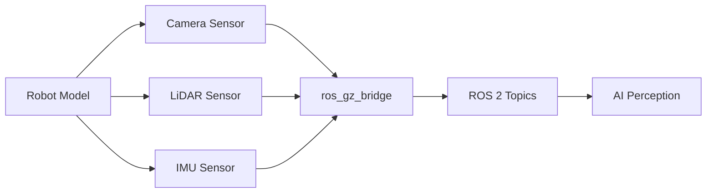
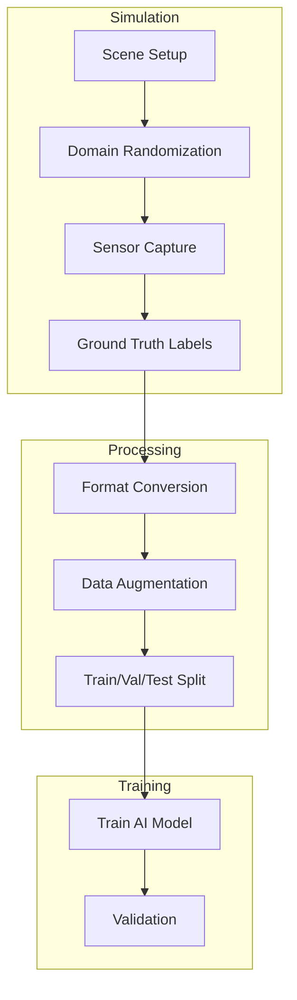

# Chapter 4: Simulating Sensors for AI Perception

## Learning Objectives

By the end of this chapter, you will be able to:

- Add **simulated sensors** to a robot model
- Configure **camera, LiDAR, and IMU** sensors in Gazebo
- **Bridge sensor data** to ROS 2 topics
- Generate **synthetic datasets** for perception training

## Why Simulate Sensors?

Real sensors are expensive, fragile, and time-consuming to set up. Simulated sensors provide:

| Benefit | Description |
|---------|-------------|
| **Infinite Data** | Generate millions of labeled samples |
| **Perfect Labels** | Ground truth is always available |
| **Edge Cases** | Simulate rare scenarios on demand |
| **Cost Savings** | No hardware wear or replacement |
| **Parallelization** | Run multiple sensors simultaneously |

### Sensor Data Flow Architecture



## Camera Sensors in Gazebo

Cameras are the most common sensor for AI perception. Gazebo simulates RGB cameras with configurable resolution, field of view, and noise.

### Basic Camera Configuration

Add a camera to your robot's SDF or URDF:

```xml
<sensor name="camera" type="camera">
  <always_on>true</always_on>
  <update_rate>30</update_rate>
  <camera>
    <horizontal_fov>1.047</horizontal_fov>
    <image>
      <width>640</width>
      <height>480</height>
      <format>R8G8B8</format>
    </image>
    <clip>
      <near>0.1</near>
      <far>100</far>
    </clip>
  </camera>
</sensor>
```

### Camera Parameters Explained

| Parameter | Description | Typical Values |
|-----------|-------------|----------------|
| `update_rate` | Frames per second | 15-60 Hz |
| `horizontal_fov` | Field of view (radians) | 1.047 (60°) |
| `width` / `height` | Image resolution | 640x480, 1280x720 |
| `format` | Pixel format | R8G8B8, L8 (grayscale) |
| `near` / `far` | Clip planes (meters) | 0.1-100 |

### Depth Camera

For 3D perception, add a depth camera:

```xml
<sensor name="depth_camera" type="depth_camera">
  <always_on>true</always_on>
  <update_rate>15</update_rate>
  <camera>
    <horizontal_fov>1.047</horizontal_fov>
    <image>
      <width>640</width>
      <height>480</height>
      <format>R_FLOAT32</format>
    </image>
    <clip>
      <near>0.1</near>
      <far>10</far>
    </clip>
  </camera>
</sensor>
```

### Adding Noise

Real cameras have noise. Add it for realism:

```xml
<camera>
  <noise>
    <type>gaussian</type>
    <mean>0.0</mean>
    <stddev>0.007</stddev>
  </noise>
</camera>
```

## LiDAR Simulation

LiDAR (Light Detection and Ranging) provides 3D point cloud data essential for navigation and obstacle avoidance.

### Basic LiDAR Configuration

```xml
<sensor name="lidar" type="gpu_lidar">
  <always_on>true</always_on>
  <update_rate>10</update_rate>
  <lidar>
    <scan>
      <horizontal>
        <samples>640</samples>
        <resolution>1</resolution>
        <min_angle>-3.14159</min_angle>
        <max_angle>3.14159</max_angle>
      </horizontal>
      <vertical>
        <samples>16</samples>
        <resolution>1</resolution>
        <min_angle>-0.261799</min_angle>
        <max_angle>0.261799</max_angle>
      </vertical>
    </scan>
    <range>
      <min>0.1</min>
      <max>100</max>
      <resolution>0.01</resolution>
    </range>
  </lidar>
</sensor>
```

### Common LiDAR Configurations

| Sensor Type | Horizontal Samples | Vertical Samples | Range |
|-------------|-------------------|------------------|-------|
| 2D Planar | 360-1080 | 1 | 12-30m |
| 16-beam | 640-2048 | 16 | 100m |
| 32-beam | 1024-2048 | 32 | 100m |
| 64-beam | 1024-2048 | 64 | 120m |

### LiDAR Noise Model

```xml
<lidar>
  <noise>
    <type>gaussian</type>
    <mean>0.0</mean>
    <stddev>0.02</stddev>
  </noise>
</lidar>
```

## IMU and Other Sensors

The Inertial Measurement Unit (IMU) provides acceleration and angular velocity data.

### IMU Configuration

```xml
<sensor name="imu" type="imu">
  <always_on>true</always_on>
  <update_rate>100</update_rate>
  <imu>
    <angular_velocity>
      <x>
        <noise type="gaussian">
          <mean>0.0</mean>
          <stddev>0.0002</stddev>
        </noise>
      </x>
      <y>
        <noise type="gaussian">
          <mean>0.0</mean>
          <stddev>0.0002</stddev>
        </noise>
      </y>
      <z>
        <noise type="gaussian">
          <mean>0.0</mean>
          <stddev>0.0002</stddev>
        </noise>
      </z>
    </angular_velocity>
    <linear_acceleration>
      <x>
        <noise type="gaussian">
          <mean>0.0</mean>
          <stddev>0.017</stddev>
        </noise>
      </x>
      <y>
        <noise type="gaussian">
          <mean>0.0</mean>
          <stddev>0.017</stddev>
        </noise>
      </y>
      <z>
        <noise type="gaussian">
          <mean>0.0</mean>
          <stddev>0.017</stddev>
        </noise>
      </z>
    </linear_acceleration>
  </imu>
</sensor>
```

### Other Common Sensors

| Sensor | Type String | Use Case |
|--------|-------------|----------|
| GPS | `navsat` | Outdoor localization |
| Contact | `contact` | Collision detection |
| Force/Torque | `force_torque` | Manipulation feedback |
| Altimeter | `altimeter` | Height above ground |
| Magnetometer | `magnetometer` | Heading estimation |

## Bridging Sensor Data to ROS 2

Sensor data from Gazebo must be bridged to ROS 2 topics for your AI pipeline.

### Bridge Configuration

```yaml
# sensor_bridge.yaml
- ros_topic_name: "/camera/image_raw"
  gz_topic_name: "/world/default/model/robot/link/camera_link/sensor/camera/image"
  ros_type_name: "sensor_msgs/msg/Image"
  gz_type_name: "gz.msgs.Image"
  direction: GZ_TO_ROS

- ros_topic_name: "/lidar/points"
  gz_topic_name: "/world/default/model/robot/link/lidar_link/sensor/lidar/scan/points"
  ros_type_name: "sensor_msgs/msg/PointCloud2"
  gz_type_name: "gz.msgs.PointCloudPacked"
  direction: GZ_TO_ROS

- ros_topic_name: "/imu/data"
  gz_topic_name: "/world/default/model/robot/link/imu_link/sensor/imu/imu"
  ros_type_name: "sensor_msgs/msg/Imu"
  gz_type_name: "gz.msgs.IMU"
  direction: GZ_TO_ROS
```

### Launch File with Sensor Bridge

```python
from launch import LaunchDescription
from launch_ros.actions import Node

def generate_launch_description():
    # Camera bridge
    camera_bridge = Node(
        package='ros_gz_bridge',
        executable='parameter_bridge',
        arguments=[
            '/camera/image_raw@sensor_msgs/msg/Image@gz.msgs.Image',
            '/camera/camera_info@sensor_msgs/msg/CameraInfo@gz.msgs.CameraInfo'
        ],
        output='screen'
    )

    # LiDAR bridge
    lidar_bridge = Node(
        package='ros_gz_bridge',
        executable='parameter_bridge',
        arguments=[
            '/lidar/points@sensor_msgs/msg/PointCloud2@gz.msgs.PointCloudPacked'
        ],
        output='screen'
    )

    # IMU bridge
    imu_bridge = Node(
        package='ros_gz_bridge',
        executable='parameter_bridge',
        arguments=[
            '/imu/data@sensor_msgs/msg/Imu@gz.msgs.IMU'
        ],
        output='screen'
    )

    return LaunchDescription([camera_bridge, lidar_bridge, imu_bridge])
```

## Synthetic Data Generation Workflow

Generating training data from simulation involves a structured workflow.

### Data Generation Pipeline



### Capturing Data in ROS 2

Use `ros2 bag` to record sensor data:

```bash
# Record camera and LiDAR data
ros2 bag record /camera/image_raw /lidar/points /imu/data -o training_data

# Replay for verification
ros2 bag play training_data
```

### Ground Truth Labels

Gazebo provides perfect ground truth:

| Label Type | Gazebo Source | Use Case |
|------------|---------------|----------|
| Object poses | Model states | 6DoF object detection |
| Segmentation | Rendering labels | Semantic segmentation |
| Depth | Depth camera | Depth estimation |
| Bounding boxes | Model geometry | Object detection |

### Example: Generating Object Detection Data

```python
import rclpy
from rclpy.node import Node
from sensor_msgs.msg import Image
from gazebo_msgs.srv import GetModelState
import cv2
from cv_bridge import CvBridge

class DataCollector(Node):
    def __init__(self):
        super().__init__('data_collector')
        self.bridge = CvBridge()
        self.image_sub = self.create_subscription(
            Image, '/camera/image_raw', self.image_callback, 10)
        self.model_client = self.create_client(
            GetModelState, '/gazebo/get_model_state')
        self.frame_count = 0

    def image_callback(self, msg):
        # Convert ROS image to OpenCV
        cv_image = self.bridge.imgmsg_to_cv2(msg, 'bgr8')

        # Get object pose for labeling
        # (In practice, use Gazebo's labeling plugins)

        # Save image and label
        cv2.imwrite(f'data/image_{self.frame_count:06d}.png', cv_image)
        self.frame_count += 1

def main():
    rclpy.init()
    collector = DataCollector()
    rclpy.spin(collector)
    rclpy.shutdown()
```

## Complete Sensor Suite Example

Here's a complete robot model with multiple sensors:

```xml
<?xml version="1.0"?>
<robot name="sensor_robot">
  <!-- Base link -->
  <link name="base_link">
    <visual>
      <geometry><box size="0.5 0.3 0.1"/></geometry>
    </visual>
    <collision>
      <geometry><box size="0.5 0.3 0.1"/></geometry>
    </collision>
  </link>

  <!-- Camera link -->
  <link name="camera_link">
    <visual>
      <geometry><box size="0.05 0.05 0.05"/></geometry>
    </visual>
  </link>
  <joint name="camera_joint" type="fixed">
    <parent link="base_link"/>
    <child link="camera_link"/>
    <origin xyz="0.25 0 0.1"/>
  </joint>

  <!-- Gazebo camera sensor -->
  <gazebo reference="camera_link">
    <sensor name="camera" type="camera">
      <always_on>true</always_on>
      <update_rate>30</update_rate>
      <camera>
        <horizontal_fov>1.047</horizontal_fov>
        <image>
          <width>640</width>
          <height>480</height>
          <format>R8G8B8</format>
        </image>
        <clip><near>0.1</near><far>100</far></clip>
      </camera>
    </sensor>
  </gazebo>

  <!-- LiDAR link -->
  <link name="lidar_link">
    <visual>
      <geometry><cylinder radius="0.05" length="0.05"/></geometry>
    </visual>
  </link>
  <joint name="lidar_joint" type="fixed">
    <parent link="base_link"/>
    <child link="lidar_link"/>
    <origin xyz="0 0 0.15"/>
  </joint>

  <!-- Gazebo LiDAR sensor -->
  <gazebo reference="lidar_link">
    <sensor name="lidar" type="gpu_lidar">
      <always_on>true</always_on>
      <update_rate>10</update_rate>
      <lidar>
        <scan>
          <horizontal>
            <samples>640</samples>
            <min_angle>-3.14159</min_angle>
            <max_angle>3.14159</max_angle>
          </horizontal>
        </scan>
        <range><min>0.1</min><max>30</max></range>
      </lidar>
    </sensor>
  </gazebo>
</robot>
```

## Summary

### Key Takeaways

1. **Simulated sensors** provide infinite, perfectly labeled training data
2. **Camera sensors** can simulate RGB, depth, and stereo configurations
3. **LiDAR sensors** generate point clouds for 3D perception
4. **IMU sensors** provide acceleration and angular velocity data
5. **ros_gz_bridge** connects sensor data to ROS 2 topics
6. **Synthetic data workflows** combine simulation, randomization, and recording

### Module 2 Complete

Congratulations! You've completed Module 2: The Digital Twin. You now understand:

- The concept and benefits of digital twins
- Physics simulation with Gazebo
- High-fidelity rendering with Unity
- Sensor simulation for AI perception

### What's Next

In **Module 3**, we'll explore **AI Perception** and learn how to:
- Process camera images with computer vision
- Detect and track objects in 3D
- Fuse sensor data for robust perception
