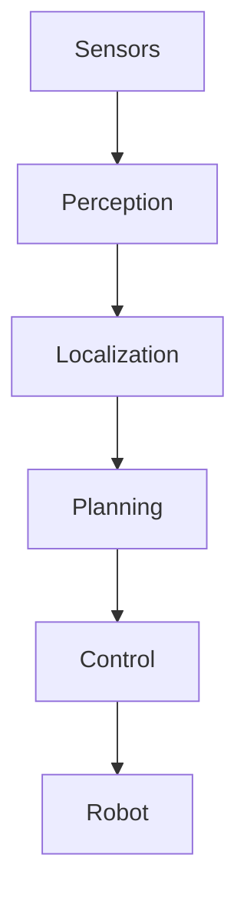
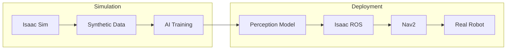
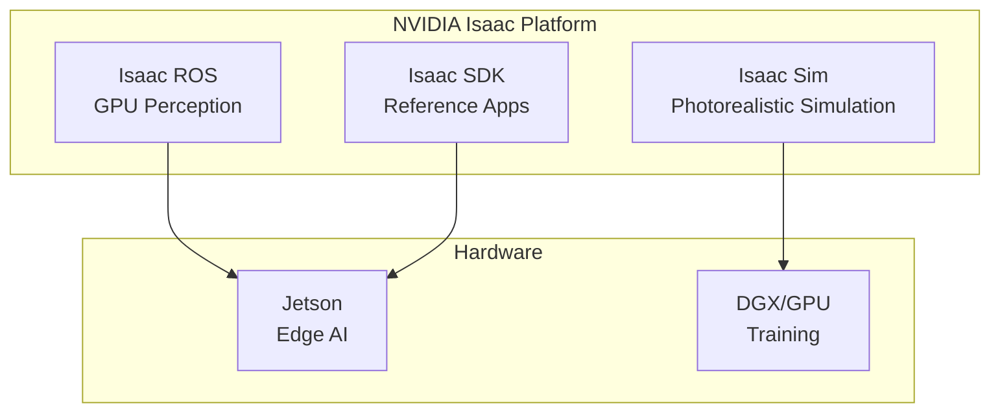

# Chapter 1: The AI-Robot Brain Architecture

## Learning Objectives

By the end of this chapter, you will be able to:

- Explain the role of **perception, localization, and planning** in robot intelligence
- Describe how **simulation, AI, and control** interact in a robotics system
- Identify **NVIDIA Isaac's position** in the Physical AI technology stack
- Understand the **sense-think-act** cycle in autonomous robots

## Introduction to the AI-Robot Brain

The **AI-robot brain** is the intelligent core of an autonomous robot. Just as the human brain processes sensory information, plans actions, and controls movement, the AI-robot brain performs analogous functions through software and hardware systems.

### The Sense-Think-Act Cycle

All autonomous robots follow a fundamental cycle:

1. **Sense**: Gather information from the environment through sensors
2. **Think**: Process information, understand context, and plan actions
3. **Act**: Execute planned movements through actuators

This cycle runs continuously, allowing the robot to adapt to changing environments in real-time.

## The Perception-Localization-Planning Architecture

Modern robot intelligence is built on three core capabilities that form a pipeline from raw sensor data to robot action.

### Architecture Overview

This diagram shows the core information flow in an autonomous robot:

1. **Sensors** capture raw data from the environment
2. **Perception** interprets sensor data to understand the world
3. **Localization** determines where the robot is in the world
4. **Planning** decides what actions to take
5. **Control** executes the planned actions on the robot

### 1. Perception: Understanding the World

**Perception** is the process of converting raw sensor data into meaningful information about the environment.

| Perception Task | Input | Output |
|-----------------|-------|--------|
| Object Detection | Camera image | Bounding boxes, class labels |
| Semantic Segmentation | Camera image | Pixel-wise labels |
| Depth Estimation | Stereo/depth camera | 3D distance map |
| Point Cloud Processing | LiDAR | 3D object clusters |

**Key Technologies**:
- Deep Neural Networks (DNNs) for visual perception
- Sensor fusion combining multiple data sources
- Real-time inference on GPUs

### 2. Localization: Where Am I?

**Localization** determines the robot's position and orientation in its environment. This is essential for navigation and interaction.

| Localization Method | Sensors Used | Best For |
|---------------------|--------------|----------|
| Odometry | Wheel encoders, IMU | Short-term tracking |
| Visual SLAM | Cameras | Indoor/outdoor mapping |
| LiDAR SLAM | LiDAR | High-precision mapping |
| GPS | Satellite receiver | Outdoor positioning |

**Key Concept**: **SLAM (Simultaneous Localization and Mapping)** builds a map of the environment while simultaneously tracking the robot's position within it.

### 3. Planning: What Should I Do?

**Planning** determines the actions the robot should take to achieve its goals while avoiding obstacles and respecting constraints.

| Planning Level | Time Horizon | Example |
|----------------|--------------|---------|
| **Strategic** | Minutes-hours | "Go to the kitchen" |
| **Tactical** | Seconds-minutes | Path around obstacles |
| **Reactive** | Milliseconds | Emergency stop |

**Key Technologies**:
- A*, Dijkstra for global path planning
- Dynamic Window Approach (DWA) for local planning
- Behavior trees for complex decision making

## Simulation, AI, and Control Interaction

Building an AI-robot brain requires tight integration between simulation, AI training, and real-world control.

### The Development Cycle

### Key Interactions

| Component | Role | Data Flow |
|-----------|------|-----------|
| **Isaac Sim** | Generate training data | Images, LiDAR, labels → AI training |
| **AI Training** | Train perception models | Labeled data → Trained weights |
| **Isaac ROS** | Run perception in real-time | Sensor data → Detections, poses |
| **Nav2** | Plan and execute navigation | Goals → Velocity commands |

### Why This Integration Matters

1. **Faster iteration**: Train in simulation before testing on hardware
2. **Safer development**: Test edge cases without risking physical damage
3. **Scalable data**: Generate unlimited training scenarios
4. **Consistent pipeline**: Same models work in simulation and reality

## NVIDIA Isaac in the Physical AI Stack

NVIDIA Isaac provides tools for each layer of the AI-robot brain, integrated into a cohesive platform.

### The Physical AI Technology Stack

| Layer | Traditional | NVIDIA Isaac |
|-------|-------------|--------------|
| **Simulation** | Gazebo, Unity | Isaac Sim (Omniverse) |
| **Perception** | OpenCV, TensorFlow | Isaac ROS (GPU-accelerated) |
| **Localization** | ORB-SLAM, RTAB-Map | cuVSLAM (GPU-accelerated) |
| **Navigation** | Nav2 | Nav2 + Isaac ROS integration |
| **Hardware** | Generic compute | Jetson, NVIDIA GPUs |

### Isaac Platform Components

### Key Advantages of NVIDIA Isaac

| Advantage | Description |
|-----------|-------------|
| **End-to-end platform** | Simulation → Training → Deployment |
| **GPU acceleration** | Real-time perception at high frame rates |
| **ROS 2 integration** | Works with existing robotics ecosystem |
| **Photorealistic simulation** | Better sim-to-real transfer |
| **Edge deployment** | Optimized for Jetson hardware |

## Putting It All Together

Let's trace a complete example of how an autonomous humanoid robot uses the AI-robot brain:

### Example: Navigating to Pick Up an Object

1. **Perception** (Isaac ROS)
   - Camera detects a cup on a table
   - DNN inference identifies object class and position
   - Depth estimation provides 3D location

2. **Localization** (cuVSLAM)
   - Visual SLAM tracks robot's position in the room
   - Creates/updates map of environment
   - Provides robot pose to planner

3. **Planning** (Nav2)
   - Global planner finds path to table
   - Local planner avoids dynamic obstacles
   - Behavior tree coordinates navigation and manipulation

4. **Control**
   - Velocity commands sent to leg controllers
   - Robot walks toward table
   - Arm controller reaches for cup

This entire pipeline runs in real-time, continuously adapting to changes in the environment.

## Summary

### Key Takeaways

1. The **AI-robot brain** implements the sense-think-act cycle for autonomous behavior
2. **Perception, localization, and planning** form the core architecture of robot intelligence
3. **Simulation and AI training** work together to create deployable perception models
4. **NVIDIA Isaac** provides an integrated platform spanning simulation to deployment
5. The **Physical AI stack** requires tight integration between software layers and hardware

### What's Next

In [Chapter 2](./chapter-2-isaac-sim), we'll dive into Isaac Sim and learn:
- How Omniverse enables photorealistic simulation
- Synthetic data generation for perception training
- Domain randomization techniques
- Isaac Sim + ROS 2 integration
