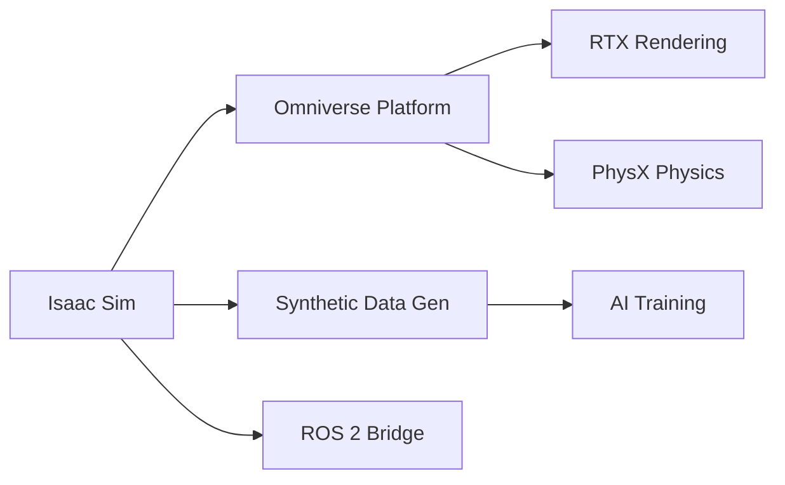
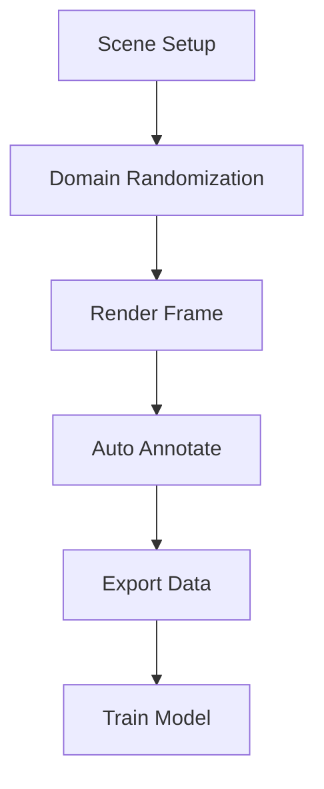
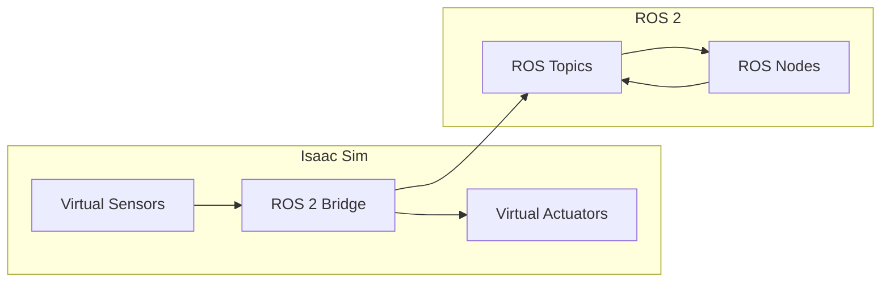

# Chapter 2: Isaac Sim – Photorealistic Simulation

## Learning Objectives

By the end of this chapter, you will be able to:

- Understand **Isaac Sim's architecture** and capabilities
- Explain **Omniverse** and **RTX rendering** for photorealistic simulation
- Describe the **synthetic data generation pipeline**
- Understand **domain randomization** techniques for robust AI training
- Explain **Isaac Sim + ROS 2** integration

## Introduction to Isaac Sim

**NVIDIA Isaac Sim** is a robotics simulation platform built on NVIDIA Omniverse. It provides photorealistic, physically accurate simulation for developing and testing AI-powered robots.

### Why Isaac Sim?

| Capability | Benefit |
|------------|---------|
| **RTX Rendering** | Photorealistic images for perception training |
| **PhysX 5** | Accurate physics simulation |
| **Omniverse Platform** | Collaborative, extensible environment |
| **ROS 2 Bridge** | Direct integration with robotics middleware |
| **Synthetic Data Tools** | Automatic labeling and domain randomization |

### Isaac Sim Architecture



## Omniverse and RTX Rendering

**NVIDIA Omniverse** is a platform for creating and operating 3D workflows and virtual worlds. Isaac Sim leverages Omniverse for:

### USD (Universal Scene Description)

Isaac Sim uses **USD** as its native scene format, enabling:

- **Interoperability**: Import from CAD, DCC tools
- **Collaboration**: Multiple users editing simultaneously
- **Composition**: Layer and reference complex scenes
- **Extensibility**: Custom schemas for robotics

### RTX Rendering Features

| Feature | Description | Use for Robotics |
|---------|-------------|------------------|
| **Ray Tracing** | Accurate light simulation | Realistic shadows, reflections |
| **Path Tracing** | Global illumination | Photorealistic training images |
| **Material Definition Language** | Physically-based materials | Accurate surface appearance |
| **Multi-GPU** | Distributed rendering | Faster data generation |

### Rendering Quality Comparison

| Renderer | Speed | Quality | Use Case |
|----------|-------|---------|----------|
| **RTX Real-Time** | 60+ FPS | Good | Interactive simulation |
| **RTX Path Traced** | 1-5 FPS | Photorealistic | Training data generation |
| **RTX Interactive** | 15-30 FPS | Very Good | Development and testing |

## Physics Simulation with PhysX

Isaac Sim uses **NVIDIA PhysX 5** for physics simulation, providing:

### PhysX Features

| Feature | Description |
|---------|-------------|
| **Rigid Body Dynamics** | Accurate collision and motion |
| **Articulated Bodies** | Robot joints and mechanisms |
| **Soft Bodies** | Deformable objects |
| **Fluids** | Particle-based fluid simulation |
| **GPU Acceleration** | Massive parallel simulation |

### Robot Physics Configuration

Isaac Sim supports URDF import with automatic physics configuration:

```python
from omni.isaac.core.utils.extensions import enable_extension
enable_extension("omni.isaac.urdf")

from omni.isaac.urdf import _urdf
urdf_interface = _urdf.acquire_urdf_interface()

import_config = _urdf.ImportConfig()
import_config.merge_fixed_joints = False
import_config.fix_base = False
import_config.default_drive_type = _urdf.UrdfJointTargetType.JOINT_DRIVE_VELOCITY

result = urdf_interface.parse_urdf(
    "/path/to/robot.urdf",
    import_config
)
```

## Synthetic Data Generation Pipeline

One of Isaac Sim's most powerful features is **Synthetic Data Generation (SDG)** for training perception models.

### The SDG Pipeline



### Available Annotations

Isaac Sim automatically generates ground truth labels:

| Annotation Type | Description | Format |
|-----------------|-------------|--------|
| **RGB Image** | Color camera image | PNG/JPG |
| **Depth** | Distance to camera | EXR/NPY |
| **Semantic Segmentation** | Per-pixel class labels | PNG |
| **Instance Segmentation** | Per-pixel instance IDs | PNG |
| **2D Bounding Box** | Object rectangles | JSON/COCO |
| **3D Bounding Box** | Object cuboids | JSON |
| **Normals** | Surface orientation | EXR |
| **Motion Vectors** | Pixel motion | EXR |

### SDG Code Example

```python
from omni.replicator.core import AnnotatorRegistry, Writer
import omni.replicator.core as rep

# Create a camera
camera = rep.create.camera(position=(2, 2, 2), look_at=(0, 0, 0))

# Create render product
render_product = rep.create.render_product(camera, (1280, 720))

# Attach annotators
rgb = rep.AnnotatorRegistry.get_annotator("rgb")
depth = rep.AnnotatorRegistry.get_annotator("distance_to_camera")
bbox_2d = rep.AnnotatorRegistry.get_annotator("bounding_box_2d_tight")
semantic_seg = rep.AnnotatorRegistry.get_annotator("semantic_segmentation")

rgb.attach([render_product])
depth.attach([render_product])
bbox_2d.attach([render_product])
semantic_seg.attach([render_product])

# Write data
writer = rep.WriterRegistry.get("BasicWriter")
writer.initialize(output_dir="/path/to/output", rgb=True,
                  bounding_box_2d_tight=True, semantic_segmentation=True)
writer.attach([render_product])
```

## Domain Randomization Techniques

**Domain randomization** varies simulation parameters to create diverse training data that generalizes better to real-world conditions.

### What to Randomize

| Category | Parameters | Purpose |
|----------|------------|---------|
| **Visual** | Lighting, textures, colors | Visual diversity |
| **Geometry** | Object positions, scales | Spatial diversity |
| **Camera** | Position, focal length, noise | Sensor diversity |
| **Physics** | Friction, mass, damping | Physical diversity |
| **Distractors** | Random objects in scene | Clutter robustness |

### Replicator Randomization API

```python
import omni.replicator.core as rep

# Randomize lighting
with rep.trigger.on_frame():
    # Random light intensity
    light = rep.get.light()
    with light:
        rep.modify.attribute("intensity",
                            rep.distribution.uniform(500, 2000))

    # Random object position
    cube = rep.get.prims(path_pattern="/World/Cube")
    with cube:
        rep.modify.pose(
            position=rep.distribution.uniform((-1, -1, 0), (1, 1, 0)),
            rotation=rep.distribution.uniform((0, 0, 0), (0, 0, 360))
        )

    # Random texture
    with rep.get.prims(semantics=[("class", "floor")]):
        rep.randomizer.texture(textures=[
            "/textures/wood.png",
            "/textures/concrete.png",
            "/textures/tile.png"
        ])
```

### Randomization Strategy

For effective domain randomization:

1. **Start simple**: Randomize one parameter at a time
2. **Match real distribution**: Use realistic ranges for parameters
3. **Include edge cases**: Add challenging scenarios (occlusion, blur)
4. **Validate with real data**: Compare synthetic to real distributions
5. **Iterate**: Adjust randomization based on model performance

## Isaac Sim + ROS 2 Integration

Isaac Sim integrates directly with ROS 2, enabling seamless development workflows.

### ROS 2 Bridge Architecture



### Supported ROS 2 Message Types

| Category | Message Types |
|----------|--------------|
| **Sensors** | `sensor_msgs/Image`, `sensor_msgs/PointCloud2`, `sensor_msgs/Imu` |
| **TF** | `tf2_msgs/TFMessage` |
| **Control** | `geometry_msgs/Twist`, `trajectory_msgs/JointTrajectory` |
| **Navigation** | `nav_msgs/Odometry`, `nav_msgs/Path` |

### ROS 2 Bridge Example

```python
import omni.graph.core as og

# Create ROS 2 bridge action graph
keys = og.Controller.Keys
(ros_camera_graph, _, _, _) = og.Controller.edit(
    {"graph_path": "/ROS_Camera", "evaluator_name": "execution"},
    {
        keys.CREATE_NODES: [
            ("OnPlaybackTick", "omni.graph.action.OnPlaybackTick"),
            ("IsaacCreateRenderProduct", "omni.isaac.core_nodes.IsaacCreateRenderProduct"),
            ("ROS2CameraHelper", "omni.isaac.ros2_bridge.ROS2CameraHelper"),
        ],
        keys.CONNECT: [
            ("OnPlaybackTick.outputs:tick", "IsaacCreateRenderProduct.inputs:execIn"),
            ("IsaacCreateRenderProduct.outputs:execOut", "ROS2CameraHelper.inputs:execIn"),
            ("IsaacCreateRenderProduct.outputs:renderProductPath",
             "ROS2CameraHelper.inputs:renderProductPath"),
        ],
        keys.SET_VALUES: [
            ("IsaacCreateRenderProduct.inputs:cameraPrim", "/World/Camera"),
            ("ROS2CameraHelper.inputs:topicName", "/camera/image_raw"),
            ("ROS2CameraHelper.inputs:frameId", "camera_link"),
        ],
    },
)
```

## Getting Started with Isaac Sim

### System Requirements

| Component | Minimum | Recommended |
|-----------|---------|-------------|
| **GPU** | NVIDIA RTX 2070 | RTX 3080 or better |
| **VRAM** | 8 GB | 16+ GB |
| **RAM** | 32 GB | 64 GB |
| **Storage** | 50 GB SSD | 100+ GB NVMe |
| **OS** | Ubuntu 20.04/22.04 | Ubuntu 22.04 |

### Cloud Alternatives

If you don't have local GPU hardware:

| Provider | Instance Type | GPU |
|----------|--------------|-----|
| **AWS** | g5.xlarge | A10G |
| **Azure** | NCas_T4_v3 | T4 |
| **GCP** | n1-standard-8 + T4 | T4 |
| **NVIDIA NGC** | Isaac Sim container | Various |

## Summary

### Key Takeaways

1. **Isaac Sim** provides photorealistic simulation built on NVIDIA Omniverse
2. **RTX rendering** enables training-quality synthetic images
3. **PhysX 5** delivers accurate physics for robot simulation
4. **Synthetic data generation** automates labeled dataset creation
5. **Domain randomization** improves model robustness
6. **ROS 2 integration** enables seamless development workflows

### What's Next

In [Chapter 3](./chapter-3-isaac-ros), we'll explore Isaac ROS and learn:
- GPU-accelerated perception pipelines
- cuVSLAM for visual localization
- DNN inference on NVIDIA hardware
- Integration with ROS 2 navigation
