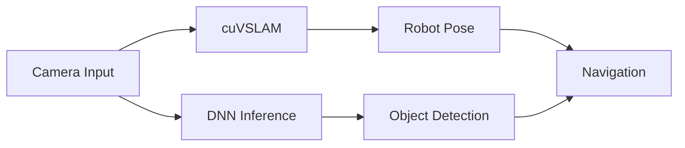
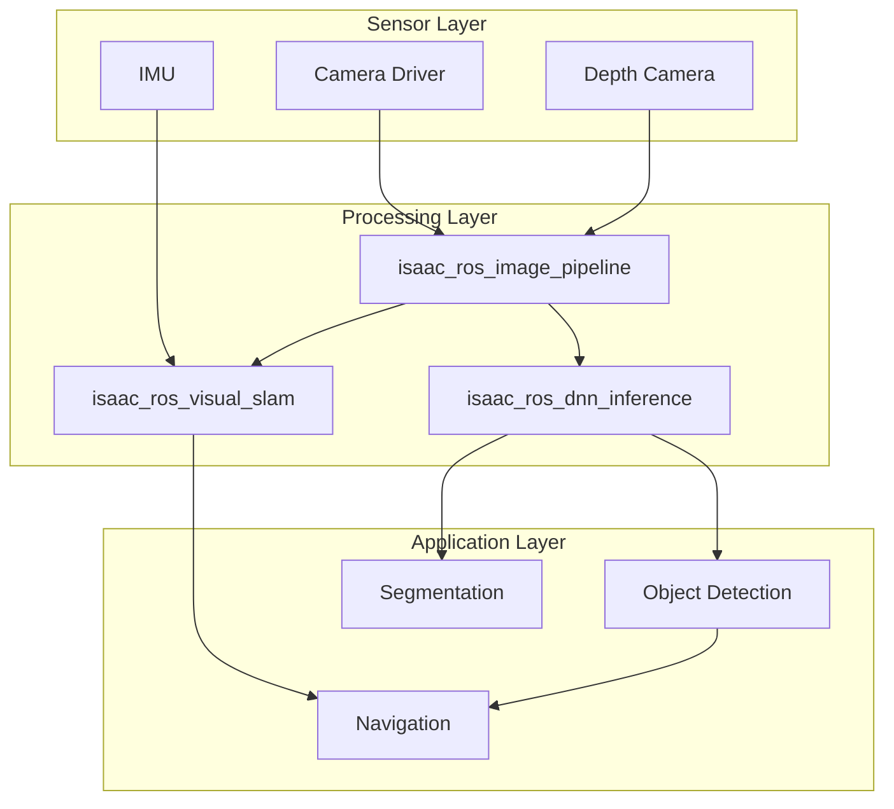
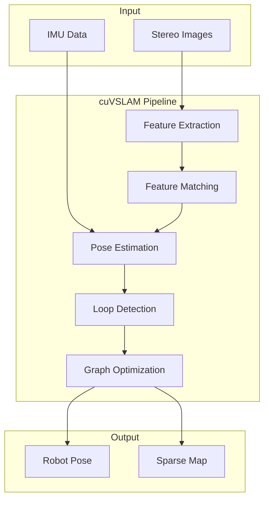
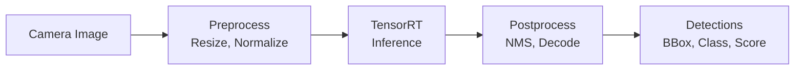

# Chapter 3: Isaac ROS – Accelerated Perception

## Learning Objectives

By the end of this chapter, you will be able to:

- Understand **Isaac ROS architecture** and packages
- Explain **GPU-accelerated perception** pipelines
- Describe **cuVSLAM** for visual simultaneous localization and mapping
- Understand **DNN inference** on NVIDIA GPUs and Jetson
- Integrate **Isaac ROS with ROS 2** navigation

## Introduction to Isaac ROS

**NVIDIA Isaac ROS** is a collection of GPU-accelerated ROS 2 packages that deliver high-performance perception capabilities for autonomous robots.

### Why Isaac ROS?

Traditional CPU-based perception faces limitations:

| Challenge | CPU Approach | Isaac ROS Solution |
|-----------|--------------|-------------------|
| **Frame rate** | 5-15 FPS | 30-60+ FPS |
| **Latency** | 100-200ms | 10-50ms |
| **Power efficiency** | High power draw | Optimized for edge |
| **Model complexity** | Limited by CPU | Full DNN capability |

### Isaac ROS Architecture



## Isaac ROS Packages

Isaac ROS provides modular packages for different perception tasks:

### Core Packages

| Package | Function | Acceleration |
|---------|----------|--------------|
| **isaac_ros_visual_slam** | Visual SLAM (cuVSLAM) | CUDA |
| **isaac_ros_dnn_inference** | Neural network inference | TensorRT |
| **isaac_ros_object_detection** | Object detection | TensorRT |
| **isaac_ros_depth_segmentation** | Depth-based segmentation | CUDA |
| **isaac_ros_image_pipeline** | Image processing | NPP/VPI |
| **isaac_ros_apriltag** | Fiducial detection | CUDA |
| **isaac_ros_freespace** | Freespace segmentation | TensorRT |

### Package Dependencies



## GPU-Accelerated Perception Pipeline

Isaac ROS leverages multiple NVIDIA acceleration technologies:

### Acceleration Technologies

| Technology | Purpose | Used In |
|------------|---------|---------|
| **CUDA** | General GPU computing | cuVSLAM, image processing |
| **TensorRT** | DNN inference optimization | Object detection, segmentation |
| **NPP** | Image processing primitives | Resize, color conversion |
| **VPI** | Vision programming interface | Stereo depth, optical flow |
| **Triton** | Inference serving | Multi-model deployment |

### Performance Comparison

| Task | CPU (FPS) | Isaac ROS (FPS) | Speedup |
|------|-----------|-----------------|---------|
| Image resize | 30 | 120+ | 4x |
| Object detection | 5-10 | 30-60 | 6x |
| Visual SLAM | 15-20 | 60-90 | 4x |
| Stereo depth | 10-15 | 30-45 | 3x |

### Example: Image Processing Pipeline

```python
from launch import LaunchDescription
from launch_ros.actions import ComposableNodeContainer
from launch_ros.descriptions import ComposableNode

def generate_launch_description():
    rectify_node = ComposableNode(
        package='isaac_ros_image_pipeline',
        plugin='nvidia::isaac_ros::image_pipeline::RectifyNode',
        name='rectify_node',
        parameters=[{
            'output_width': 1280,
            'output_height': 720,
        }],
        remappings=[
            ('image_raw', '/camera/image_raw'),
            ('camera_info', '/camera/camera_info'),
        ]
    )

    resize_node = ComposableNode(
        package='isaac_ros_image_pipeline',
        plugin='nvidia::isaac_ros::image_pipeline::ResizeNode',
        name='resize_node',
        parameters=[{
            'output_width': 640,
            'output_height': 480,
        }],
        remappings=[
            ('image', '/rectify/image_rect'),
            ('camera_info', '/rectify/camera_info'),
        ]
    )

    container = ComposableNodeContainer(
        name='image_pipeline_container',
        namespace='',
        package='rclcpp_components',
        executable='component_container_mt',
        composable_node_descriptions=[rectify_node, resize_node],
    )

    return LaunchDescription([container])
```

## cuVSLAM: Visual SLAM with NVIDIA

**cuVSLAM** (CUDA Visual SLAM) is NVIDIA's GPU-accelerated visual odometry and SLAM solution.

### cuVSLAM Features

| Feature | Description |
|---------|-------------|
| **Stereo Visual Odometry** | 6-DoF pose from stereo cameras |
| **Visual-Inertial Odometry** | Fused camera + IMU |
| **Loop Closure** | Recognize previously visited places |
| **Relocalization** | Recover from tracking loss |
| **GPU Acceleration** | Full pipeline on GPU |

### How cuVSLAM Works



### cuVSLAM Launch Configuration

```python
from launch import LaunchDescription
from launch_ros.actions import ComposableNodeContainer
from launch_ros.descriptions import ComposableNode

def generate_launch_description():
    visual_slam_node = ComposableNode(
        name='visual_slam_node',
        package='isaac_ros_visual_slam',
        plugin='nvidia::isaac_ros::visual_slam::VisualSlamNode',
        parameters=[{
            'enable_imu_fusion': True,
            'gyro_noise_density': 0.000244,
            'gyro_random_walk': 0.000019393,
            'accel_noise_density': 0.001862,
            'accel_random_walk': 0.003,
            'calibration_frequency': 200.0,
            'image_jitter_threshold_ms': 34.0,
        }],
        remappings=[
            ('stereo_camera/left/image', '/camera/left/image_raw'),
            ('stereo_camera/left/camera_info', '/camera/left/camera_info'),
            ('stereo_camera/right/image', '/camera/right/image_raw'),
            ('stereo_camera/right/camera_info', '/camera/right/camera_info'),
            ('visual_slam/imu', '/imu'),
        ]
    )

    container = ComposableNodeContainer(
        name='visual_slam_container',
        namespace='',
        package='rclcpp_components',
        executable='component_container_mt',
        composable_node_descriptions=[visual_slam_node],
    )

    return LaunchDescription([container])
```

## DNN Inference with Isaac ROS

Isaac ROS provides optimized DNN inference using **TensorRT**, NVIDIA's high-performance deep learning inference optimizer.

### TensorRT Optimization

| Optimization | Description | Speedup |
|--------------|-------------|---------|
| **Layer Fusion** | Combine operations | 2-3x |
| **Precision Calibration** | FP16/INT8 inference | 2-4x |
| **Kernel Auto-tuning** | Best kernels for hardware | 1.5-2x |
| **Memory Optimization** | Reduce memory footprint | Variable |

### Object Detection Pipeline



### Detection Node Example

```python
from launch import LaunchDescription
from launch_ros.actions import ComposableNodeContainer
from launch_ros.descriptions import ComposableNode

def generate_launch_description():
    # TensorRT node for inference
    tensor_rt_node = ComposableNode(
        name='tensor_rt_node',
        package='isaac_ros_tensor_rt',
        plugin='nvidia::isaac_ros::dnn_inference::TensorRTNode',
        parameters=[{
            'model_file_path': '/models/ssd_mobilenet.onnx',
            'engine_file_path': '/models/ssd_mobilenet.plan',
            'input_tensor_names': ['input_tensor'],
            'input_binding_names': ['input'],
            'output_tensor_names': ['output_tensor'],
            'output_binding_names': ['output'],
            'verbose': False,
        }]
    )

    # Decoder for object detection output
    detection_decoder_node = ComposableNode(
        name='detection_decoder_node',
        package='isaac_ros_detectnet',
        plugin='nvidia::isaac_ros::detectnet::DetectNetDecoderNode',
        parameters=[{
            'label_list': ['person', 'car', 'bicycle'],
            'confidence_threshold': 0.5,
        }]
    )

    container = ComposableNodeContainer(
        name='detection_container',
        namespace='',
        package='rclcpp_components',
        executable='component_container_mt',
        composable_node_descriptions=[
            tensor_rt_node,
            detection_decoder_node,
        ],
    )

    return LaunchDescription([container])
```

## Running on Jetson

Isaac ROS is optimized for **NVIDIA Jetson** edge AI platforms:

### Jetson Platform Comparison

| Platform | GPU Cores | Memory | TDP | Use Case |
|----------|-----------|--------|-----|----------|
| **Jetson Orin Nano** | 1024 | 4-8 GB | 7-15W | Entry-level robots |
| **Jetson Orin NX** | 1024 | 8-16 GB | 10-25W | Mid-range robots |
| **Jetson AGX Orin** | 2048 | 32-64 GB | 15-60W | High-performance robots |

### Jetson Deployment Considerations

| Factor | Recommendation |
|--------|----------------|
| **Memory** | Use INT8 inference to reduce memory |
| **Power** | Configure power mode for application |
| **Cooling** | Ensure adequate thermal management |
| **Storage** | Use NVMe for model loading |

## Integration with Navigation

Isaac ROS perception outputs feed directly into ROS 2 navigation stacks:

### Perception to Navigation Data Flow

| Isaac ROS Output | ROS 2 Topic Type | Nav2 Consumer |
|------------------|------------------|---------------|
| Robot pose | `geometry_msgs/PoseStamped` | AMCL, EKF |
| Detections | `vision_msgs/Detection2DArray` | Costmap layers |
| Depth image | `sensor_msgs/Image` | Costmap layers |
| Point cloud | `sensor_msgs/PointCloud2` | Obstacle layer |

### Example: Perception to Nav2

```yaml
# nav2_params.yaml
local_costmap:
  local_costmap:
    ros__parameters:
      plugins: ["obstacle_layer", "detection_layer", "inflation_layer"]
      obstacle_layer:
        plugin: "nav2_costmap_2d::ObstacleLayer"
        observation_sources: depth
        depth:
          topic: /camera/depth/points
          data_type: "PointCloud2"
          clearing: True
          marking: True
      detection_layer:
        plugin: "nav2_costmap_2d::StaticLayer"
        topic: /isaac_ros/detections
```

## Summary

### Key Takeaways

1. **Isaac ROS** provides GPU-accelerated perception for real-time robotics
2. **cuVSLAM** enables high-performance visual odometry and SLAM
3. **TensorRT** optimizes DNN inference for maximum throughput
4. **Modular packages** integrate seamlessly with ROS 2
5. **Jetson platforms** provide edge deployment for autonomous robots
6. **Navigation integration** connects perception to planning and control

### What's Next

In [Chapter 4](./chapter-4-nav2-navigation), we'll explore Nav2 and learn:
- Nav2 architecture and components
- Path planning for humanoid robots
- Costmaps and obstacle avoidance
- Behavior trees for complex navigation
