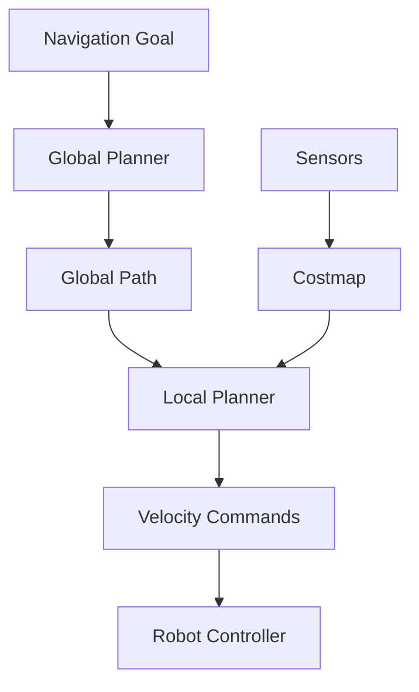
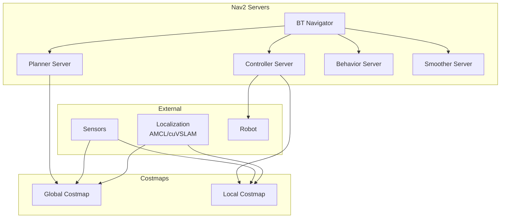
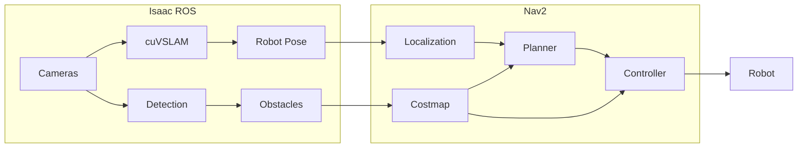

# Chapter 4: Nav2 for Humanoid Navigation

## Learning Objectives

By the end of this chapter, you will be able to:

- Understand the **Nav2 architecture** and its components
- Explain **costmaps** for representing obstacles and free space
- Describe **path planning algorithms** for humanoid robots
- Understand **behavior trees** for complex navigation tasks
- Integrate **Nav2 with Isaac ROS** for end-to-end autonomy

## Introduction to Nav2

**Nav2** (Navigation 2) is the ROS 2 navigation stack, providing a complete framework for autonomous robot navigation. It handles everything from path planning to obstacle avoidance.

### Why Nav2 for Humanoids?

| Capability | Benefit for Humanoids |
|------------|----------------------|
| **Modular architecture** | Customize for bipedal motion |
| **Costmap layers** | Handle 3D obstacle information |
| **Behavior trees** | Complex locomotion sequences |
| **Plugin system** | Custom planners for legged robots |
| **ROS 2 native** | Integrates with Isaac ROS |

### Nav2 in the Robot Stack



## Nav2 Architecture Overview

Nav2 consists of several cooperating servers and a behavior tree that orchestrates them.

### Core Components

| Component | Function | Plugins |
|-----------|----------|---------|
| **BT Navigator** | Orchestrates navigation | Various BT nodes |
| **Controller Server** | Local path following | DWB, MPPI, RPP |
| **Planner Server** | Global path planning | NavFn, Smac, Theta* |
| **Behavior Server** | Recovery behaviors | Spin, BackUp, Wait |
| **Costmap 2D** | Environment representation | Static, Obstacle, Inflation |
| **Localization** | Robot pose estimation | AMCL, EKF (via robot_localization) |

### Architecture Diagram



## Costmaps: Global and Local

**Costmaps** represent the environment as a 2D grid where each cell has a cost indicating traversability.

### Costmap Layers

| Layer | Function | Data Source |
|-------|----------|-------------|
| **Static Layer** | Known map obstacles | Pre-built map |
| **Obstacle Layer** | Dynamic obstacles | LiDAR, depth camera |
| **Voxel Layer** | 3D obstacle representation | Point clouds |
| **Inflation Layer** | Safety buffer around obstacles | Computed from obstacles |
| **Range Layer** | Sonar/IR sensors | Range sensors |

### Cost Values

| Cost | Meaning | Action |
|------|---------|--------|
| 0 | Free space | Safe to traverse |
| 1-252 | Increasing cost | Prefer lower cost paths |
| 253 | Inscribed | Robot center can't be here |
| 254 | Lethal | Definite collision |
| 255 | Unknown | No information |

### Costmap Configuration

```yaml
# global_costmap params
global_costmap:
  global_costmap:
    ros__parameters:
      update_frequency: 1.0
      publish_frequency: 1.0
      global_frame: map
      robot_base_frame: base_link
      resolution: 0.05
      track_unknown_space: true
      plugins: ["static_layer", "obstacle_layer", "inflation_layer"]

      static_layer:
        plugin: "nav2_costmap_2d::StaticLayer"
        map_subscribe_transient_local: True

      obstacle_layer:
        plugin: "nav2_costmap_2d::ObstacleLayer"
        enabled: True
        observation_sources: scan
        scan:
          topic: /scan
          max_obstacle_height: 2.0
          clearing: True
          marking: True
          data_type: "LaserScan"

      inflation_layer:
        plugin: "nav2_costmap_2d::InflationLayer"
        cost_scaling_factor: 3.0
        inflation_radius: 0.55
```

## Path Planning for Humanoids

Humanoid robots have unique navigation requirements compared to wheeled robots.

### Humanoid Navigation Challenges

| Challenge | Wheeled Robot | Humanoid Robot |
|-----------|---------------|----------------|
| **Terrain** | Flat surfaces | Steps, slopes, uneven ground |
| **Footprint** | Fixed | Changes with stance |
| **Velocity** | Continuous | Discrete steps |
| **Balance** | Stable | Requires active control |
| **Obstacles** | 2D avoidance | 3D stepping over/around |

### Global Planners

| Planner | Algorithm | Best For |
|---------|-----------|----------|
| **NavFn** | Dijkstra/A* | Simple environments |
| **Smac 2D** | A* with smoothing | General purpose |
| **Smac Hybrid-A*** | Hybrid A* | Non-holonomic robots |
| **Smac Lattice** | State lattice | Complex motion constraints |
| **Theta*** | Any-angle planning | Open environments |

### Smac Planner Configuration

```yaml
planner_server:
  ros__parameters:
    planner_plugins: ["GridBased"]
    GridBased:
      plugin: "nav2_smac_planner/SmacPlanner2D"
      tolerance: 0.25
      downsample_costmap: false
      downsampling_factor: 1
      allow_unknown: true
      max_iterations: 1000000
      max_on_approach_iterations: 1000
      max_planning_time: 5.0
      cost_travel_multiplier: 2.0
      use_final_approach_orientation: false
      smoother:
        max_iterations: 1000
        w_smooth: 0.3
        w_data: 0.2
        tolerance: 1.0e-10
```

### Local Controllers

| Controller | Method | Characteristics |
|------------|--------|-----------------|
| **DWB** | Dynamic Window | Fast, reactive |
| **MPPI** | Model Predictive | Smooth, predictive |
| **RPP** | Regulated Pure Pursuit | Simple, reliable |
| **Rotation Shim** | Rotation wrapper | In-place rotation |

### MPPI Controller for Humanoids

```yaml
controller_server:
  ros__parameters:
    controller_plugins: ["FollowPath"]
    FollowPath:
      plugin: "nav2_mppi_controller::MPPIController"
      time_steps: 56
      model_dt: 0.05
      batch_size: 2000
      vx_std: 0.2
      vy_std: 0.0
      wz_std: 0.4
      vx_max: 0.5
      vx_min: -0.35
      vy_max: 0.0
      wz_max: 1.0
      iteration_count: 1
      prune_distance: 1.7
      transform_tolerance: 0.1
      temperature: 0.3
      gamma: 0.015
      motion_model: "DiffDrive"
      critics: ["ConstraintCritic", "ObstaclesCritic", "GoalCritic",
                "GoalAngleCritic", "PathFollowCritic", "PathAngleCritic",
                "PreferForwardCritic"]
```

## Behavior Trees for Navigation

Nav2 uses **Behavior Trees** (BT) to orchestrate complex navigation behaviors.

### Behavior Tree Basics

| Node Type | Symbol | Function |
|-----------|--------|----------|
| **Sequence** | → | Execute children in order, fail if any fails |
| **Fallback** | ? | Execute until one succeeds |
| **Action** | □ | Execute an action |
| **Condition** | ◯ | Check a condition |
| **Decorator** | ◇ | Modify child behavior |

### Default Navigation BT

```xml
<root main_tree_to_execute="MainTree">
  <BehaviorTree ID="MainTree">
    <RecoveryNode number_of_retries="6" name="NavigateRecovery">
      <PipelineSequence name="NavigateWithReplanning">
        <RateController hz="1.0">
          <RecoveryNode number_of_retries="1">
            <ComputePathToPose goal="{goal}" path="{path}"
                               planner_id="GridBased"/>
            <ClearEntireCostmap name="ClearGlobalCostmap"
                                service_name="global_costmap/clear_entirely_global_costmap"/>
          </RecoveryNode>
        </RateController>
        <RecoveryNode number_of_retries="1">
          <FollowPath path="{path}" controller_id="FollowPath"/>
          <ClearEntireCostmap name="ClearLocalCostmap"
                              service_name="local_costmap/clear_entirely_local_costmap"/>
        </RecoveryNode>
      </PipelineSequence>
      <ReactiveFallback name="RecoveryFallback">
        <GoalUpdated/>
        <RoundRobin name="RecoveryActions">
          <Spin spin_dist="1.57"/>
          <Wait wait_duration="5"/>
          <BackUp backup_dist="0.15" backup_speed="0.025"/>
        </RoundRobin>
      </ReactiveFallback>
    </RecoveryNode>
  </BehaviorTree>
</root>
```

### Custom Behavior Tree for Humanoids

Humanoids may need custom behaviors:

```xml
<root main_tree_to_execute="HumanoidNavTree">
  <BehaviorTree ID="HumanoidNavTree">
    <RecoveryNode number_of_retries="3" name="NavigateRecovery">
      <PipelineSequence name="HumanoidNavigate">
        <!-- Plan global path -->
        <ComputePathToPose goal="{goal}" path="{path}"
                           planner_id="SmacPlanner"/>

        <!-- Check if path requires stepping -->
        <Fallback name="HandleObstacles">
          <Condition ID="PathClear"/>
          <Sequence name="StepOverSequence">
            <!-- Custom humanoid step-over behavior -->
            <Action ID="PrepareStepOver"/>
            <Action ID="ExecuteStepOver"/>
            <Action ID="RecoverBalance"/>
          </Sequence>
        </Fallback>

        <!-- Follow path with balance control -->
        <FollowPath path="{path}" controller_id="HumanoidController"/>
      </PipelineSequence>

      <!-- Recovery behaviors -->
      <ReactiveFallback name="RecoveryFallback">
        <GoalUpdated/>
        <Sequence name="HumanoidRecovery">
          <Action ID="StabilizeBalance"/>
          <Wait wait_duration="2"/>
          <Action ID="ReplanPath"/>
        </Sequence>
      </ReactiveFallback>
    </RecoveryNode>
  </BehaviorTree>
</root>
```

## Integration with Isaac ROS

Combining Nav2 with Isaac ROS creates a powerful autonomous navigation system.

### End-to-End Pipeline



### Integration Launch File

```python
from launch import LaunchDescription
from launch.actions import IncludeLaunchDescription
from launch.launch_description_sources import PythonLaunchDescriptionSource
from launch_ros.actions import Node
from ament_index_python.packages import get_package_share_directory
import os

def generate_launch_description():
    # Isaac ROS Visual SLAM
    vslam_launch = IncludeLaunchDescription(
        PythonLaunchDescriptionSource([
            get_package_share_directory('isaac_ros_visual_slam'),
            '/launch/isaac_ros_visual_slam.launch.py'
        ])
    )

    # Nav2 Bringup
    nav2_launch = IncludeLaunchDescription(
        PythonLaunchDescriptionSource([
            get_package_share_directory('nav2_bringup'),
            '/launch/navigation_launch.py'
        ]),
        launch_arguments={
            'use_sim_time': 'false',
            'params_file': '/path/to/nav2_params.yaml'
        }.items()
    )

    # Robot localization (fuse cuVSLAM with IMU)
    ekf_node = Node(
        package='robot_localization',
        executable='ekf_node',
        name='ekf_filter_node',
        parameters=['/path/to/ekf_params.yaml']
    )

    return LaunchDescription([
        vslam_launch,
        ekf_node,
        nav2_launch,
    ])
```

## Practical Example: Humanoid Navigation

Let's walk through a complete humanoid navigation scenario:

### Scenario: Navigate to Pick Up Object

1. **Goal received**: "Go to table and pick up cup"
2. **Localization**: cuVSLAM provides robot pose
3. **Perception**: Object detection finds cup location
4. **Global planning**: Smac planner creates path to table
5. **Local control**: MPPI controller follows path
6. **Obstacle handling**: Costmap updates with detected obstacles
7. **Recovery**: If blocked, behavior tree triggers recovery
8. **Approach**: Final approach behavior for manipulation

### Nav2 Parameters for Humanoid

```yaml
# Humanoid-specific Nav2 configuration
bt_navigator:
  ros__parameters:
    global_frame: map
    robot_base_frame: base_link
    odom_topic: /odom
    bt_loop_duration: 10
    default_server_timeout: 20
    default_bt_xml_filename: "humanoid_navigate.xml"
    plugin_lib_names:
      - nav2_compute_path_to_pose_action_bt_node
      - nav2_follow_path_action_bt_node
      - nav2_spin_action_bt_node
      - nav2_wait_action_bt_node
      - nav2_back_up_action_bt_node
      - nav2_clear_costmap_service_bt_node

controller_server:
  ros__parameters:
    controller_frequency: 20.0  # Lower for humanoid stability
    min_x_velocity_threshold: 0.001
    min_y_velocity_threshold: 0.5
    min_theta_velocity_threshold: 0.001
    progress_checker_plugin: "progress_checker"
    goal_checker_plugins: ["general_goal_checker"]
    controller_plugins: ["FollowPath"]

    progress_checker:
      plugin: "nav2_controller::SimpleProgressChecker"
      required_movement_radius: 0.3
      movement_time_allowance: 20.0  # More time for bipedal movement

    general_goal_checker:
      plugin: "nav2_controller::SimpleGoalChecker"
      xy_goal_tolerance: 0.15
      yaw_goal_tolerance: 0.25
      stateful: True
```

## Summary

### Key Takeaways

1. **Nav2** provides a complete navigation framework for ROS 2 robots
2. **Costmaps** represent the environment as traversability costs
3. **Global planners** find paths through the environment
4. **Local controllers** follow paths while avoiding obstacles
5. **Behavior trees** orchestrate complex navigation sequences
6. **Isaac ROS integration** enables GPU-accelerated perception for navigation

### Module 3 Complete

Congratulations! You've completed Module 3: The AI-Robot Brain. You now understand:

- The perception-localization-planning architecture
- Isaac Sim for photorealistic simulation and synthetic data
- Isaac ROS for GPU-accelerated perception
- Nav2 for autonomous navigation

### What's Next

In **Module 4**, we'll explore **Robot Manipulation** and learn:
- Motion planning with MoveIt 2
- Grasp planning and execution
- Force/torque sensing and control
- Human-robot collaboration
