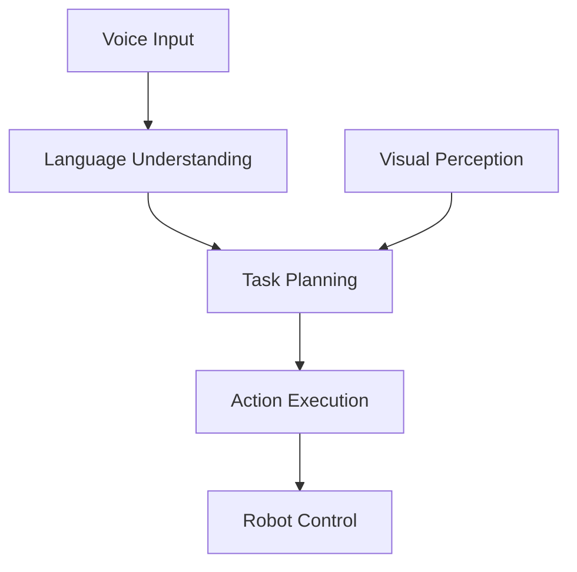
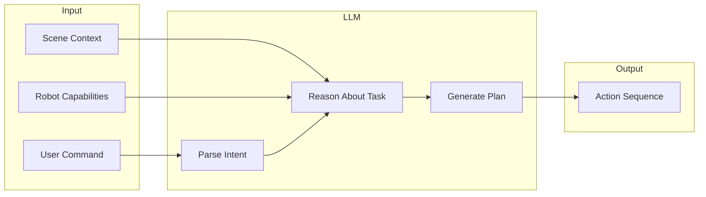
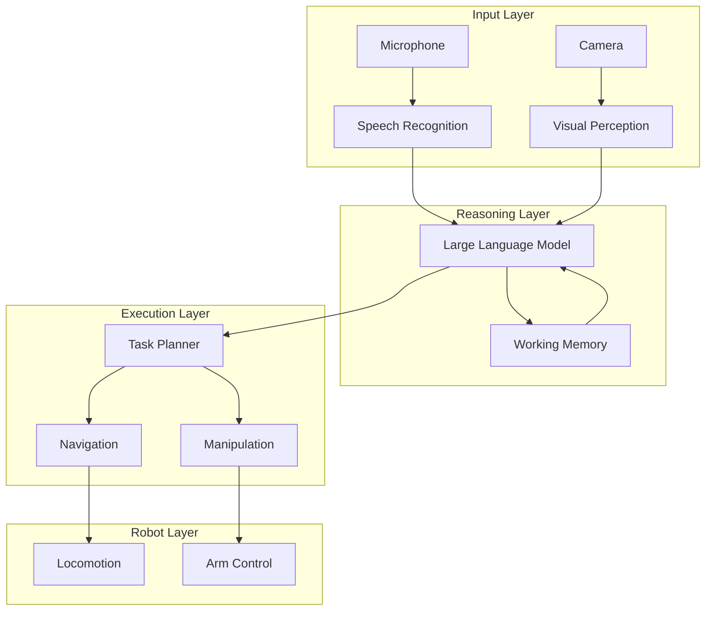

# Chapter 1: Vision-Language-Action Systems

## Learning Objectives

By the end of this chapter, you will be able to:

- Understand the **VLA paradigm** and its importance for humanoid robotics
- Explain how **language, vision, and action** connect in autonomous systems
- Describe the **role of LLMs** in robotic reasoning
- Compare **VLA vs. traditional** robot programming approaches

## Introduction to VLA

**Vision-Language-Action (VLA)** systems represent a paradigm shift in robotics. Instead of programming robots with explicit rules for every situation, VLA enables robots to understand natural language instructions, perceive their environment, and reason about how to accomplish tasks.

### The VLA Architecture



This diagram shows the core VLA data flow:

1. **Voice Input**: User speaks a command
2. **Language Understanding**: Speech is converted to text and parsed
3. **Visual Perception**: Camera data provides environmental context
4. **Task Planning**: LLM reasons about how to accomplish the goal
5. **Action Execution**: Plan is converted to robot commands
6. **Robot Control**: Physical actions are performed

## Connecting Language, Vision, and Control

The power of VLA comes from the tight integration of these three modalities.

### Language: The Interface

Natural language provides an intuitive interface for human-robot interaction:

| Traditional | VLA Approach |
|-------------|--------------|
| `move_to(x=2.5, y=1.3)` | "Go to the table" |
| `pick(object_id=42)` | "Pick up the red cup" |
| `if obstacle then replan()` | "Find another way if blocked" |

### Vision: The Context

Visual perception grounds language in physical reality:

| Language Phrase | Visual Grounding |
|-----------------|------------------|
| "the red cup" | Object detection + color recognition |
| "on the table" | Spatial relationship understanding |
| "near the door" | Scene understanding + localization |

### Action: The Execution

Actions translate plans into physical reality:

| High-Level Plan | Robot Actions |
|-----------------|---------------|
| "Go to kitchen" | Nav2 goal → path planning → locomotion |
| "Pick up cup" | Object pose → grasp planning → arm motion |
| "Place on counter" | Target pose → motion planning → release |

## Role of LLMs in Robotic Reasoning

Large Language Models serve as the "cognitive engine" of VLA systems, providing capabilities that traditional planning approaches lack.

### LLM Capabilities for Robotics

| Capability | Description | Example |
|------------|-------------|---------|
| **Instruction parsing** | Understand varied phrasings | "Get me water" = "Fetch a glass of water" |
| **Task decomposition** | Break complex tasks into steps | "Make coffee" → grind, brew, pour, serve |
| **Common sense** | Apply world knowledge | Cups are usually on tables, not floors |
| **Error recovery** | Suggest alternatives | "Cup not found, should I check the dishwasher?" |
| **Explanation** | Describe actions and reasoning | "I'm going to the kitchen because..." |

### The LLM as Task Planner



### Example: LLM-Based Planning

**User Command**: "Bring me my coffee from the kitchen"

**LLM Reasoning**:
```
1. Parse intent: Fetch object (coffee) from location (kitchen) to user
2. Gather context: User location, kitchen location, coffee location
3. Plan sequence:
   a. Navigate to kitchen
   b. Locate coffee cup
   c. Approach coffee cup
   d. Grasp coffee cup
   e. Navigate to user
   f. Present coffee cup
   g. Wait for user to take cup
   h. Return to home position
```

## VLA vs. Traditional Robot Programming

Understanding the differences helps appreciate VLA's advantages.

### Traditional Approach

```python
# Traditional: Explicit state machine
class CoffeeFetchTask:
    def __init__(self):
        self.state = "IDLE"

    def execute(self):
        if self.state == "IDLE":
            self.navigate_to(KITCHEN_COORDS)
            self.state = "AT_KITCHEN"
        elif self.state == "AT_KITCHEN":
            coffee = self.find_object("coffee_cup")
            if coffee:
                self.grasp(coffee)
                self.state = "HOLDING"
            else:
                self.state = "ERROR"
        # ... many more states and transitions
```

**Limitations**:
- Rigid: Can't handle unexpected situations
- Verbose: Every scenario must be coded
- Brittle: Small changes require code updates

### VLA Approach

```python
# VLA: LLM-based reasoning
class VLAController:
    def __init__(self, llm, perception, robot):
        self.llm = llm
        self.perception = perception
        self.robot = robot

    async def execute_command(self, command: str):
        # Get current scene understanding
        scene = await self.perception.get_scene_description()

        # Ask LLM to generate plan
        plan = await self.llm.generate_plan(
            command=command,
            scene=scene,
            capabilities=self.robot.capabilities
        )

        # Execute each step
        for step in plan.steps:
            result = await self.robot.execute(step)
            if not result.success:
                # Ask LLM for recovery
                recovery = await self.llm.suggest_recovery(step, result.error)
                await self.robot.execute(recovery)
```

**Advantages**:
- Flexible: Handles novel situations
- Concise: Logic embedded in LLM
- Robust: Can reason about errors

### Comparison Table

| Aspect | Traditional | VLA |
|--------|-------------|-----|
| **Flexibility** | Low | High |
| **Development time** | Long | Short |
| **Novel situations** | Fails | Adapts |
| **Explainability** | Code inspection | Natural language |
| **Compute requirements** | Low | High |
| **Determinism** | High | Lower |

## VLA System Architecture

A complete VLA system integrates multiple components:



### Component Responsibilities

| Component | Role | Technology |
|-----------|------|------------|
| **Speech Recognition** | Voice to text | Whisper |
| **Visual Perception** | Scene understanding | Isaac ROS, YOLO |
| **LLM** | Reasoning and planning | GPT-4, Claude, Llama |
| **Working Memory** | Context tracking | Vector DB, state |
| **Task Planner** | Action coordination | BehaviorTree, FSM |
| **Navigation** | Path planning | Nav2 |
| **Manipulation** | Arm control | MoveIt 2 |

## Challenges and Considerations

VLA systems face several challenges:

### Technical Challenges

| Challenge | Description | Mitigation |
|-----------|-------------|------------|
| **Latency** | LLM inference takes time | Streaming, local models |
| **Hallucination** | LLMs may generate invalid plans | Action validation layer |
| **Grounding** | Connecting words to reality | Explicit perception feedback |
| **Safety** | Preventing dangerous actions | Action safety checks |

### Practical Challenges

| Challenge | Description | Mitigation |
|-----------|-------------|------------|
| **Cost** | API calls can be expensive | Local models, caching |
| **Privacy** | Sending data to cloud | On-device inference |
| **Reliability** | Network dependency | Fallback behaviors |

## Summary

### Key Takeaways

1. **VLA unifies** vision, language, and action for intelligent robot behavior
2. **LLMs provide** flexible reasoning and natural language understanding
3. **Traditional programming** is rigid; VLA adapts to novel situations
4. **Integration requires** careful architecture connecting perception, reasoning, and action
5. **Challenges include** latency, grounding, and safety concerns

### What's Next

In [Chapter 2](./chapter-2-voice-to-action), we'll dive into voice-to-action systems and learn:
- Speech recognition with OpenAI Whisper
- Intent parsing and command extraction
- Building a voice-to-ROS 2 bridge
