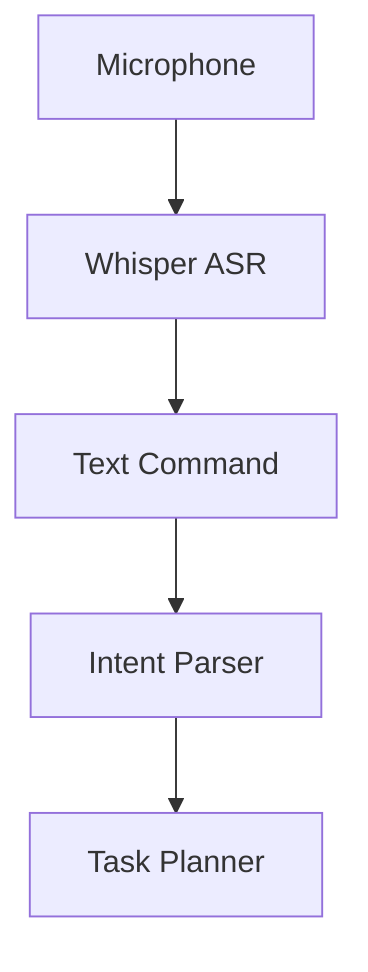
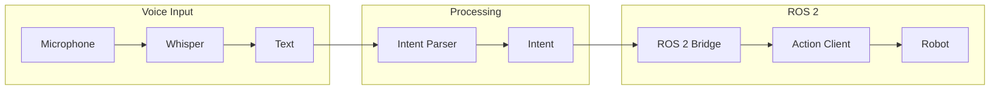

# Chapter 2: Voice-to-Action with Speech Recognition

## Learning Objectives

By the end of this chapter, you will be able to:

- Understand **speech recognition** for robotics applications
- Implement **voice command processing** with OpenAI Whisper
- Design **intent parsing** and command extraction pipelines
- Build a **voice-to-ROS 2 bridge** for robot control

## Introduction to Voice Control

Voice control provides the most natural interface for human-robot interaction. Instead of programming or using controllers, users simply speak their intentions.

### Why Voice for Robotics?

| Benefit | Description |
|---------|-------------|
| **Natural** | Humans already know how to speak |
| **Hands-free** | No need for controllers or keyboards |
| **Accessible** | Works for users with mobility limitations |
| **Flexible** | Can express complex intentions naturally |
| **Intuitive** | No training required |

### Voice Control Architecture



## Speech Recognition with OpenAI Whisper

**Whisper** is OpenAI's automatic speech recognition (ASR) system, trained on 680,000 hours of multilingual data.

### Whisper Features

| Feature | Description |
|---------|-------------|
| **Multilingual** | 99+ languages supported |
| **Robust** | Handles accents, background noise |
| **Accurate** | Near-human transcription accuracy |
| **Open source** | Available for local deployment |
| **Multiple sizes** | Tiny to Large models |

### Whisper Model Sizes

| Model | Parameters | VRAM | Speed | Accuracy |
|-------|------------|------|-------|----------|
| tiny | 39M | ~1GB | Fastest | Lower |
| base | 74M | ~1GB | Fast | Good |
| small | 244M | ~2GB | Medium | Better |
| medium | 769M | ~5GB | Slower | Very Good |
| large | 1550M | ~10GB | Slowest | Best |

### Installing Whisper

```bash
# Install via pip
pip install openai-whisper

# Or install with CUDA support
pip install openai-whisper torch torchvision torchaudio --index-url https://download.pytorch.org/whl/cu118
```

### Basic Whisper Usage

```python
import whisper

# Load model
model = whisper.load_model("base")

# Transcribe audio file
result = model.transcribe("command.wav")
print(result["text"])
# Output: "Go to the kitchen and bring me a glass of water"
```

### Real-Time Whisper with Streaming

```python
import whisper
import pyaudio
import numpy as np
import queue
import threading

class RealtimeWhisper:
    def __init__(self, model_size="base"):
        self.model = whisper.load_model(model_size)
        self.audio_queue = queue.Queue()
        self.sample_rate = 16000
        self.chunk_duration = 5  # seconds

    def audio_callback(self, in_data, frame_count, time_info, status):
        """Callback for audio stream"""
        audio_data = np.frombuffer(in_data, dtype=np.float32)
        self.audio_queue.put(audio_data)
        return (None, pyaudio.paContinue)

    def start_listening(self):
        """Start audio capture"""
        p = pyaudio.PyAudio()
        stream = p.open(
            format=pyaudio.paFloat32,
            channels=1,
            rate=self.sample_rate,
            input=True,
            frames_per_buffer=self.sample_rate * self.chunk_duration,
            stream_callback=self.audio_callback
        )
        stream.start_stream()
        return stream

    def transcribe_stream(self):
        """Process audio chunks and transcribe"""
        while True:
            if not self.audio_queue.empty():
                audio_chunk = self.audio_queue.get()
                result = self.model.transcribe(audio_chunk)
                yield result["text"]
```

## Intent Parsing and Command Extraction

Raw transcribed text must be parsed to extract actionable intents.

### Intent Structure

| Component | Description | Example |
|-----------|-------------|---------|
| **Action** | What to do | "go", "pick up", "open" |
| **Object** | Target of action | "cup", "door", "box" |
| **Location** | Where to perform | "kitchen", "table", "here" |
| **Modifier** | Additional details | "red", "quickly", "carefully" |

### Simple Rule-Based Parser

```python
import re
from dataclasses import dataclass
from typing import Optional, List

@dataclass
class Intent:
    action: str
    object: Optional[str] = None
    location: Optional[str] = None
    modifiers: List[str] = None

class IntentParser:
    ACTIONS = ["go", "move", "navigate", "pick", "grab", "take",
               "place", "put", "open", "close", "find", "bring"]

    LOCATIONS = ["kitchen", "bedroom", "living room", "bathroom",
                 "table", "counter", "shelf", "door"]

    def parse(self, text: str) -> Intent:
        text = text.lower().strip()
        words = text.split()

        # Find action
        action = None
        for word in words:
            if word in self.ACTIONS:
                action = word
                break

        # Find location
        location = None
        for loc in self.LOCATIONS:
            if loc in text:
                location = loc
                break

        # Find object (simple: noun after action)
        obj = self._extract_object(text, action)

        return Intent(action=action, object=obj, location=location)

    def _extract_object(self, text: str, action: str) -> Optional[str]:
        # Pattern: action + (the|a|my) + object
        pattern = rf"{action}\s+(?:the|a|my)?\s*(\w+)"
        match = re.search(pattern, text)
        if match:
            return match.group(1)
        return None
```

### LLM-Based Intent Parsing

For more robust parsing, use an LLM:

```python
import openai
from pydantic import BaseModel
from typing import Optional, List

class RobotIntent(BaseModel):
    action: str
    target_object: Optional[str]
    target_location: Optional[str]
    modifiers: List[str]
    confidence: float

class LLMIntentParser:
    def __init__(self, model="gpt-4"):
        self.client = openai.OpenAI()
        self.model = model

    def parse(self, command: str) -> RobotIntent:
        response = self.client.chat.completions.create(
            model=self.model,
            messages=[
                {
                    "role": "system",
                    "content": """You are a robot command parser.
                    Extract the intent from user commands.
                    Return JSON with: action, target_object, target_location,
                    modifiers (list), confidence (0-1)."""
                },
                {
                    "role": "user",
                    "content": f"Parse this command: {command}"
                }
            ],
            response_format={"type": "json_object"}
        )

        import json
        data = json.loads(response.choices[0].message.content)
        return RobotIntent(**data)

# Usage
parser = LLMIntentParser()
intent = parser.parse("Go to the kitchen and bring me the red mug")
print(intent)
# RobotIntent(action='navigate_and_fetch',
#             target_object='red mug',
#             target_location='kitchen',
#             modifiers=['bring to user'],
#             confidence=0.95)
```

## Voice-to-ROS 2 Bridge

Connect voice commands to ROS 2 actions for robot control.

### Bridge Architecture



### ROS 2 Voice Command Node

```python
import rclpy
from rclpy.node import Node
from rclpy.action import ActionClient
from std_msgs.msg import String
from nav2_msgs.action import NavigateToPose
from geometry_msgs.msg import PoseStamped
import whisper
import numpy as np

class VoiceCommandNode(Node):
    def __init__(self):
        super().__init__('voice_command_node')

        # Load Whisper model
        self.whisper = whisper.load_model("base")

        # Intent parser
        self.parser = IntentParser()

        # Publishers and action clients
        self.command_pub = self.create_publisher(String, '/voice/command', 10)
        self.nav_client = ActionClient(self, NavigateToPose, 'navigate_to_pose')

        # Location database
        self.locations = {
            'kitchen': {'x': 5.0, 'y': 2.0, 'theta': 0.0},
            'living room': {'x': 0.0, 'y': 0.0, 'theta': 0.0},
            'bedroom': {'x': -3.0, 'y': 4.0, 'theta': 1.57},
        }

        self.get_logger().info('Voice command node initialized')

    def process_audio(self, audio_data: np.ndarray):
        """Process audio and execute command"""
        # Transcribe
        result = self.whisper.transcribe(audio_data)
        text = result["text"]
        self.get_logger().info(f'Transcribed: {text}')

        # Publish raw command
        msg = String()
        msg.data = text
        self.command_pub.publish(msg)

        # Parse intent
        intent = self.parser.parse(text)
        self.get_logger().info(f'Intent: {intent}')

        # Execute based on intent
        self.execute_intent(intent)

    def execute_intent(self, intent):
        """Execute parsed intent"""
        if intent.action in ['go', 'move', 'navigate']:
            if intent.location in self.locations:
                self.navigate_to(intent.location)
            else:
                self.get_logger().warn(f'Unknown location: {intent.location}')

        elif intent.action in ['pick', 'grab', 'take']:
            self.get_logger().info(f'Pick action for: {intent.object}')
            # Trigger manipulation pipeline
            # self.pick_object(intent.object)

    def navigate_to(self, location_name: str):
        """Send navigation goal"""
        if not self.nav_client.wait_for_server(timeout_sec=5.0):
            self.get_logger().error('Navigation server not available')
            return

        loc = self.locations[location_name]

        goal = NavigateToPose.Goal()
        goal.pose = PoseStamped()
        goal.pose.header.frame_id = 'map'
        goal.pose.header.stamp = self.get_clock().now().to_msg()
        goal.pose.pose.position.x = loc['x']
        goal.pose.pose.position.y = loc['y']

        self.get_logger().info(f'Navigating to {location_name}')
        self.nav_client.send_goal_async(goal)

def main(args=None):
    rclpy.init(args=args)
    node = VoiceCommandNode()
    rclpy.spin(node)
    rclpy.shutdown()

if __name__ == '__main__':
    main()
```

## Handling Ambiguity and Errors

Real-world voice commands are often ambiguous or unclear.

### Common Issues

| Issue | Example | Solution |
|-------|---------|----------|
| **Ambiguity** | "Bring it here" | Ask for clarification |
| **Noise** | Garbled audio | Request repeat |
| **Unknown words** | Technical jargon | Expand vocabulary |
| **Incomplete** | "Go to the..." | Wait for completion |

### Clarification Dialog

```python
class ClarificationHandler:
    def __init__(self, tts_engine):
        self.tts = tts_engine

    def request_clarification(self, issue_type: str, context: dict):
        """Ask user for clarification"""
        prompts = {
            'unknown_location': "I don't know where {location} is. Can you describe it?",
            'ambiguous_object': "There are multiple {object}s. Which one do you mean?",
            'unclear_command': "I didn't understand. Can you repeat that?",
            'confirm_action': "Should I {action}? Please confirm.",
        }

        prompt = prompts.get(issue_type, "Can you repeat that?")
        message = prompt.format(**context)

        # Speak clarification request
        self.tts.speak(message)

        return message
```

### Confidence Thresholds

```python
class VoiceCommandController:
    def __init__(self):
        self.confidence_threshold = 0.7
        self.clarification_handler = ClarificationHandler(TTSEngine())

    def process_command(self, audio):
        # Transcribe with confidence
        result = self.whisper.transcribe(audio)
        text = result["text"]

        # Check transcription confidence
        avg_confidence = np.mean([seg['confidence']
                                  for seg in result.get('segments', [])])

        if avg_confidence < self.confidence_threshold:
            self.clarification_handler.request_clarification(
                'unclear_command', {}
            )
            return None

        # Parse and validate intent
        intent = self.parser.parse(text)

        if not intent.action:
            self.clarification_handler.request_clarification(
                'unclear_command', {}
            )
            return None

        return intent
```

## Local vs. Cloud Whisper

Choose based on your requirements:

### Comparison

| Aspect | Local Whisper | Cloud API |
|--------|---------------|-----------|
| **Latency** | Lower (no network) | Higher (network round-trip) |
| **Cost** | Free (after hardware) | Pay per minute |
| **Privacy** | Full control | Data sent externally |
| **Accuracy** | Same models available | Same models |
| **Setup** | More complex | Simple API call |

### Cloud Whisper API

```python
from openai import OpenAI

client = OpenAI()

def transcribe_cloud(audio_file_path: str) -> str:
    with open(audio_file_path, "rb") as audio_file:
        transcript = client.audio.transcriptions.create(
            model="whisper-1",
            file=audio_file,
            response_format="text"
        )
    return transcript
```

## Summary

### Key Takeaways

1. **Whisper** provides state-of-the-art speech recognition for robotics
2. **Intent parsing** extracts actionable commands from natural language
3. **ROS 2 bridges** connect voice commands to robot actions
4. **Clarification handling** improves robustness in real-world conditions
5. **Local deployment** offers privacy and lower latency

### What's Next

In [Chapter 3](./chapter-3-llm-planning), we'll explore cognitive planning with LLMs:
- Using LLMs as task planners
- Prompt engineering for robotics
- Translating plans to ROS 2 actions
