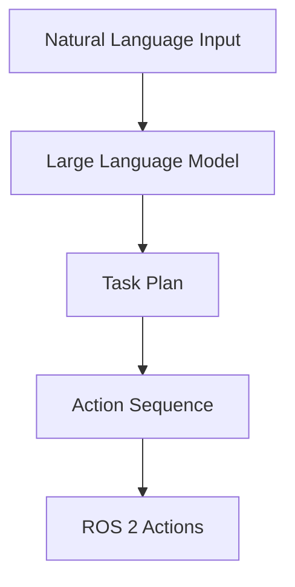
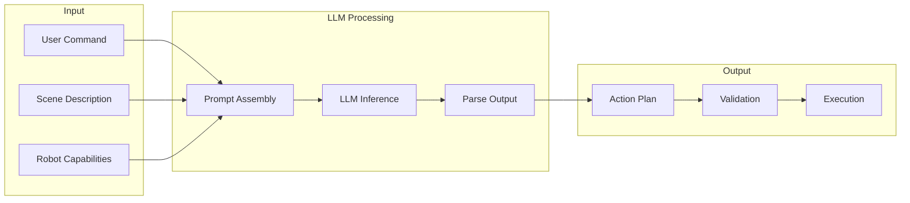

# Chapter 3: Cognitive Planning with LLMs

## Learning Objectives

By the end of this chapter, you will be able to:

- Understand **LLM-based task planning** for robotics
- Design effective **prompts for robot task generation**
- Implement **task decomposition** and sequencing
- Translate **LLM outputs to ROS 2 actions**
- Handle **grounding** of language in robot capabilities

## Introduction to Cognitive Planning

**Cognitive planning** uses LLMs to bridge the gap between natural language instructions and executable robot actions. The LLM serves as a reasoning engine that understands context, decomposes tasks, and generates action sequences.

### LLM Planning Architecture



## LLMs as Robot Task Planners

LLMs excel at task planning because they encode vast amounts of world knowledge and can reason about complex scenarios.

### Why LLMs for Planning?

| Capability | Traditional Planner | LLM Planner |
|------------|---------------------|-------------|
| **Domain knowledge** | Hand-coded | Learned from data |
| **Novel situations** | Fails | Generalizes |
| **Natural language** | Requires parser | Native |
| **Common sense** | Missing | Built-in |
| **Explainability** | Limited | Natural language |

### LLM Planning Pipeline



## Prompt Engineering for Robotics

Effective prompts are crucial for reliable robot planning.

### Prompt Components

| Component | Purpose | Example |
|-----------|---------|---------|
| **System context** | Define robot role | "You are a helpful household robot..." |
| **Capabilities** | Available actions | "You can: navigate, pick, place, speak" |
| **Constraints** | Safety limits | "Never enter rooms with closed doors" |
| **Scene** | Current state | "You are in living room, cup is on table" |
| **Task** | User command | "Bring me the cup" |
| **Output format** | Structured response | "Return JSON with action steps" |

### Example Planning Prompt

```python
ROBOT_SYSTEM_PROMPT = """You are a household humanoid robot assistant.

CAPABILITIES:
- navigate_to(location): Move to a named location
- pick_object(object_name): Pick up an object
- place_object(location): Place held object at location
- speak(message): Say something to the user
- wait(seconds): Wait for specified time
- look_at(target): Turn to face target

CONSTRAINTS:
- You can only hold one object at a time
- You must be near an object to pick it up
- You cannot pick up objects that are too heavy (>5kg)
- Always confirm before performing potentially dangerous actions

LOCATIONS YOU KNOW:
- kitchen, living_room, bedroom, bathroom, entrance

OUTPUT FORMAT:
Return a JSON object with:
{
  "understanding": "Brief interpretation of the command",
  "plan": [
    {"action": "action_name", "params": {...}, "reason": "why this step"}
  ],
  "success_criteria": "How to know task is complete"
}
"""
```

### Task-Specific Prompts

```python
def create_planning_prompt(command: str, scene: dict, history: list) -> str:
    """Assemble a complete planning prompt"""

    scene_description = f"""
CURRENT SCENE:
- Robot location: {scene['robot_location']}
- Holding: {scene.get('holding', 'nothing')}
- Visible objects: {', '.join(scene['visible_objects'])}
- Nearby locations: {', '.join(scene['nearby_locations'])}
"""

    history_text = ""
    if history:
        history_text = "\nRECENT ACTIONS:\n"
        for h in history[-5:]:  # Last 5 actions
            history_text += f"- {h['action']}: {h['result']}\n"

    user_prompt = f"""
{scene_description}
{history_text}
USER COMMAND: {command}

Generate a step-by-step plan to accomplish this task.
"""

    return user_prompt
```

## Task Decomposition and Sequencing

Complex tasks must be broken into executable steps.

### Decomposition Strategies

| Strategy | Description | Example |
|----------|-------------|---------|
| **Hierarchical** | High-level to low-level | "Make coffee" → "Get cup" → "Navigate to cabinet" |
| **Temporal** | Sequential ordering | Step 1, Step 2, Step 3... |
| **Conditional** | Branch on conditions | "If cup is dirty, wash it first" |
| **Parallel** | Concurrent actions | "Navigate while scanning for obstacles" |

### LLM Task Decomposition

```python
import openai
import json
from typing import List, Dict

class LLMTaskPlanner:
    def __init__(self, model: str = "gpt-4"):
        self.client = openai.OpenAI()
        self.model = model

    def decompose_task(self, command: str, scene: dict) -> List[Dict]:
        """Decompose a high-level command into executable steps"""

        prompt = create_planning_prompt(command, scene, [])

        response = self.client.chat.completions.create(
            model=self.model,
            messages=[
                {"role": "system", "content": ROBOT_SYSTEM_PROMPT},
                {"role": "user", "content": prompt}
            ],
            response_format={"type": "json_object"},
            temperature=0.2  # Low temperature for consistency
        )

        result = json.loads(response.choices[0].message.content)
        return result['plan']

    def replan_on_failure(self, original_plan: List[Dict],
                          failed_step: int, error: str,
                          current_scene: dict) -> List[Dict]:
        """Generate new plan after a failure"""

        prompt = f"""
The robot was executing a plan but encountered an error.

ORIGINAL PLAN:
{json.dumps(original_plan, indent=2)}

FAILED AT STEP {failed_step}:
{json.dumps(original_plan[failed_step])}

ERROR: {error}

CURRENT SCENE:
{json.dumps(current_scene, indent=2)}

Generate a new plan to complete the original goal, accounting for the failure.
"""

        response = self.client.chat.completions.create(
            model=self.model,
            messages=[
                {"role": "system", "content": ROBOT_SYSTEM_PROMPT},
                {"role": "user", "content": prompt}
            ],
            response_format={"type": "json_object"},
            temperature=0.3
        )

        result = json.loads(response.choices[0].message.content)
        return result['plan']
```

### Example Decomposition

**Command**: "Make me a cup of coffee"

**LLM Output**:
```json
{
  "understanding": "User wants coffee prepared and brought to them",
  "plan": [
    {
      "action": "navigate_to",
      "params": {"location": "kitchen"},
      "reason": "Coffee machine is in kitchen"
    },
    {
      "action": "look_at",
      "params": {"target": "coffee_machine"},
      "reason": "Locate the coffee machine"
    },
    {
      "action": "pick_object",
      "params": {"object_name": "empty_mug"},
      "reason": "Need a mug for coffee"
    },
    {
      "action": "place_object",
      "params": {"location": "coffee_machine_tray"},
      "reason": "Position mug under dispenser"
    },
    {
      "action": "interact",
      "params": {"target": "coffee_machine", "action": "brew"},
      "reason": "Start brewing coffee"
    },
    {
      "action": "wait",
      "params": {"seconds": 60},
      "reason": "Wait for coffee to brew"
    },
    {
      "action": "pick_object",
      "params": {"object_name": "filled_mug"},
      "reason": "Pick up the brewed coffee"
    },
    {
      "action": "navigate_to",
      "params": {"location": "user_location"},
      "reason": "Bring coffee to user"
    },
    {
      "action": "speak",
      "params": {"message": "Here is your coffee!"},
      "reason": "Notify user of completion"
    }
  ],
  "success_criteria": "User has received the coffee mug"
}
```

## LLM-to-ROS 2 Action Translation

Convert LLM plan steps into executable ROS 2 actions.

### Action Registry

```python
from dataclasses import dataclass
from typing import Callable, Dict, Any
import rclpy
from rclpy.action import ActionClient
from nav2_msgs.action import NavigateToPose

@dataclass
class RobotAction:
    name: str
    action_client: ActionClient
    goal_factory: Callable[[Dict], Any]
    timeout: float = 30.0

class ActionRegistry:
    def __init__(self, node):
        self.node = node
        self.actions: Dict[str, RobotAction] = {}
        self._register_default_actions()

    def _register_default_actions(self):
        """Register available robot actions"""

        # Navigation
        nav_client = ActionClient(
            self.node, NavigateToPose, 'navigate_to_pose'
        )
        self.register('navigate_to', nav_client, self._make_nav_goal)

        # Add more actions...
        # self.register('pick_object', pick_client, self._make_pick_goal)
        # self.register('place_object', place_client, self._make_place_goal)

    def register(self, name: str, client: ActionClient,
                 goal_factory: Callable):
        self.actions[name] = RobotAction(
            name=name,
            action_client=client,
            goal_factory=goal_factory
        )

    def _make_nav_goal(self, params: Dict) -> NavigateToPose.Goal:
        """Create navigation goal from parameters"""
        goal = NavigateToPose.Goal()
        # Convert location name to coordinates
        coords = self.node.location_db.get(params['location'])
        goal.pose.header.frame_id = 'map'
        goal.pose.pose.position.x = coords['x']
        goal.pose.pose.position.y = coords['y']
        return goal

    async def execute(self, action_name: str, params: Dict) -> bool:
        """Execute an action by name"""
        if action_name not in self.actions:
            self.node.get_logger().error(f'Unknown action: {action_name}')
            return False

        action = self.actions[action_name]

        if not action.action_client.wait_for_server(timeout_sec=5.0):
            self.node.get_logger().error(f'Action server not available: {action_name}')
            return False

        goal = action.goal_factory(params)
        result = await action.action_client.send_goal_async(goal)

        return result.accepted
```

### Plan Executor

```python
import asyncio
from typing import List, Dict

class PlanExecutor:
    def __init__(self, action_registry: ActionRegistry, planner: LLMTaskPlanner):
        self.registry = action_registry
        self.planner = planner
        self.execution_history = []

    async def execute_plan(self, plan: List[Dict], scene_updater) -> bool:
        """Execute a plan step by step"""

        for i, step in enumerate(plan):
            action = step['action']
            params = step['params']

            self.registry.node.get_logger().info(
                f"Executing step {i+1}/{len(plan)}: {action}"
            )

            try:
                success = await self.registry.execute(action, params)

                self.execution_history.append({
                    'step': i,
                    'action': action,
                    'params': params,
                    'result': 'success' if success else 'failed'
                })

                if not success:
                    # Attempt replanning
                    current_scene = await scene_updater.get_current_scene()
                    new_plan = self.planner.replan_on_failure(
                        plan, i, "Action failed", current_scene
                    )
                    return await self.execute_plan(new_plan, scene_updater)

            except Exception as e:
                self.registry.node.get_logger().error(f"Error: {e}")
                return False

        return True
```

## Grounding Language in Robot Capabilities

LLMs must understand what the robot can actually do.

### Capability Constraints

```python
class CapabilityGrounder:
    def __init__(self, robot_config: dict):
        self.capabilities = robot_config['capabilities']
        self.limits = robot_config['limits']

    def create_capability_prompt(self) -> str:
        """Generate capability description for LLM"""

        lines = ["ROBOT CAPABILITIES:"]

        for cap in self.capabilities:
            lines.append(f"- {cap['name']}: {cap['description']}")
            if 'parameters' in cap:
                for param, desc in cap['parameters'].items():
                    lines.append(f"    - {param}: {desc}")

        lines.append("\nLIMITATIONS:")
        for limit in self.limits:
            lines.append(f"- {limit}")

        return "\n".join(lines)

    def validate_plan(self, plan: List[Dict]) -> List[str]:
        """Check if plan is within robot capabilities"""
        errors = []

        for i, step in enumerate(plan):
            action = step['action']

            # Check if action exists
            if action not in [c['name'] for c in self.capabilities]:
                errors.append(f"Step {i}: Unknown action '{action}'")
                continue

            # Check parameters
            cap = next(c for c in self.capabilities if c['name'] == action)
            required_params = cap.get('required_parameters', [])

            for param in required_params:
                if param not in step.get('params', {}):
                    errors.append(f"Step {i}: Missing parameter '{param}'")

        return errors
```

### Object Grounding

```python
class ObjectGrounder:
    def __init__(self, perception_system):
        self.perception = perception_system

    async def ground_object_reference(self, object_description: str) -> dict:
        """Convert natural language object reference to detected object"""

        # Get current detections
        detections = await self.perception.get_detections()

        # Use LLM to match description to detection
        prompt = f"""
Given these detected objects:
{json.dumps(detections, indent=2)}

Which object best matches: "{object_description}"?

Return JSON with:
- matched_object_id: ID of the matching object or null
- confidence: 0-1 confidence score
- reasoning: Brief explanation
"""

        response = self.llm.complete(prompt)
        result = json.loads(response)

        if result['matched_object_id'] and result['confidence'] > 0.7:
            return detections[result['matched_object_id']]

        return None
```

## Local LLM Alternatives

For privacy, latency, or cost reasons, use local LLMs.

### Ollama Integration

```python
import requests

class OllamaPlanner:
    def __init__(self, model: str = "llama3.1:8b", host: str = "localhost:11434"):
        self.model = model
        self.base_url = f"http://{host}/api"

    def generate_plan(self, system_prompt: str, user_prompt: str) -> dict:
        """Generate plan using local Ollama model"""

        response = requests.post(
            f"{self.base_url}/generate",
            json={
                "model": self.model,
                "prompt": user_prompt,
                "system": system_prompt,
                "format": "json",
                "stream": False,
                "options": {
                    "temperature": 0.2,
                    "num_predict": 1000
                }
            }
        )

        result = response.json()
        return json.loads(result['response'])
```

### Model Comparison for Robotics

| Model | Size | Speed | Planning Quality | Local? |
|-------|------|-------|------------------|--------|
| GPT-4 | - | Medium | Excellent | No |
| Claude 3.5 | - | Medium | Excellent | No |
| Llama 3.1 70B | 70B | Slow | Good | Yes |
| Llama 3.1 8B | 8B | Fast | Moderate | Yes |
| Mistral 7B | 7B | Fast | Moderate | Yes |

## Summary

### Key Takeaways

1. **LLMs enable** flexible, natural language-based robot planning
2. **Prompt engineering** is critical for reliable plan generation
3. **Task decomposition** breaks complex commands into executable steps
4. **Action translation** converts LLM outputs to ROS 2 actions
5. **Grounding** ensures plans match robot capabilities
6. **Local LLMs** provide privacy and cost benefits

### What's Next

In [Chapter 4](./chapter-4-capstone), we'll build the capstone project:
- Integrating all VLA components
- End-to-end autonomous humanoid system
- Voice to manipulation pipeline
