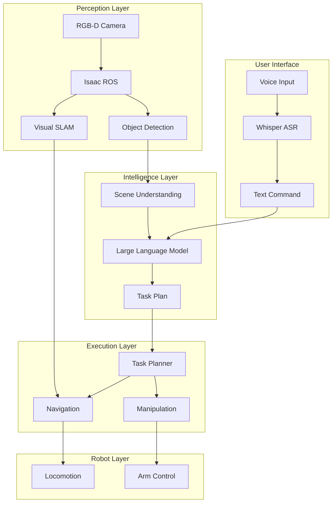
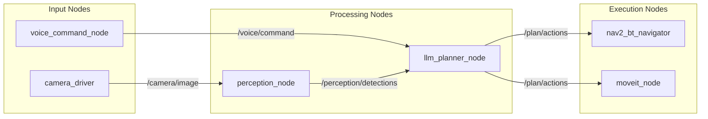
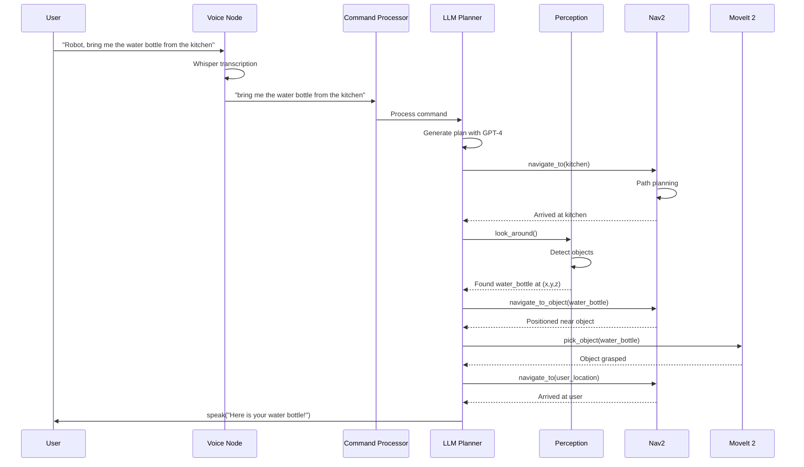

# Chapter 4: Capstone - The Autonomous Humanoid

## Learning Objectives

By the end of this chapter, you will be able to:

- **Design** a complete VLA system architecture
- **Integrate** voice, vision, planning, and action components
- **Build** an end-to-end autonomous humanoid pipeline
- **Deploy** and test the complete system

## Capstone Project Overview

This capstone brings together everything from the entire book: ROS 2 fundamentals, digital twins, NVIDIA Isaac perception, and VLA intelligence. We'll build a complete autonomous humanoid that can receive voice commands and execute complex tasks.

### System Goals

| Goal | Description |
|------|-------------|
| **Voice interaction** | Natural language commands via speech |
| **Intelligent planning** | LLM-based task decomposition |
| **Visual perception** | Object detection and scene understanding |
| **Autonomous navigation** | Nav2-based movement |
| **Manipulation** | Object interaction capabilities |

### Complete System Architecture



## System Architecture Design

### Component Overview

| Component | Technology | Role |
|-----------|------------|------|
| **Speech Recognition** | Whisper | Voice to text |
| **Language Model** | GPT-4 / Local LLM | Planning and reasoning |
| **Object Detection** | Isaac ROS + YOLO | Visual perception |
| **Navigation** | Nav2 | Autonomous movement |
| **Manipulation** | MoveIt 2 | Arm control |
| **State Management** | ROS 2 | Component coordination |

### ROS 2 Node Architecture



## Voice Input and Language Processing

### Voice Command Pipeline

```python
import rclpy
from rclpy.node import Node
from std_msgs.msg import String
import whisper
import numpy as np
import sounddevice as sd

class VoiceInputNode(Node):
    def __init__(self):
        super().__init__('voice_input_node')

        # Load Whisper model
        self.whisper_model = whisper.load_model("base")

        # Publisher for transcribed commands
        self.command_pub = self.create_publisher(
            String, '/voice/command', 10
        )

        # Audio parameters
        self.sample_rate = 16000
        self.recording_duration = 5.0  # seconds

        # Wake word detection (simple keyword)
        self.wake_word = "robot"

        self.get_logger().info('Voice input node initialized')

    def record_audio(self) -> np.ndarray:
        """Record audio from microphone"""
        self.get_logger().info('Recording...')
        audio = sd.rec(
            int(self.recording_duration * self.sample_rate),
            samplerate=self.sample_rate,
            channels=1,
            dtype='float32'
        )
        sd.wait()
        return audio.flatten()

    def transcribe(self, audio: np.ndarray) -> str:
        """Transcribe audio using Whisper"""
        result = self.whisper_model.transcribe(audio)
        return result["text"].strip()

    def process_command(self):
        """Main processing loop"""
        audio = self.record_audio()
        text = self.transcribe(audio)

        self.get_logger().info(f'Transcribed: {text}')

        # Check for wake word
        if self.wake_word.lower() in text.lower():
            # Publish command (remove wake word)
            command = text.lower().replace(self.wake_word.lower(), '').strip()
            msg = String()
            msg.data = command
            self.command_pub.publish(msg)
            self.get_logger().info(f'Published command: {command}')
            return command

        return None
```

### Command Processing Service

```python
from std_srvs.srv import Trigger
from custom_msgs.srv import ProcessCommand  # Custom service

class CommandProcessorNode(Node):
    def __init__(self):
        super().__init__('command_processor_node')

        # Subscribe to voice commands
        self.command_sub = self.create_subscription(
            String, '/voice/command', self.command_callback, 10
        )

        # Service for manual command input
        self.command_srv = self.create_service(
            ProcessCommand, '/process_command', self.process_command_srv
        )

        # Publisher for parsed intents
        self.intent_pub = self.create_publisher(
            String, '/command/intent', 10
        )

    def command_callback(self, msg):
        """Handle voice commands"""
        command = msg.data
        self.get_logger().info(f'Received command: {command}')
        self.process_command(command)

    def process_command_srv(self, request, response):
        """Service handler for commands"""
        result = self.process_command(request.command)
        response.success = result is not None
        response.intent = result if result else ""
        return response

    def process_command(self, command: str) -> str:
        """Process and publish command intent"""
        # Intent will be processed by LLM planner
        msg = String()
        msg.data = command
        self.intent_pub.publish(msg)
        return command
```

## LLM Planning and Task Decomposition

### Central Planner Node

```python
import json
import openai
from rclpy.action import ActionClient
from nav2_msgs.action import NavigateToPose
from std_msgs.msg import String

class LLMPlannerNode(Node):
    def __init__(self):
        super().__init__('llm_planner_node')

        # OpenAI client
        self.llm_client = openai.OpenAI()
        self.model = "gpt-4"

        # Subscribe to commands and perception
        self.command_sub = self.create_subscription(
            String, '/command/intent', self.command_callback, 10
        )
        self.detection_sub = self.create_subscription(
            String, '/perception/detections', self.detection_callback, 10
        )

        # Action clients
        self.nav_client = ActionClient(
            self, NavigateToPose, 'navigate_to_pose'
        )

        # State
        self.current_detections = []
        self.robot_location = "living_room"
        self.locations = {
            'kitchen': {'x': 5.0, 'y': 2.0},
            'living_room': {'x': 0.0, 'y': 0.0},
            'bedroom': {'x': -3.0, 'y': 4.0},
        }

        self.get_logger().info('LLM Planner node initialized')

    def detection_callback(self, msg):
        """Update current detections"""
        self.current_detections = json.loads(msg.data)

    def command_callback(self, msg):
        """Process command and generate plan"""
        command = msg.data
        self.get_logger().info(f'Planning for: {command}')

        # Generate plan using LLM
        plan = self.generate_plan(command)

        if plan:
            # Execute plan
            self.execute_plan(plan)

    def generate_plan(self, command: str) -> list:
        """Use LLM to generate action plan"""

        system_prompt = """You are a household humanoid robot assistant.

CAPABILITIES:
- navigate_to(location): Move to kitchen, living_room, or bedroom
- pick_object(object_name): Pick up an object
- place_object(location): Place held object
- speak(message): Say something
- look_around(): Scan environment for objects

CURRENT STATE:
- Location: {location}
- Detected objects: {objects}

OUTPUT FORMAT:
Return a JSON object with:
{{
  "understanding": "Brief interpretation",
  "plan": [
    {{"action": "action_name", "params": {{}}, "reason": "why"}}
  ]
}}
""".format(
            location=self.robot_location,
            objects=self.current_detections
        )

        try:
            response = self.llm_client.chat.completions.create(
                model=self.model,
                messages=[
                    {"role": "system", "content": system_prompt},
                    {"role": "user", "content": f"Command: {command}"}
                ],
                response_format={"type": "json_object"},
                temperature=0.2
            )

            result = json.loads(response.choices[0].message.content)
            self.get_logger().info(f'Plan: {result["understanding"]}')
            return result['plan']

        except Exception as e:
            self.get_logger().error(f'Planning failed: {e}')
            return None

    def execute_plan(self, plan: list):
        """Execute each step in the plan"""
        for i, step in enumerate(plan):
            action = step['action']
            params = step['params']

            self.get_logger().info(
                f'Step {i+1}: {action} - {step["reason"]}'
            )

            if action == 'navigate_to':
                self.execute_navigation(params['location'])
            elif action == 'pick_object':
                self.execute_pick(params['object_name'])
            elif action == 'speak':
                self.execute_speak(params['message'])
            elif action == 'look_around':
                self.execute_look_around()

    def execute_navigation(self, location: str):
        """Send navigation goal"""
        if location not in self.locations:
            self.get_logger().warn(f'Unknown location: {location}')
            return

        coords = self.locations[location]

        goal = NavigateToPose.Goal()
        goal.pose.header.frame_id = 'map'
        goal.pose.header.stamp = self.get_clock().now().to_msg()
        goal.pose.pose.position.x = coords['x']
        goal.pose.pose.position.y = coords['y']

        self.get_logger().info(f'Navigating to {location}')
        future = self.nav_client.send_goal_async(goal)
        rclpy.spin_until_future_complete(self, future)

        self.robot_location = location

    def execute_pick(self, object_name: str):
        """Trigger manipulation to pick object"""
        self.get_logger().info(f'Picking up: {object_name}')
        # Would call MoveIt 2 action here

    def execute_speak(self, message: str):
        """Text-to-speech output"""
        self.get_logger().info(f'Speaking: {message}')
        # Would call TTS service here

    def execute_look_around(self):
        """Trigger perception scan"""
        self.get_logger().info('Scanning environment...')
        # Would trigger camera pan/scan here
```

## Navigation and Visual Perception Integration

### Perception Node with Isaac ROS

```python
from sensor_msgs.msg import Image
from vision_msgs.msg import Detection2DArray
from cv_bridge import CvBridge
import json

class PerceptionNode(Node):
    def __init__(self):
        super().__init__('perception_node')

        self.bridge = CvBridge()

        # Subscribe to camera and detections
        self.image_sub = self.create_subscription(
            Image, '/camera/color/image_raw', self.image_callback, 10
        )
        self.detection_sub = self.create_subscription(
            Detection2DArray, '/detectnet/detections',
            self.detection_callback, 10
        )

        # Publisher for scene understanding
        self.scene_pub = self.create_publisher(
            String, '/perception/detections', 10
        )

        self.current_detections = []
        self.get_logger().info('Perception node initialized')

    def image_callback(self, msg):
        """Process incoming images"""
        # Image processing would happen here
        pass

    def detection_callback(self, msg):
        """Process object detections from Isaac ROS"""
        detections = []

        for detection in msg.detections:
            det = {
                'class': detection.results[0].hypothesis.class_id,
                'confidence': detection.results[0].hypothesis.score,
                'bbox': {
                    'x': detection.bbox.center.position.x,
                    'y': detection.bbox.center.position.y,
                    'width': detection.bbox.size_x,
                    'height': detection.bbox.size_y
                }
            }
            detections.append(det)

        self.current_detections = detections

        # Publish scene understanding
        msg = String()
        msg.data = json.dumps(detections)
        self.scene_pub.publish(msg)

    def get_object_location(self, object_name: str) -> dict:
        """Get 3D location of detected object"""
        for det in self.current_detections:
            if object_name.lower() in det['class'].lower():
                # Would compute 3D position from depth here
                return {
                    'found': True,
                    'position': {'x': 1.0, 'y': 0.5, 'z': 0.8}
                }
        return {'found': False}
```

### Navigation Integration

```python
from nav2_msgs.action import NavigateToPose
from geometry_msgs.msg import PoseStamped
from action_msgs.msg import GoalStatus

class NavigationManager:
    def __init__(self, node):
        self.node = node
        self.nav_client = ActionClient(
            node, NavigateToPose, 'navigate_to_pose'
        )

        # Wait for navigation server
        self.nav_client.wait_for_server()
        self.node.get_logger().info('Navigation ready')

    async def navigate_to_pose(self, x: float, y: float,
                               theta: float = 0.0) -> bool:
        """Navigate to specified pose"""

        goal = NavigateToPose.Goal()
        goal.pose.header.frame_id = 'map'
        goal.pose.header.stamp = self.node.get_clock().now().to_msg()
        goal.pose.pose.position.x = x
        goal.pose.pose.position.y = y

        # Set orientation from theta
        goal.pose.pose.orientation.z = np.sin(theta / 2)
        goal.pose.pose.orientation.w = np.cos(theta / 2)

        self.node.get_logger().info(f'Navigating to ({x}, {y})')

        # Send goal
        goal_handle = await self.nav_client.send_goal_async(goal)

        if not goal_handle.accepted:
            self.node.get_logger().error('Navigation goal rejected')
            return False

        # Wait for result
        result = await goal_handle.get_result_async()

        if result.status == GoalStatus.STATUS_SUCCEEDED:
            self.node.get_logger().info('Navigation succeeded')
            return True
        else:
            self.node.get_logger().warn('Navigation failed')
            return False

    async def navigate_to_object(self, object_name: str,
                                  perception: PerceptionNode) -> bool:
        """Navigate near a detected object"""

        location = perception.get_object_location(object_name)

        if not location['found']:
            self.node.get_logger().warn(f'Object not found: {object_name}')
            return False

        # Navigate to position in front of object
        pos = location['position']
        approach_distance = 0.5  # meters

        target_x = pos['x'] - approach_distance
        target_y = pos['y']

        return await self.navigate_to_pose(target_x, target_y)
```

## Manipulation and Task Execution

### Manipulation Interface

```python
from moveit_msgs.action import MoveGroup
from geometry_msgs.msg import Pose

class ManipulationManager:
    def __init__(self, node):
        self.node = node

        # MoveIt action client
        self.moveit_client = ActionClient(
            node, MoveGroup, 'move_action'
        )

        # Predefined poses
        self.poses = {
            'home': self._create_pose(0.3, 0.0, 0.5, 0, 0, 0, 1),
            'pre_grasp': self._create_pose(0.5, 0.0, 0.3, 0, 0.707, 0, 0.707),
            'place': self._create_pose(0.4, 0.2, 0.4, 0, 0, 0, 1),
        }

        self.node.get_logger().info('Manipulation ready')

    def _create_pose(self, x, y, z, qx, qy, qz, qw) -> Pose:
        """Create a Pose message"""
        pose = Pose()
        pose.position.x = x
        pose.position.y = y
        pose.position.z = z
        pose.orientation.x = qx
        pose.orientation.y = qy
        pose.orientation.z = qz
        pose.orientation.w = qw
        return pose

    async def move_to_pose(self, pose_name: str) -> bool:
        """Move arm to predefined pose"""
        if pose_name not in self.poses:
            self.node.get_logger().error(f'Unknown pose: {pose_name}')
            return False

        target_pose = self.poses[pose_name]
        self.node.get_logger().info(f'Moving to pose: {pose_name}')

        # Would send MoveIt goal here
        return True

    async def pick_object(self, object_pose: Pose) -> bool:
        """Pick up object at given pose"""
        self.node.get_logger().info('Executing pick sequence')

        # 1. Move to pre-grasp
        await self.move_to_pose('pre_grasp')

        # 2. Approach object
        # Would compute approach trajectory

        # 3. Close gripper
        # Would call gripper service

        # 4. Lift
        # Would execute lift motion

        return True

    async def place_object(self, target_pose: Pose) -> bool:
        """Place object at target pose"""
        self.node.get_logger().info('Executing place sequence')

        # 1. Move to place pose
        await self.move_to_pose('place')

        # 2. Open gripper
        # Would call gripper service

        # 3. Retreat
        await self.move_to_pose('home')

        return True
```

## End-to-End Demo Walkthrough

### Complete System Launch

```python
# autonomous_humanoid.py - Main entry point

import rclpy
from rclpy.executors import MultiThreadedExecutor

def main():
    rclpy.init()

    # Create nodes
    voice_node = VoiceInputNode()
    processor_node = CommandProcessorNode()
    planner_node = LLMPlannerNode()
    perception_node = PerceptionNode()

    # Use multi-threaded executor
    executor = MultiThreadedExecutor(num_threads=4)
    executor.add_node(voice_node)
    executor.add_node(processor_node)
    executor.add_node(planner_node)
    executor.add_node(perception_node)

    try:
        executor.spin()
    except KeyboardInterrupt:
        pass
    finally:
        executor.shutdown()
        rclpy.shutdown()

if __name__ == '__main__':
    main()
```

### Launch File

```python
# launch/autonomous_humanoid.launch.py

from launch import LaunchDescription
from launch_ros.actions import Node

def generate_launch_description():
    return LaunchDescription([
        # Voice input
        Node(
            package='humanoid_vla',
            executable='voice_input_node',
            name='voice_input',
            output='screen',
        ),

        # Command processor
        Node(
            package='humanoid_vla',
            executable='command_processor_node',
            name='command_processor',
            output='screen',
        ),

        # LLM Planner
        Node(
            package='humanoid_vla',
            executable='llm_planner_node',
            name='llm_planner',
            output='screen',
            parameters=[{
                'llm_model': 'gpt-4',
                'temperature': 0.2,
            }],
        ),

        # Perception
        Node(
            package='humanoid_vla',
            executable='perception_node',
            name='perception',
            output='screen',
        ),

        # Include Nav2
        # IncludeLaunchDescription(
        #     PythonLaunchDescriptionSource('nav2_bringup/launch/navigation_launch.py')
        # ),
    ])
```

### Demo Scenario

**Scenario**: User says "Robot, bring me the water bottle from the kitchen"



### Testing the System

```bash
# Terminal 1: Launch the system
ros2 launch humanoid_vla autonomous_humanoid.launch.py

# Terminal 2: Monitor topics
ros2 topic echo /voice/command
ros2 topic echo /perception/detections
ros2 topic echo /plan/actions

# Terminal 3: Send test command manually
ros2 service call /process_command custom_msgs/srv/ProcessCommand \
  "{command: 'go to the kitchen and find the red cup'}"
```

## Summary

### What We Built

This capstone integrates all four modules of the book:

| Module | Contribution |
|--------|--------------|
| **Module 1: ROS 2** | Node architecture, topics, actions, services |
| **Module 2: Digital Twin** | Simulation and testing environment |
| **Module 3: NVIDIA Isaac** | Visual perception and navigation |
| **Module 4: VLA** | Voice input, LLM planning, task execution |

### Key Takeaways

1. **VLA architecture** enables natural human-robot interaction
2. **LLMs provide** flexible reasoning and task decomposition
3. **Integration requires** careful coordination between components
4. **ROS 2** provides the communication infrastructure
5. **End-to-end testing** is essential for complex systems

### Future Directions

| Area | Potential Enhancement |
|------|----------------------|
| **Learning** | Fine-tune LLM on robot-specific tasks |
| **Perception** | Add 3D scene graphs for better understanding |
| **Manipulation** | Implement learned grasp policies |
| **Safety** | Add action validation and safety constraints |
| **Multi-robot** | Coordinate multiple humanoids |

### Congratulations!

You've completed the journey from ROS 2 basics to building an autonomous humanoid with VLA capabilities. The skills you've learned provide a foundation for building the next generation of intelligent robots.
