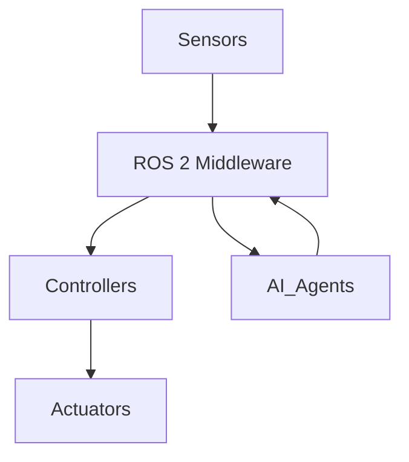

# Implementation Plan: Module 1 – The Robotic Nervous System (ROS 2)

**Branch**: `module-1-ros2` | **Date**: 2025-12-17 | **Spec**: [spec.md](./spec.md)
**Input**: Feature specification from `/specs/module-1-ros2/spec.md`

## Summary

Create Module 1 book content for "The Robotic Nervous System (ROS 2)" as Markdown files
within a Docusaurus static site. The module teaches ROS 2 fundamentals using a biological
analogy, covering nodes/topics/services, communication patterns, Python AI agent integration,
and URDF files. All content will be authored as `.md` files with embedded Mermaid diagrams,
rendered via Docusaurus on GitHub Pages.

## Technical Context

**Language/Version**: Markdown (MDX compatible), JavaScript/TypeScript (Docusaurus)
**Primary Dependencies**: Docusaurus 3.x, @docusaurus/preset-classic, @docusaurus/theme-mermaid
**Storage**: Git repository (file-based content)
**Testing**: Docusaurus build (`npm run build`), manual Mermaid diagram verification
**Target Platform**: GitHub Pages (static hosting)
**Project Type**: Static documentation site (Docusaurus)
**Performance Goals**: Fast page loads (<2s), SEO-friendly, mobile-responsive
**Constraints**: GitHub Pages free tier, no server-side rendering
**Scale/Scope**: 1 module, 4 chapters, ~15-20 pages of content

## Constitution Check

*GATE: Must pass before implementation.*

| Principle | Status | Evidence |
|-----------|--------|----------|
| I. Spec-First | ✅ PASS | spec.md created and reviewed before this plan |
| II. Technical Accuracy | ✅ PASS | Code examples from spec are runnable ROS 2 Humble code |
| III. Reproducibility | ✅ PASS | Docusaurus is open-source; `npx create-docusaurus` is reproducible |
| IV. Modular Architecture | ✅ PASS | Module 1 is self-contained in `docs/module-1-ros2/` |
| V. Grounded Context | N/A | RAG chatbot not implemented in this phase |
| VI. Free-Tier | ✅ PASS | GitHub Pages is free; Docusaurus is open-source |

**Quality Gates Applicable**:
- Build Gate: `npm run build` must succeed
- Deploy Gate: GitHub Pages deployment must succeed
- Code Gate: Python examples must be syntactically correct (runtime testing deferred)

## Project Structure

### Documentation (this feature)

```text
specs/module-1-ros2/
├── spec.md              # Feature specification
├── plan.md              # This file
└── tasks.md             # Task list (created by /sp.tasks)
```

### Source Code (Docusaurus site)

```text
my-site/                          # Docusaurus project root
├── docs/
│   └── module-1-ros2/
│       ├── introduction.md       # Module introduction and overview
│       ├── chapter-1-ros2-nervous-system.md
│       ├── chapter-2-node-communication.md
│       ├── chapter-3-python-ai-agents.md
│       └── chapter-4-urdf-files.md
├── src/
│   └── css/
│       └── custom.css           # Optional custom styles
├── static/
│   └── img/                     # Static images if needed
├── docusaurus.config.js         # Site configuration (enable Mermaid)
├── sidebars.js                  # Sidebar navigation for Module 1
├── package.json
└── README.md
```

**Structure Decision**: Docusaurus "classic" preset with docs-only mode. All Module 1
content lives under `docs/module-1-ros2/` for clean URL paths like `/module-1-ros2/chapter-1`.

## Implementation Phases

### Phase 1: Docusaurus Project Setup

**Goal**: Initialize Docusaurus project with Mermaid support.

**Tasks**:
1. Run `npx create-docusaurus@latest my-site classic`
2. Enable Mermaid theme in `docusaurus.config.js`
3. Configure `sidebars.js` for Module 1 navigation
4. Verify build with `npm run build`

**Docusaurus Configuration** (key additions):

```javascript
// docusaurus.config.js
module.exports = {
  // ... other config
  markdown: {
    mermaid: true,
  },
  themes: ['@docusaurus/theme-mermaid'],
};
```

**Sidebar Configuration**:

```javascript
// sidebars.js
module.exports = {
  module1Sidebar: [
    {
      type: 'category',
      label: 'Module 1: ROS 2 Nervous System',
      items: [
        'module-1-ros2/introduction',
        'module-1-ros2/chapter-1-ros2-nervous-system',
        'module-1-ros2/chapter-2-node-communication',
        'module-1-ros2/chapter-3-python-ai-agents',
        'module-1-ros2/chapter-4-urdf-files',
      ],
    },
  ],
};
```

---

### Phase 2: Module 1 Content Creation

**Goal**: Create all chapter Markdown files with learning objectives, content, diagrams,
code examples, and summaries.

**Files to Create**:

| File | Purpose | Key Content |
|------|---------|-------------|
| `introduction.md` | Module overview | Prerequisites, learning outcomes, chapter list |
| `chapter-1-ros2-nervous-system.md` | ROS 2 fundamentals | Biological analogy, nodes/topics/services, history |
| `chapter-2-node-communication.md` | Communication patterns | Topics vs. services, pipeline design |
| `chapter-3-python-ai-agents.md` | Python integration | rclpy tutorial, AI agent example |
| `chapter-4-urdf-files.md` | URDF overview | Links, joints, humanoid example |

**Content Requirements per Chapter**:
- Front matter with `sidebar_position`, `title`, `description`
- Learning Objectives section at top
- Mermaid diagrams where specified in spec
- Code examples with syntax highlighting
- Summary/Key Takeaways section at bottom

---

### Phase 3: Build and Verification

**Goal**: Ensure Docusaurus builds successfully and all content renders correctly.

**Verification Checklist**:
- [ ] `npm run build` completes without errors
- [ ] All Mermaid diagrams render in browser
- [ ] All code blocks have correct syntax highlighting
- [ ] Sidebar navigation works correctly
- [ ] Mobile responsiveness is acceptable

---

## File Specifications

### introduction.md

```markdown
---
sidebar_position: 1
title: "Module 1: The Robotic Nervous System"
description: "Introduction to ROS 2 for humanoid robot development"
---

# Module 1: The Robotic Nervous System (ROS 2)

## Overview

[Module overview from spec]

## Prerequisites

- Python programming experience
- Basic understanding of distributed systems concepts

## Learning Outcomes

By the end of this module, you will be able to:

1. Explain ROS 2's role in robot control
2. Describe why ROS 2 replaced ROS 1
3. Design basic ROS 2 node architectures
4. Communicate via topics and services
5. Bridge Python AI agents to ROS controllers
6. Understand humanoid URDF files

## Chapters

1. [ROS 2 as a Robotic Nervous System](./chapter-1-ros2-nervous-system)
2. [Designing Node Communication Patterns](./chapter-2-node-communication)
3. [Bridging Python AI Agents to ROS 2](./chapter-3-python-ai-agents)
4. [Understanding Humanoid URDF Files](./chapter-4-urdf-files)
```

### chapter-1-ros2-nervous-system.md

```markdown
---
sidebar_position: 2
title: "Chapter 1: ROS 2 as a Robotic Nervous System"
description: "Understanding ROS 2 middleware through the biological nervous system analogy"
---

# Chapter 1: ROS 2 as a Robotic Nervous System

## Learning Objectives

By the end of this chapter, you will be able to:

- Explain what ROS 2 is and its role in robot software
- Describe the biological analogy: sensors → brain → actuators
- Define nodes, topics, and services
- Articulate why ROS 2 replaced ROS 1 (DDS, real-time, security, multi-robot)

[Content from spec Chapter 1 outline...]

## ROS 2 Architecture Diagram



## Summary

[Key takeaways...]
```

---

## Dependencies

### NPM Packages Required

```json
{
  "dependencies": {
    "@docusaurus/core": "^3.0.0",
    "@docusaurus/preset-classic": "^3.0.0",
    "@docusaurus/theme-mermaid": "^3.0.0"
  }
}
```

### Installation Commands

```bash
# Initialize Docusaurus
npx create-docusaurus@latest my-site classic

# Add Mermaid support
cd my-site
npm install @docusaurus/theme-mermaid
```

---

## Complexity Tracking

> No constitution violations. All requirements met with standard Docusaurus setup.

| Aspect | Decision | Rationale |
|--------|----------|-----------|
| Static site generator | Docusaurus | Constitution specifies Docusaurus |
| Diagram format | Mermaid | Version-controllable, spec requirement |
| Content format | Markdown | Standard for Docusaurus, easy to author |

---

## Risk Analysis

| Risk | Likelihood | Impact | Mitigation |
|------|------------|--------|------------|
| Mermaid diagrams don't render | Low | Medium | Test locally before commit |
| Code examples have syntax errors | Medium | Low | Validate Python syntax in IDE |
| GitHub Pages deployment fails | Low | Medium | Test build locally first |

---

## Next Steps

1. Run `/sp.tasks` to generate the task list
2. Execute Phase 1: Initialize Docusaurus project
3. Execute Phase 2: Create Module 1 content files
4. Execute Phase 3: Build verification
