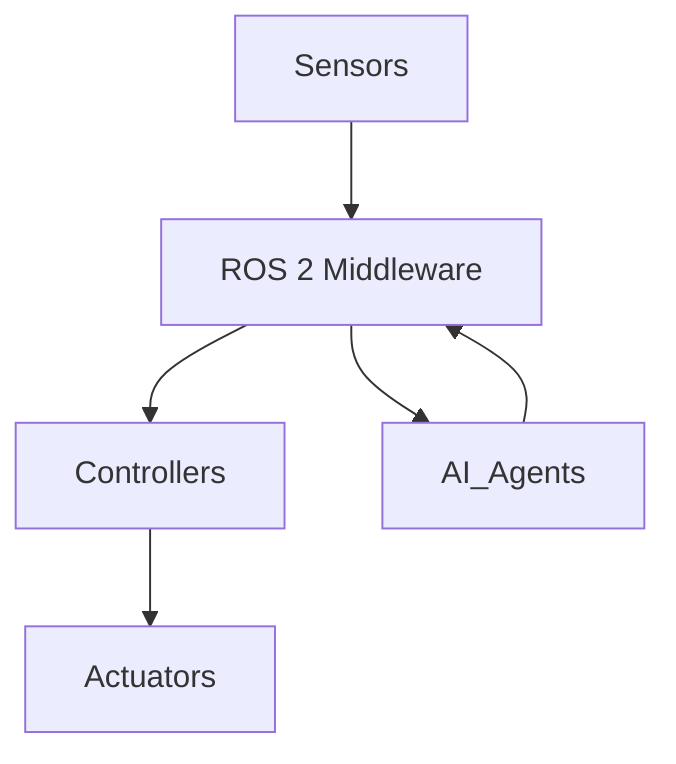
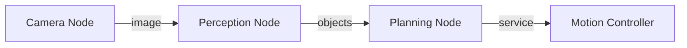
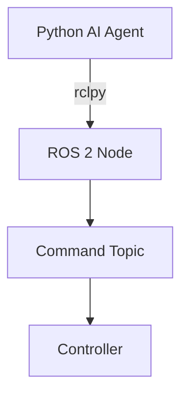

# Feature Specification: Module 1 – The Robotic Nervous System (ROS 2)

**Feature Branch**: `module-1-ros2`
**Created**: 2025-12-17
**Status**: Draft
**Input**: User description: "Module 1 – ROS 2 as the robotic nervous system for humanoid robots"

## Overview

This module introduces ROS 2 (Robot Operating System 2) as the foundational middleware for
humanoid robot development. Using the biological analogy of a "nervous system," the module
teaches readers how ROS 2 connects sensors, AI agents, and actuators in a modular,
production-grade architecture.

**Target Audience**: AI engineers transitioning to robotics, robotics/mechatronics students,
developers building humanoid robots.

**Prerequisites**: Python programming, basic understanding of distributed systems concepts.

## User Scenarios & Testing *(mandatory)*

### User Story 1 - Understand ROS 2 Architecture (Priority: P1)

A reader new to ROS 2 wants to understand what ROS 2 is, why it exists, and how it serves
as middleware connecting robot components. They should grasp the biological analogy and
core concepts (nodes, topics, services) without needing to write code yet.

**Why this priority**: Foundational understanding is required before any hands-on work.
Without conceptual clarity, later chapters will not make sense.

**Independent Test**: Reader can explain ROS 2's role, draw a basic node-topic diagram,
and articulate why ROS 2 replaced ROS 1.

**Acceptance Scenarios**:

1. **Given** a reader with Python background but no ROS experience, **When** they complete
   Chapter 1, **Then** they can explain what nodes, topics, and services are.
2. **Given** the same reader, **When** asked why ROS 2 replaced ROS 1, **Then** they can
   cite DDS, real-time support, and security as key reasons.
3. **Given** a diagram of a robot system, **When** the reader labels it, **Then** they
   correctly identify sensors → ROS 2 middleware → controllers → actuators flow.

---

### User Story 2 - Design Node Communication Patterns (Priority: P2)

A reader wants to design a multi-node ROS 2 system where nodes communicate via topics and
services. They should understand when to use topics (pub/sub) vs. services (request/response)
and be able to sketch communication patterns for perception, planning, and control.

**Why this priority**: After understanding architecture, readers need to design before
implementing. This is the bridge between theory and code.

**Independent Test**: Reader can design a node graph for a camera-perception-planning-motion
pipeline and justify topic vs. service choices.

**Acceptance Scenarios**:

1. **Given** a robot with camera, perception, planning, and motion nodes, **When** the
   reader designs the communication, **Then** they correctly use topics for streaming data
   (images, objects) and services for discrete commands.
2. **Given** the Mermaid diagram from Chapter 2, **When** the reader explains it, **Then**
   they can describe data flow from Camera Node → Perception → Planning → Motion Controller.

---

### User Story 3 - Bridge Python AI Agents to ROS 2 (Priority: P3)

A reader wants to integrate their Python-based AI agent (e.g., LLM-powered decision maker)
with ROS 2 controllers. They should understand rclpy basics and be able to publish commands
from Python to ROS 2 topics.

**Why this priority**: This is the practical outcome that connects AI expertise to robotics.
It enables readers to make their AI agents control robots.

**Independent Test**: Reader can write a minimal Python script using rclpy that publishes
a command to a ROS 2 topic.

**Acceptance Scenarios**:

1. **Given** a Python AI agent and a ROS 2 environment, **When** the reader follows
   Chapter 3, **Then** they can create an rclpy node that publishes to a command topic.
2. **Given** the code example from Chapter 3, **When** executed in a ROS 2 environment,
   **Then** the command is received by a mock controller node.

---

### User Story 4 - Understand Humanoid Robot URDF Files (Priority: P4)

A reader wants to understand how humanoid robot geometry and joints are defined in URDF
(Unified Robot Description Format) files. They should be able to read and interpret a
basic humanoid URDF.

**Why this priority**: URDF knowledge is essential for working with humanoid robots but
builds on prior ROS 2 understanding.

**Independent Test**: Reader can identify links, joints, and their relationships in a
sample humanoid URDF file.

**Acceptance Scenarios**:

1. **Given** a sample humanoid URDF file, **When** the reader examines it, **Then** they
   can identify the root link, joint types (revolute, fixed), and parent-child relationships.
2. **Given** a URDF snippet, **When** asked to describe the robot's arm structure, **Then**
   the reader correctly traces shoulder → elbow → wrist → hand links.

---

### Edge Cases

- What happens when a reader has ROS 1 experience but not ROS 2?
  - Chapter 1 includes a "ROS 1 → ROS 2 Migration" callout box explaining key differences.
- How does the system handle readers without access to real robot hardware?
  - All examples use simulation (Gazebo) or mock nodes; no physical hardware required.
- What if rclpy installation fails on the reader's system?
  - Troubleshooting appendix covers common installation issues on Ubuntu, macOS, Windows.

## Requirements *(mandatory)*

### Functional Requirements

- **FR-001**: Chapter 1 MUST explain ROS 2 as middleware with biological nervous system analogy
- **FR-002**: Chapter 1 MUST define nodes, topics, and services with diagrams
- **FR-003**: Chapter 1 MUST include historical context (ROS 1 → ROS 2 evolution)
- **FR-004**: Chapter 2 MUST demonstrate multi-node communication patterns
- **FR-005**: Chapter 2 MUST include Mermaid diagram of Camera → Perception → Planning → Motion flow
- **FR-006**: Chapter 3 MUST demonstrate Python AI agent integration via rclpy
- **FR-007**: Chapter 3 MUST include runnable code example for publishing to a topic
- **FR-008**: Module MUST include URDF overview for humanoid robots
- **FR-009**: All code examples MUST be tested and runnable in ROS 2 Humble or newer
- **FR-010**: All diagrams MUST use Mermaid syntax for version control compatibility
- **FR-011**: Each chapter MUST include learning objectives, examples, and summary

### Key Entities

- **Node**: A single-purpose computational unit in ROS 2 (e.g., camera driver, perception)
- **Topic**: A named bus for pub/sub message passing between nodes
- **Service**: A request/response mechanism for synchronous communication
- **Message**: A typed data structure passed via topics (e.g., sensor_msgs/Image)
- **URDF**: XML format describing robot geometry, joints, and physical properties

## Chapter Structure

### Chapter 1: ROS 2 as a Robotic Nervous System

**Learning Objectives**:
- Explain what ROS 2 is and its role in robot software
- Describe the biological analogy: sensors → brain → actuators
- Define nodes, topics, and services
- Articulate why ROS 2 replaced ROS 1 (DDS, real-time, security, multi-robot)

**Content Outline**:
1. Introduction: The Need for Robot Middleware
2. Historical Context: From Monolithic to Modular (ROS 1 → ROS 2)
3. The Nervous System Analogy
4. Core Concepts: Nodes, Topics, Services
5. ROS 2 Architecture Diagram (Mermaid)
6. Summary and Key Takeaways

**Diagram**:


---

### Chapter 2: Designing Node Communication Patterns

**Learning Objectives**:
- Design multi-node ROS 2 architectures
- Choose between topics (pub/sub) and services (request/response)
- Trace data flow through a perception-planning-control pipeline

**Content Outline**:
1. Topics vs. Services: When to Use Which
2. Designing a Camera-Perception-Planning-Motion Pipeline
3. Communication Pattern Diagram (Mermaid)
4. Best Practices for Node Design
5. Summary and Key Takeaways

**Diagram**:


---

### Chapter 3: Bridging Python AI Agents to ROS 2

**Learning Objectives**:
- Understand rclpy (ROS 2 Python client library)
- Create a minimal ROS 2 node in Python
- Publish commands from an AI agent to a ROS 2 topic

**Content Outline**:
1. Introduction to rclpy
2. Creating Your First ROS 2 Node in Python
3. Publishing to Topics
4. Integrating an AI Agent (LLM or Policy Model)
5. Code Example: AI Agent → Command Topic → Controller
6. Summary and Key Takeaways

**Diagram**:


**Code Example** (must be runnable):
```python
import rclpy
from rclpy.node import Node
from std_msgs.msg import String

class AIAgentNode(Node):
    def __init__(self):
        super().__init__('ai_agent_node')
        self.publisher_ = self.create_publisher(String, 'command_topic', 10)
        self.timer = self.create_timer(1.0, self.publish_command)

    def publish_command(self):
        msg = String()
        msg.data = 'move_forward'
        self.publisher_.publish(msg)
        self.get_logger().info(f'Published: {msg.data}')

def main(args=None):
    rclpy.init(args=args)
    node = AIAgentNode()
    rclpy.spin(node)
    node.destroy_node()
    rclpy.shutdown()

if __name__ == '__main__':
    main()
```

---

### Chapter 4: Understanding Humanoid URDF Files (Optional/Appendix)

**Learning Objectives**:
- Understand URDF structure (links, joints, visual, collision)
- Read and interpret a humanoid robot URDF
- Identify joint types and kinematic chains

**Content Outline**:
1. What is URDF?
2. URDF Structure: Links and Joints
3. Joint Types: Revolute, Prismatic, Fixed
4. Example: Humanoid Arm URDF
5. Visualizing URDF in RViz
6. Summary and Key Takeaways

## Success Criteria *(mandatory)*

### Measurable Outcomes

- **SC-001**: Reader can explain ROS 2's role in 2 sentences after Chapter 1
- **SC-002**: Reader can draw a 4-node ROS 2 communication diagram after Chapter 2
- **SC-003**: Reader can run the rclpy code example and see output after Chapter 3
- **SC-004**: All code examples execute without modification in ROS 2 Humble environment
- **SC-005**: Module renders correctly in Docusaurus with all Mermaid diagrams visible
- **SC-006**: RAG chatbot can answer questions about ROS 2 concepts from this module

### Constitution Compliance

- ✅ **Principle II (Technical Accuracy)**: All code examples tested and runnable
- ✅ **Principle III (Reproducibility)**: No proprietary dependencies; ROS 2 is open-source
- ✅ **Principle IV (Modular Architecture)**: Module is self-contained, can be published independently
- ✅ **Content Standards**: Chapters include objectives, examples, summaries
