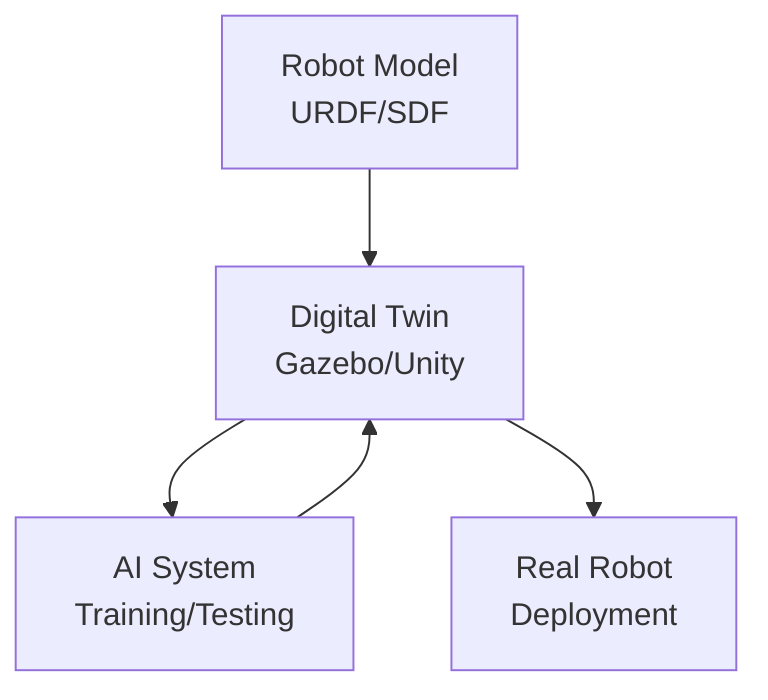

# Implementation Plan: Module 2 – The Digital Twin (Gazebo & Unity)

**Branch**: `module-2-digital-twin` | **Date**: 2025-12-18 | **Spec**: [spec.md](./spec.md)
**Input**: Feature specification from `/specs/module-2-digital-twin/spec.md`

## Summary

Create Module 2 book content for "The Digital Twin (Gazebo & Unity)" as Markdown files
within the existing Docusaurus static site. The module teaches digital twin concepts,
Gazebo physics simulation, Unity high-fidelity rendering, and sensor simulation for AI
perception. All content will be authored as `.md` files with embedded Mermaid diagrams,
added to the existing `my-site/` Docusaurus project.

## Technical Context

**Language/Version**: Markdown (MDX compatible), JavaScript (Docusaurus config)
**Primary Dependencies**: Docusaurus 3.x (already installed), @docusaurus/theme-mermaid (already installed)
**Storage**: Git repository (file-based content)
**Testing**: Docusaurus build (`npm run build`), manual Mermaid diagram verification
**Target Platform**: GitHub Pages (static hosting)
**Project Type**: Static documentation site (Docusaurus) - extending existing site
**Performance Goals**: Fast page loads (<2s), SEO-friendly, mobile-responsive
**Constraints**: GitHub Pages free tier, no server-side rendering
**Scale/Scope**: 1 module, 4 chapters, ~15-20 pages of content

## Constitution Check

*GATE: Must pass before implementation.*

| Principle | Status | Evidence |
|-----------|--------|----------|
| I. Spec-First | ✅ PASS | spec.md created and reviewed before this plan |
| II. Technical Accuracy | ✅ PASS | Code examples from spec are runnable Gazebo/ROS 2 code |
| III. Reproducibility | ✅ PASS | Gazebo is open-source; Docusaurus already configured |
| IV. Modular Architecture | ✅ PASS | Module 2 is self-contained in `docs/module-2-digital-twin/` |
| V. Grounded Context | N/A | RAG chatbot not implemented in this phase |
| VI. Free-Tier | ✅ PASS | GitHub Pages is free; Gazebo is open-source |

**Quality Gates Applicable**:
- Build Gate: `npm run build` must succeed
- Deploy Gate: GitHub Pages deployment must succeed
- Code Gate: Python/XML examples must be syntactically correct

## Project Structure

### Documentation (this feature)

```text
specs/module-2-digital-twin/
├── spec.md              # Feature specification
├── plan.md              # This file
└── tasks.md             # Task list (created by /sp.tasks)
```

### Source Code (Docusaurus site - extending existing)

```text
my-site/                          # Existing Docusaurus project root
├── docs/
│   ├── module-1-ros2/           # Already exists (Module 1)
│   │   └── ...
│   └── module-2-digital-twin/   # NEW - Module 2 content
│       ├── introduction.md       # Module introduction and overview
│       ├── chapter-1-digital-twins.md
│       ├── chapter-2-gazebo-physics.md
│       ├── chapter-3-unity-rendering.md
│       └── chapter-4-sensor-simulation.md
├── docusaurus.config.js         # Update navbar for Module 2
├── sidebars.js                  # Add Module 2 sidebar configuration
└── ...
```

**Structure Decision**: Extend existing Docusaurus site by adding `docs/module-2-digital-twin/`
folder. Update `sidebars.js` to include Module 2 navigation alongside Module 1.

## Implementation Phases

### Phase 1: Module 2 Folder Setup

**Goal**: Create the module folder and update navigation.

**Tasks**:
1. Create `my-site/docs/module-2-digital-twin/` folder
2. Update `sidebars.js` to add Module 2 sidebar configuration
3. Update `docusaurus.config.js` navbar to include Module 2 link

**Sidebar Configuration** (addition to sidebars.js):

```javascript
// sidebars.js - add module2Sidebar
const sidebars = {
  module1Sidebar: [...], // existing
  module2Sidebar: [
    {
      type: 'category',
      label: 'Module 2: The Digital Twin',
      collapsed: false,
      items: [
        'module-2-digital-twin/introduction',
        'module-2-digital-twin/chapter-1-digital-twins',
        'module-2-digital-twin/chapter-2-gazebo-physics',
        'module-2-digital-twin/chapter-3-unity-rendering',
        'module-2-digital-twin/chapter-4-sensor-simulation',
      ],
    },
  ],
};
```

---

### Phase 2: Module 2 Content Creation

**Goal**: Create all chapter Markdown files with learning objectives, content, diagrams,
code examples, and summaries.

**Files to Create**:

| File | Purpose | Key Content |
|------|---------|-------------|
| `introduction.md` | Module overview | Prerequisites, learning outcomes, chapter list |
| `chapter-1-digital-twins.md` | Digital twin concepts | Definition, benefits, Gazebo vs. Unity |
| `chapter-2-gazebo-physics.md` | Gazebo simulation | Physics, URDF spawning, launch file |
| `chapter-3-unity-rendering.md` | Unity integration | ROS-Unity bridge, high-fidelity rendering |
| `chapter-4-sensor-simulation.md` | Sensor simulation | Camera, LiDAR, IMU, synthetic data |

**Content Requirements per Chapter**:
- Front matter with `sidebar_position`, `title`, `description`
- Learning Objectives section at top
- Mermaid diagrams where specified in spec
- Code examples with syntax highlighting
- Summary/Key Takeaways section at bottom

---

### Phase 3: Build and Verification

**Goal**: Ensure Docusaurus builds successfully and all content renders correctly.

**Verification Checklist**:
- [ ] `npm run build` completes without errors
- [ ] All Mermaid diagrams render in browser
- [ ] All code blocks have correct syntax highlighting
- [ ] Sidebar navigation shows Module 2 chapters in correct order
- [ ] Module 1 and Module 2 both accessible from navbar
- [ ] Mobile responsiveness is acceptable

---

## File Specifications

### introduction.md

```markdown
---
sidebar_position: 1
title: "Module 2: The Digital Twin"
description: "Introduction to digital twins with Gazebo and Unity"
---

# Module 2: The Digital Twin (Gazebo & Unity)

## Overview

[Module overview from spec]

## Prerequisites

- Module 1: ROS 2 fundamentals (nodes, topics, URDF)
- Basic understanding of 3D graphics concepts

## Learning Outcomes

By the end of this module, you will be able to:

1. Understand the role of digital twins in robotics
2. Simulate physics, gravity, and collisions in Gazebo
3. Use Unity for high-fidelity rendering and interaction
4. Simulate sensors for AI perception systems

## Chapters

1. [Digital Twins for Physical AI](./chapter-1-digital-twins)
2. [Physics Simulation with Gazebo](./chapter-2-gazebo-physics)
3. [High-Fidelity Rendering with Unity](./chapter-3-unity-rendering)
4. [Simulating Sensors for AI Perception](./chapter-4-sensor-simulation)
```

### chapter-1-digital-twins.md

```markdown
---
sidebar_position: 2
title: "Chapter 1: Digital Twins for Physical AI"
description: "Understanding the concept and benefits of digital twins in robotics"
---

# Chapter 1: Digital Twins for Physical AI

## Learning Objectives

By the end of this chapter, you will be able to:

- Define digital twin and explain its role in robotics
- Describe why simulation is essential for Physical AI
- Compare Gazebo and Unity for different use cases
- Understand the simulation-to-reality (sim-to-real) pipeline

[Content from spec Chapter 1 outline...]

## Digital Twin Architecture



## Summary

[Key takeaways...]
```

---

## Dependencies

### Existing Dependencies (already installed)

```json
{
  "dependencies": {
    "@docusaurus/core": "^3.0.0",
    "@docusaurus/preset-classic": "^3.0.0",
    "@docusaurus/theme-mermaid": "^3.0.0"
  }
}
```

No new dependencies required—Module 2 extends the existing Docusaurus site.

---

## Complexity Tracking

> No constitution violations. All requirements met with existing Docusaurus setup.

| Aspect | Decision | Rationale |
|--------|----------|-----------|
| Site structure | Extend existing | Module 2 added to `my-site/docs/` |
| Navigation | Multi-sidebar | Each module has its own sidebar |
| Diagram format | Mermaid | Already configured in Module 1 |

---

## Risk Analysis

| Risk | Likelihood | Impact | Mitigation |
|------|------------|--------|------------|
| Sidebar configuration conflict | Low | Medium | Test both module sidebars |
| Mermaid diagrams don't render | Low | Medium | Already working in Module 1 |
| Code examples have syntax errors | Medium | Low | Validate Python/XML syntax |

---

## Next Steps

1. Run `/sp.tasks` to generate the task list
2. Execute Phase 1: Create Module 2 folder and update navigation
3. Execute Phase 2: Create Module 2 content files
4. Execute Phase 3: Build verification
