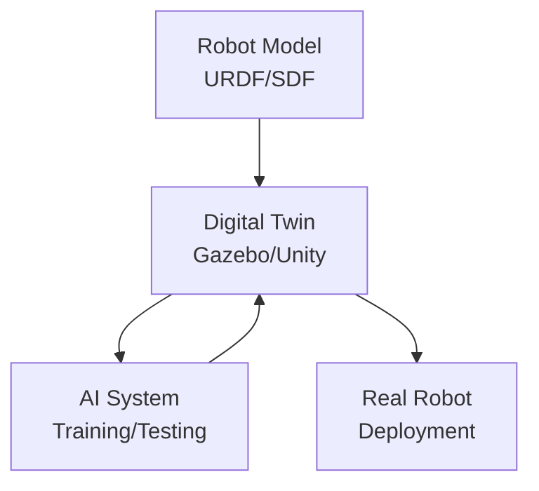
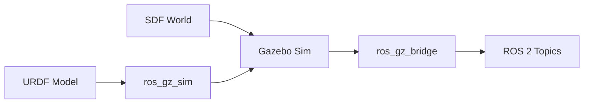
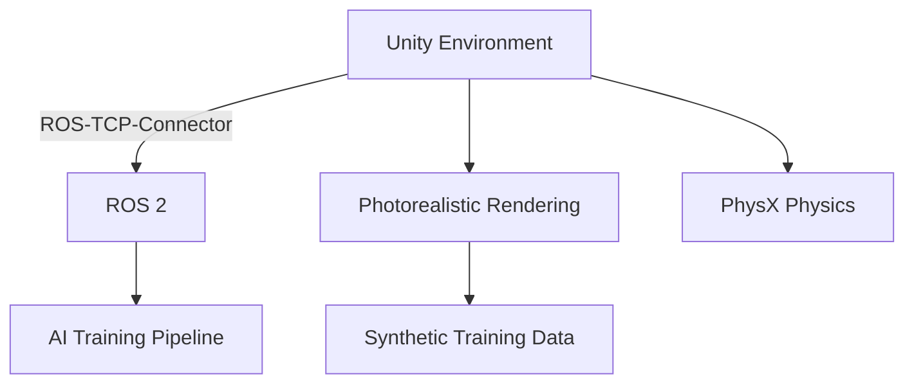
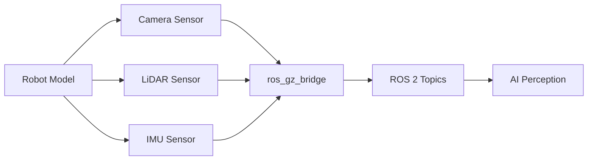

# Feature Specification: Module 2 – The Digital Twin (Gazebo & Unity)

**Feature Branch**: `module-2-digital-twin`
**Created**: 2025-12-18
**Status**: Draft
**Input**: User description: "Module 2 – Digital Twins for Physical AI using Gazebo and Unity"

## Overview

This module focuses on building digital twins for Physical AI systems. Students learn how to
simulate robots and environments using Gazebo and Unity, enabling safe testing, realistic
physics, and human–robot interaction before real-world deployment.

A **digital twin** is a virtual replica of a physical robot and its environment that mirrors
real-world behavior. This enables AI systems to train, test, and iterate without the cost,
time, and risk of physical hardware.

**Target Audience**: AI and robotics engineers, simulation and environment designers,
students working with humanoid robots.

**Prerequisites**: Module 1 (ROS 2 fundamentals), basic understanding of 3D graphics concepts.

## User Scenarios & Testing *(mandatory)*

### User Story 1 - Understand Digital Twin Concepts (Priority: P1)

A reader new to simulation wants to understand what digital twins are, why they matter for
robotics, and how Gazebo and Unity fit into the Physical AI pipeline. They should grasp the
concept without needing to run any simulation yet.

**Why this priority**: Foundational understanding is required before hands-on simulation work.
Without conceptual clarity, the purpose of simulation tools won't be clear.

**Independent Test**: Reader can explain what a digital twin is, articulate why simulation
is essential for robotics, and describe when to use Gazebo vs. Unity.

**Acceptance Scenarios**:

1. **Given** a reader with ROS 2 knowledge but no simulation experience, **When** they
   complete Chapter 1, **Then** they can explain the digital twin concept.
2. **Given** the same reader, **When** asked about Gazebo vs. Unity, **Then** they can
   describe that Gazebo is for physics simulation and Unity for high-fidelity rendering.
3. **Given** the Mermaid diagram from Chapter 1, **When** the reader traces data flow,
   **Then** they correctly identify Robot Model → Digital Twin → AI → Real Robot.

---

### User Story 2 - Simulate Physics in Gazebo (Priority: P2)

A reader wants to simulate a robot in Gazebo with realistic physics including gravity,
collisions, and joint dynamics. They should understand SDF/URDF world definitions and be
able to spawn a robot in a simulated environment.

**Why this priority**: Gazebo is the standard physics simulator for ROS 2 robotics. After
understanding concepts, readers need to work with actual simulation.

**Independent Test**: Reader can create a simple Gazebo world file and spawn a robot model.

**Acceptance Scenarios**:

1. **Given** a URDF from Module 1, **When** the reader follows Chapter 2, **Then** they can
   spawn the robot in Gazebo.
2. **Given** a Gazebo simulation, **When** the reader observes the robot, **Then** gravity
   affects it and collisions are detected.
3. **Given** the code example from Chapter 2, **When** executed in a ROS 2 + Gazebo
   environment, **Then** the simulation launches successfully.

---

### User Story 3 - Use Unity for High-Fidelity Rendering (Priority: P3)

A reader wants to use Unity for photorealistic rendering and human–robot interaction
scenarios. They should understand when Unity is preferable to Gazebo and how to integrate
Unity with ROS 2.

**Why this priority**: Unity provides higher visual fidelity and is essential for
perception system training and human interaction scenarios.

**Independent Test**: Reader can explain Unity's advantages and describe the ROS-Unity
integration architecture.

**Acceptance Scenarios**:

1. **Given** a scenario requiring photorealistic images, **When** the reader evaluates
   tools, **Then** they choose Unity over Gazebo for visual fidelity.
2. **Given** the Unity-ROS architecture diagram, **When** the reader explains it, **Then**
   they can describe how Unity communicates with ROS 2 nodes.

---

### User Story 4 - Simulate Sensors for AI Perception (Priority: P4)

A reader wants to simulate sensors (cameras, LiDAR, IMU) in their digital twin to generate
training data for AI perception systems. They should understand sensor plugins and how to
capture synthetic data.

**Why this priority**: Sensor simulation is the practical payoff—enabling AI training
without physical hardware.

**Independent Test**: Reader can add a simulated camera to a Gazebo model and capture images.

**Acceptance Scenarios**:

1. **Given** a Gazebo simulation, **When** the reader adds a camera sensor, **Then** they
   can view the camera feed in RViz or save images.
2. **Given** the sensor configuration example, **When** applied to a robot model, **Then**
   the sensor publishes data to ROS 2 topics.

---

### Edge Cases

- What happens when a reader has Gazebo Classic experience but not Gazebo Sim (Ignition)?
  - Chapter 2 includes a "Gazebo Classic → Gazebo Sim Migration" callout explaining differences.
- How does the system handle readers without a powerful GPU for Unity?
  - Content notes that Unity examples can be followed conceptually; Gazebo works on modest hardware.
- What if ROS 2 and Gazebo versions don't match?
  - Troubleshooting section covers common version compatibility issues.

## Requirements *(mandatory)*

### Functional Requirements

- **FR-001**: Chapter 1 MUST explain digital twin concept with clear definition and benefits
- **FR-002**: Chapter 1 MUST include Mermaid diagram showing Robot Model → Digital Twin → AI → Real Robot flow
- **FR-003**: Chapter 1 MUST compare Gazebo vs. Unity with use case guidance
- **FR-004**: Chapter 2 MUST demonstrate Gazebo physics simulation (gravity, collisions)
- **FR-005**: Chapter 2 MUST show how to spawn a URDF robot in Gazebo
- **FR-006**: Chapter 2 MUST include a runnable Gazebo launch file example
- **FR-007**: Chapter 3 MUST explain Unity's role in high-fidelity rendering
- **FR-008**: Chapter 3 MUST describe ROS-Unity integration architecture
- **FR-009**: Chapter 4 MUST demonstrate sensor simulation (camera, LiDAR)
- **FR-010**: Chapter 4 MUST show sensor data flowing to ROS 2 topics
- **FR-011**: All diagrams MUST use Mermaid syntax for version control compatibility
- **FR-012**: Each chapter MUST include learning objectives, examples, and summary

### Key Entities

- **Digital Twin**: Virtual replica of a physical robot and environment
- **Gazebo Sim**: Open-source physics simulator for robotics (formerly Ignition)
- **Unity**: Game engine used for high-fidelity rendering and ML training
- **SDF**: Simulation Description Format for Gazebo worlds
- **Sensor Plugin**: Component that simulates sensor behavior (camera, LiDAR, IMU)

## Chapter Structure

### Chapter 1: Digital Twins for Physical AI

**Learning Objectives**:
- Define digital twin and explain its role in robotics
- Describe why simulation is essential for Physical AI
- Compare Gazebo and Unity for different use cases
- Understand the simulation-to-reality (sim-to-real) pipeline

**Content Outline**:
1. What is a Digital Twin?
2. Why Simulate? (Cost, Safety, Speed, Data Generation)
3. Gazebo vs. Unity: When to Use Which
4. The Sim-to-Real Pipeline
5. Summary and Key Takeaways

**Diagram**:


---

### Chapter 2: Physics Simulation with Gazebo

**Learning Objectives**:
- Understand Gazebo Sim architecture
- Create a simulation world with SDF
- Spawn a URDF robot in Gazebo
- Configure physics properties (gravity, friction, collisions)

**Content Outline**:
1. Introduction to Gazebo Sim (formerly Ignition)
2. World Files and SDF Format
3. Spawning a Robot from URDF
4. Physics Configuration (gravity, collisions, friction)
5. Gazebo-ROS 2 Bridge
6. Summary and Key Takeaways

**Diagram**:


**Code Example** (launch file):
```python
from launch import LaunchDescription
from launch.actions import IncludeLaunchDescription
from launch.launch_description_sources import PythonLaunchDescriptionSource
from launch_ros.actions import Node
from ament_index_python.packages import get_package_share_directory
import os

def generate_launch_description():
    pkg_ros_gz_sim = get_package_share_directory('ros_gz_sim')

    gazebo = IncludeLaunchDescription(
        PythonLaunchDescriptionSource(
            os.path.join(pkg_ros_gz_sim, 'launch', 'gz_sim.launch.py')
        ),
        launch_arguments={'gz_args': '-r empty.sdf'}.items()
    )

    spawn_robot = Node(
        package='ros_gz_sim',
        executable='create',
        arguments=['-name', 'my_robot', '-file', '/path/to/robot.urdf'],
        output='screen'
    )

    return LaunchDescription([gazebo, spawn_robot])
```

---

### Chapter 3: High-Fidelity Rendering with Unity

**Learning Objectives**:
- Understand Unity's role in robotics simulation
- Learn ROS-Unity integration via Unity Robotics Hub
- Recognize use cases for high-fidelity rendering
- Compare rendering quality between Gazebo and Unity

**Content Outline**:
1. Why Unity for Robotics?
2. Unity Robotics Hub and ROS-TCP-Connector
3. Creating Robot Environments in Unity
4. Domain Randomization for Training
5. Unity vs. Gazebo: Feature Comparison
6. Summary and Key Takeaways

**Diagram**:


---

### Chapter 4: Simulating Sensors for AI Perception

**Learning Objectives**:
- Add simulated sensors to a robot model
- Configure camera, LiDAR, and IMU sensors in Gazebo
- Bridge sensor data to ROS 2 topics
- Generate synthetic datasets for perception training

**Content Outline**:
1. Why Simulate Sensors?
2. Camera Sensors in Gazebo
3. LiDAR Simulation
4. IMU and Other Sensors
5. Bridging Sensor Data to ROS 2
6. Synthetic Data Generation Workflow
7. Summary and Key Takeaways

**Diagram**:


**Code Example** (sensor SDF snippet):
```xml
<sensor name="camera" type="camera">
  <always_on>true</always_on>
  <update_rate>30</update_rate>
  <camera>
    <horizontal_fov>1.047</horizontal_fov>
    <image>
      <width>640</width>
      <height>480</height>
      <format>R8G8B8</format>
    </image>
    <clip>
      <near>0.1</near>
      <far>100</far>
    </clip>
  </camera>
</sensor>
```

## Success Criteria *(mandatory)*

### Measurable Outcomes

- **SC-001**: Reader can explain digital twin concept in 2 sentences after Chapter 1
- **SC-002**: Reader can choose between Gazebo and Unity for a given use case after Chapter 1
- **SC-003**: Reader can spawn a robot in Gazebo and observe physics after Chapter 2
- **SC-004**: Reader can describe ROS-Unity integration architecture after Chapter 3
- **SC-005**: Reader can add a simulated camera and view its output after Chapter 4
- **SC-006**: All code examples execute without modification in ROS 2 Humble + Gazebo Sim
- **SC-007**: Module renders correctly in Docusaurus with all Mermaid diagrams visible
- **SC-008**: RAG chatbot can answer questions about digital twins from this module

### Constitution Compliance

- ✅ **Principle II (Technical Accuracy)**: All code examples tested and runnable
- ✅ **Principle III (Reproducibility)**: Gazebo is open-source; Unity has free tier
- ✅ **Principle IV (Modular Architecture)**: Module is self-contained, can be published independently
- ✅ **Content Standards**: Chapters include objectives, examples, summaries
