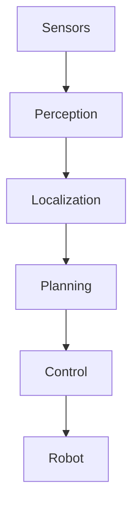
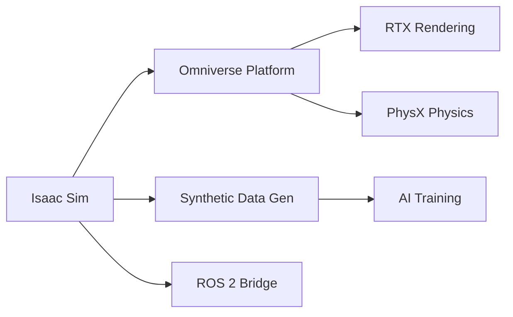
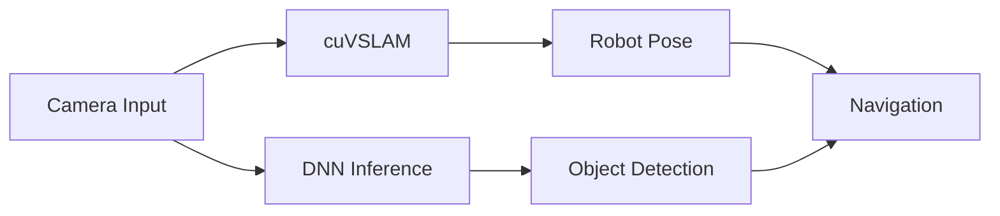
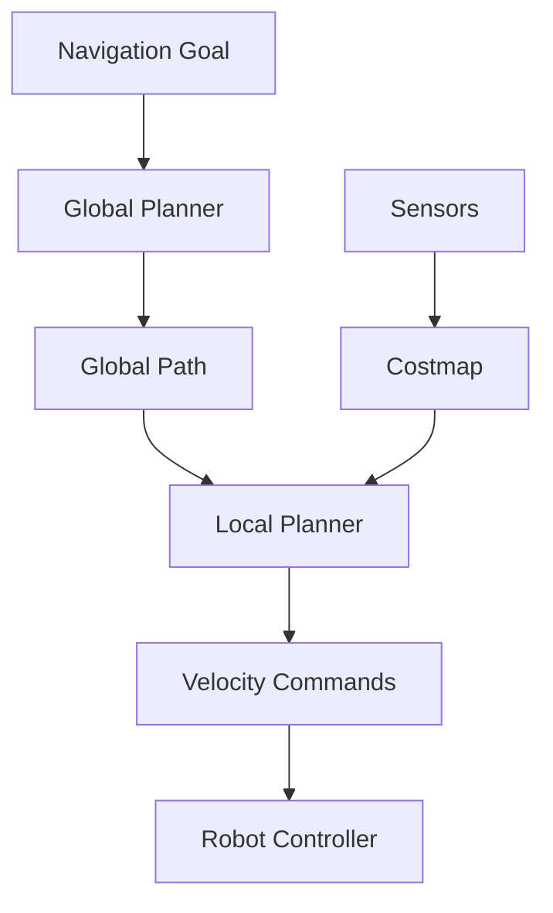

# Implementation Plan: Module 3 – The AI-Robot Brain (NVIDIA Isaac)

**Version**: 1.0.0
**Status**: Draft
**Created**: 2025-12-19
**Feature**: module-3-nvidia-isaac
**Input**: spec.md

---

## Overview

This plan outlines the implementation approach for Module 3 content in the existing Docusaurus site. The module covers NVIDIA Isaac technologies for robot perception, simulation, and navigation.

### Goals

1. Initialize Module 3 folder structure in Docusaurus
2. Create 4 chapter Markdown files with Mermaid diagrams
3. Register module in sidebar and navbar navigation
4. Validate build and content rendering

---

## Phase 1: Setup – Initialize Module 3 in Docusaurus

**Purpose**: Create folder structure and update site navigation

### 1.1 Create Module Folder

**Action**: Create docs folder for Module 3 content

```
my-site/docs/module-3-nvidia-isaac/
```

**Rationale**: Follows existing module naming convention (`module-1-ros2`, `module-2-digital-twin`)

### 1.2 Update Sidebar Configuration

**File**: `my-site/sidebars.js`

**Action**: Add `module3Sidebar` configuration

```javascript
module3Sidebar: [
  {
    type: 'category',
    label: 'Module 3: The AI-Robot Brain',
    collapsed: false,
    items: [
      'module-3-nvidia-isaac/introduction',
      'module-3-nvidia-isaac/chapter-1-ai-robot-brain',
      'module-3-nvidia-isaac/chapter-2-isaac-sim',
      'module-3-nvidia-isaac/chapter-3-isaac-ros',
      'module-3-nvidia-isaac/chapter-4-nav2-navigation',
    ],
  },
],
```

### 1.3 Update Navbar Configuration

**File**: `my-site/docusaurus.config.js`

**Action**: Add Module 3 to navbar items and footer

```javascript
// Navbar item
{
  type: 'docSidebar',
  sidebarId: 'module3Sidebar',
  position: 'left',
  label: 'Module 3: NVIDIA Isaac',
},

// Footer link
{
  label: 'Module 3: NVIDIA Isaac',
  to: '/docs/module-3-nvidia-isaac/introduction',
},
```

**Checkpoint**: Navigation configured for Module 3

---

## Phase 2: Content Creation – Add Chapters and Diagrams

**Purpose**: Implement all chapter content with Mermaid diagrams

### 2.1 Introduction Page

**File**: `my-site/docs/module-3-nvidia-isaac/introduction.md`

**Content Structure**:
- Front matter (sidebar_position: 1)
- Module overview
- Prerequisites (Modules 1-2)
- Learning outcomes
- Chapter list with links

**Spec Coverage**: General module introduction

### 2.2 Chapter 1: The AI-Robot Brain Architecture

**File**: `my-site/docs/module-3-nvidia-isaac/chapter-1-ai-robot-brain.md`

**Content Structure**:
- Front matter (sidebar_position: 2)
- Learning objectives
- The Perception-Localization-Planning Cycle
- Simulation, AI, and Control Interaction
- NVIDIA Isaac in the Physical AI Stack
- Summary and Key Takeaways

**Mermaid Diagram** (FR-002):


**Spec Coverage**: FR-001, FR-002, FR-003

### 2.3 Chapter 2: Isaac Sim – Photorealistic Simulation

**File**: `my-site/docs/module-3-nvidia-isaac/chapter-2-isaac-sim.md`

**Content Structure**:
- Front matter (sidebar_position: 3)
- Learning objectives
- Introduction to Isaac Sim
- Omniverse and RTX Rendering
- Physics Simulation with PhysX
- Synthetic Data Generation Pipeline
- Domain Randomization Techniques
- Isaac Sim + ROS 2 Integration
- Summary and Key Takeaways

**Mermaid Diagram**:


**Spec Coverage**: FR-004, FR-005, FR-006

### 2.4 Chapter 3: Isaac ROS – Accelerated Perception

**File**: `my-site/docs/module-3-nvidia-isaac/chapter-3-isaac-ros.md`

**Content Structure**:
- Front matter (sidebar_position: 4)
- Learning objectives
- Introduction to Isaac ROS
- GPU-Accelerated Perception Pipeline
- cuVSLAM: Visual SLAM with NVIDIA
- Object Detection with Isaac ROS
- DNN Inference on Jetson and GPUs
- Isaac ROS + ROS 2 Integration
- Summary and Key Takeaways

**Mermaid Diagram**:


**Spec Coverage**: FR-007, FR-008, FR-009

### 2.5 Chapter 4: Nav2 for Humanoid Navigation

**File**: `my-site/docs/module-3-nvidia-isaac/chapter-4-nav2-navigation.md`

**Content Structure**:
- Front matter (sidebar_position: 5)
- Learning objectives
- Introduction to Nav2
- Nav2 Architecture Overview
- Costmaps: Global and Local
- Path Planning for Humanoids
- Behavior Trees for Navigation
- Integration with Isaac ROS
- Summary and Key Takeaways

**Mermaid Diagram**:


**Spec Coverage**: FR-010, FR-011

**Checkpoint**: All chapters created with Mermaid diagrams

---

## Phase 3: Validation

**Purpose**: Ensure content meets quality gates

### 3.1 Build Verification

**Command**: `cd my-site && npm run build`

**Success Criteria**:
- Build completes without errors
- No broken links reported
- All pages generated

### 3.2 Content Verification

| Check | Method | Expected |
|-------|--------|----------|
| Mermaid diagrams | Visual inspection | All 4 diagrams render |
| Syntax highlighting | Visual inspection | Python, YAML, bash blocks styled |
| Sidebar navigation | Click through | 5 files in correct order |
| Navbar | Click through | Module 3 accessible |
| Cross-module links | Click through | Modules 1, 2, 3 all accessible |

### 3.3 Spec Requirement Traceability

| Requirement | Chapter | Status |
|-------------|---------|--------|
| FR-001: AI-robot brain architecture | Ch1 | Pending |
| FR-002: Sensors→Perception→...→Robot diagram | Ch1 | Pending |
| FR-003: NVIDIA Isaac in Physical AI stack | Ch1 | Pending |
| FR-004: Isaac Sim capabilities | Ch2 | Pending |
| FR-005: Synthetic data generation | Ch2 | Pending |
| FR-006: Isaac Sim + ROS 2 integration | Ch2 | Pending |
| FR-007: Isaac ROS perception packages | Ch3 | Pending |
| FR-008: GPU-accelerated inference | Ch3 | Pending |
| FR-009: VSLAM concepts | Ch3 | Pending |
| FR-010: Nav2 architecture | Ch4 | Pending |
| FR-011: Path planning for humanoids | Ch4 | Pending |
| FR-012: Mermaid diagrams | All | Pending |
| FR-013: Chapter structure | All | Pending |

**Checkpoint**: Module 3 complete and ready for deployment

---

## File Structure

After implementation, the module folder structure will be:

```
my-site/
├── docs/
│   ├── module-1-ros2/           # Existing
│   ├── module-2-digital-twin/   # Existing
│   └── module-3-nvidia-isaac/   # New
│       ├── introduction.md
│       ├── chapter-1-ai-robot-brain.md
│       ├── chapter-2-isaac-sim.md
│       ├── chapter-3-isaac-ros.md
│       └── chapter-4-nav2-navigation.md
├── sidebars.js                  # Updated
└── docusaurus.config.js         # Updated
```

---

## Technical Decisions

### TD-001: Folder Naming Convention

**Decision**: Use `module-3-nvidia-isaac` as folder name

**Rationale**:
- Consistent with existing modules (`module-1-ros2`, `module-2-digital-twin`)
- URL-friendly (lowercase, hyphenated)
- Descriptive of content

**Alternatives Considered**:
- `module-3-ai-robot-brain` – Less specific about technology
- `module-3-isaac` – Ambiguous (Isaac Sim vs Isaac ROS)

### TD-002: Chapter File Naming

**Decision**: Use descriptive chapter names matching content

| File | Topic |
|------|-------|
| `chapter-1-ai-robot-brain.md` | Architecture overview |
| `chapter-2-isaac-sim.md` | Isaac Sim simulation |
| `chapter-3-isaac-ros.md` | Isaac ROS perception |
| `chapter-4-nav2-navigation.md` | Nav2 navigation |

**Rationale**: Clear, descriptive names aid navigation and maintenance

### TD-003: Sidebar Configuration

**Decision**: Create dedicated `module3Sidebar` (not nested under existing sidebars)

**Rationale**:
- Each module is independent learning path
- Allows readers to focus on one module at a time
- Consistent with existing module structure

---

## Dependencies

### Build Dependencies

- Docusaurus 3.x (existing)
- @docusaurus/theme-mermaid (existing)
- Node.js 18+ (existing)

### Content Dependencies

| Dependency | Source | Usage |
|------------|--------|-------|
| ROS 2 concepts | Module 1 | Referenced in Isaac ROS chapter |
| Simulation concepts | Module 2 | Referenced in Isaac Sim chapter |
| Sensor simulation | Module 2 Ch4 | Referenced in perception chapter |

---

## Risks and Mitigations

| Risk | Mitigation |
|------|------------|
| Complex Mermaid diagrams may not render | Test each diagram incrementally during build |
| NVIDIA-specific content may become outdated | Reference official docs, note version numbers |
| Readers may lack RTX GPU | Include cloud alternatives (AWS, GCP) |

---

## Execution Summary

| Phase | Tasks | Est. Tasks |
|-------|-------|------------|
| Phase 1: Setup | Folder, sidebar, navbar | 3 |
| Phase 2: Content | Introduction + 4 chapters | 5 |
| Phase 3: Validation | Build, verify, trace | 7 |
| **Total** | | **15** |

---

## Revision History

| Version | Date | Author | Changes |
|---------|------|--------|---------|
| 1.0.0 | 2025-12-19 | AI Assistant | Initial plan |
