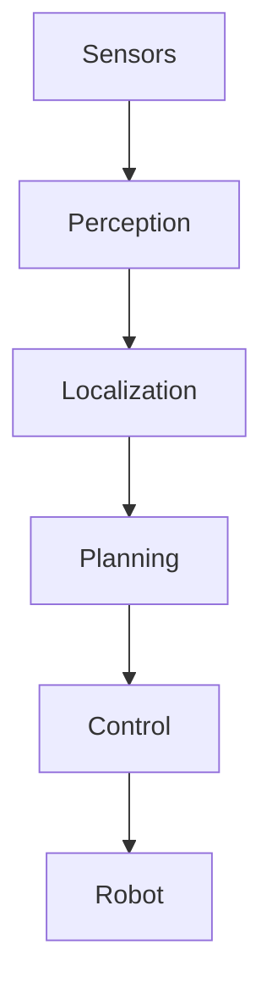
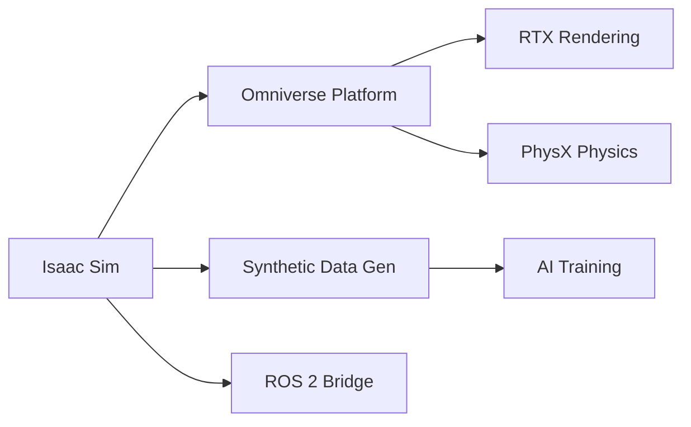
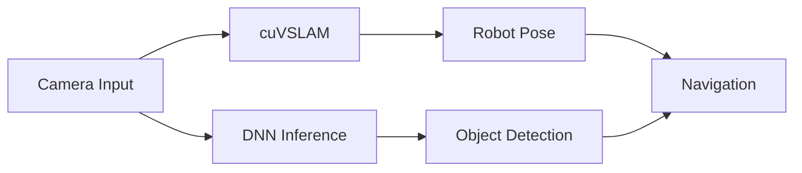
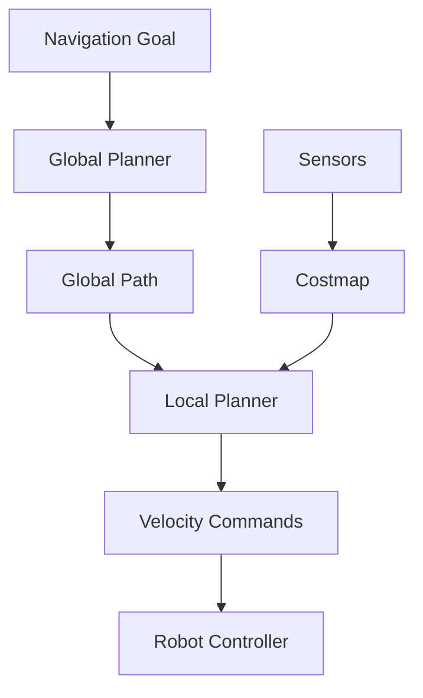
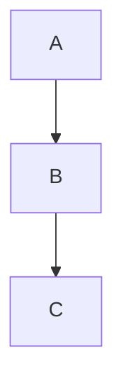

# Specification: Module 3 – The AI-Robot Brain (NVIDIA Isaac)

**Version**: 1.0.0
**Status**: Draft
**Created**: 2025-12-19
**Feature**: module-3-nvidia-isaac

---

## Overview

This module focuses on the AI "brain" of humanoid robots, covering advanced perception, training, and navigation using NVIDIA Isaac technologies. Students learn how photorealistic simulation, hardware-accelerated perception, and navigation stacks enable intelligent robot behavior in physical environments.

### Target Audience

- AI and robotics engineers
- Developers working with NVIDIA Isaac
- Students building autonomous humanoid robots

### Prerequisites

- Module 1: ROS 2 fundamentals (nodes, topics, URDF)
- Module 2: Digital twin concepts (Gazebo, simulation)
- Basic understanding of neural networks and computer vision
- Familiarity with GPU computing concepts

---

## User Stories

### US1: Understand AI-Robot Brain Architecture (Priority: P1)

**As a** robotics engineer,
**I want to** understand the AI-robot brain architecture,
**So that** I can design intelligent robot systems using perception, localization, and planning components.

**Acceptance Criteria**:
- Can explain the role of perception, localization, and planning in robot intelligence
- Can describe how simulation, AI, and control interact
- Can identify NVIDIA Isaac's position in the Physical AI stack

---

### US2: Use Isaac Sim for Photorealistic Simulation (Priority: P2)

**As a** robotics developer,
**I want to** use Isaac Sim for photorealistic simulation and synthetic data generation,
**So that** I can train perception models with diverse, labeled datasets.

**Acceptance Criteria**:
- Can explain Isaac Sim's capabilities (rendering, physics, domain randomization)
- Can describe the synthetic data generation pipeline
- Can understand Isaac Sim's integration with ROS 2

---

### US3: Understand Isaac ROS for Accelerated Perception (Priority: P3)

**As a** robotics engineer,
**I want to** understand Isaac ROS for hardware-accelerated perception,
**So that** I can leverage GPU acceleration for real-time visual SLAM and perception.

**Acceptance Criteria**:
- Can explain Isaac ROS perception packages (cuVSLAM, object detection)
- Can describe GPU-accelerated inference pipeline
- Can understand VSLAM concepts and applications

---

### US4: Use Nav2 for Humanoid Navigation (Priority: P4)

**As a** robotics developer,
**I want to** understand Nav2 for humanoid path planning and navigation,
**So that** I can implement autonomous navigation for bipedal robots.

**Acceptance Criteria**:
- Can explain Nav2 architecture and components
- Can describe path planning algorithms for humanoids
- Can understand costmaps and obstacle avoidance

---

## Functional Requirements

### Chapter Content Requirements

| ID | Requirement | Priority | User Story |
|----|-------------|----------|------------|
| FR-001 | AI-robot brain architecture with perception, localization, planning cycle | Must | US1 |
| FR-002 | Mermaid diagram: Sensors → Perception → Localization → Planning → Control → Robot | Must | US1 |
| FR-003 | NVIDIA Isaac's role in the Physical AI technology stack | Must | US1 |
| FR-004 | Isaac Sim capabilities for photorealistic simulation | Must | US2 |
| FR-005 | Synthetic data generation pipeline and domain randomization | Must | US2 |
| FR-006 | Isaac Sim + ROS 2 integration architecture | Must | US2 |
| FR-007 | Isaac ROS perception packages (cuVSLAM, object detection) | Must | US3 |
| FR-008 | GPU-accelerated inference pipeline explanation | Must | US3 |
| FR-009 | Visual SLAM (VSLAM) concepts and Isaac implementation | Must | US3 |
| FR-010 | Nav2 architecture and humanoid navigation components | Must | US4 |
| FR-011 | Path planning and costmap concepts for bipedal robots | Must | US4 |
| FR-012 | All diagrams use Mermaid syntax | Must | All |
| FR-013 | Each chapter includes learning objectives, examples, and summary | Must | All |

---

## Chapter Structure

### Chapter 1: The AI-Robot Brain Architecture

**Learning Objectives**:
- Explain the role of perception, localization, and planning in robot intelligence
- Describe the interaction between simulation, AI, and control
- Identify NVIDIA Isaac's position in the Physical AI stack

**Content Outline**:
1. Introduction to the AI-Robot Brain
2. The Perception-Localization-Planning Cycle
3. Simulation, AI, and Control Interaction
4. NVIDIA Isaac in the Physical AI Stack
5. Summary and Key Takeaways

**Mermaid Diagram**:


---

### Chapter 2: Isaac Sim – Photorealistic Simulation

**Learning Objectives**:
- Understand Isaac Sim's rendering and physics capabilities
- Explain synthetic data generation for perception training
- Describe Isaac Sim's integration with ROS 2

**Content Outline**:
1. Introduction to Isaac Sim
2. Omniverse and RTX Rendering
3. Physics Simulation with PhysX
4. Synthetic Data Generation Pipeline
5. Domain Randomization Techniques
6. Isaac Sim + ROS 2 Integration
7. Summary and Key Takeaways

**Mermaid Diagram**:


---

### Chapter 3: Isaac ROS – Accelerated Perception

**Learning Objectives**:
- Understand Isaac ROS perception packages
- Explain GPU-accelerated inference for real-time perception
- Describe Visual SLAM (cuVSLAM) concepts and applications

**Content Outline**:
1. Introduction to Isaac ROS
2. GPU-Accelerated Perception Pipeline
3. cuVSLAM: Visual SLAM with NVIDIA
4. Object Detection with Isaac ROS
5. DNN Inference on Jetson and GPUs
6. Isaac ROS + ROS 2 Integration
7. Summary and Key Takeaways

**Mermaid Diagram**:


---

### Chapter 4: Nav2 for Humanoid Navigation

**Learning Objectives**:
- Understand Nav2 architecture and components
- Explain path planning algorithms for bipedal robots
- Describe costmaps and obstacle avoidance strategies

**Content Outline**:
1. Introduction to Nav2
2. Nav2 Architecture Overview
3. Costmaps: Global and Local
4. Path Planning for Humanoids
5. Behavior Trees for Navigation
6. Integration with Isaac ROS
7. Summary and Key Takeaways

**Mermaid Diagram**:


---

## Non-Functional Requirements

### NFR-001: Content Quality

- All content must be technically accurate and verifiable
- Code examples must be syntactically correct
- Diagrams must render correctly in Docusaurus with Mermaid

### NFR-002: Accessibility

- Content must be accessible to readers with Module 1-2 prerequisites
- Technical terms must be defined on first use
- Complex concepts must include analogies or visual aids

### NFR-003: Consistency

- Follow established chapter structure from Modules 1-2
- Use consistent terminology across chapters
- Maintain consistent code style (Python, YAML, XML)

---

## Content Guidelines

### Diagram Requirements

All diagrams must use Mermaid syntax compatible with Docusaurus:

```markdown

```

### Code Block Requirements

- Python code blocks: Use `python` language tag
- YAML configurations: Use `yaml` language tag
- XML/SDF files: Use `xml` language tag
- Shell commands: Use `bash` language tag

### Chapter Template

Each chapter must include:

1. **Front Matter**: sidebar_position, title, description
2. **Learning Objectives**: 3-5 bullet points
3. **Main Content**: Structured with H2 headings
4. **Mermaid Diagrams**: At least one per chapter
5. **Code Examples**: Where applicable
6. **Summary**: Key takeaways section
7. **What's Next**: Link to next chapter

---

## Dependencies

### External Dependencies

| Dependency | Purpose | Documentation |
|------------|---------|---------------|
| NVIDIA Isaac Sim | Photorealistic simulation | [Isaac Sim Docs](https://docs.omniverse.nvidia.com/isaacsim) |
| Isaac ROS | GPU-accelerated perception | [Isaac ROS Docs](https://nvidia-isaac-ros.github.io/) |
| Nav2 | Navigation stack | [Nav2 Docs](https://nav2.org/) |
| ROS 2 Humble | Robot middleware | [ROS 2 Docs](https://docs.ros.org/en/humble/) |

### Internal Dependencies

| Dependency | Source | Usage |
|------------|--------|-------|
| ROS 2 concepts | Module 1 | Nodes, topics, URDF |
| Simulation basics | Module 2 | Gazebo, digital twins |
| Sensor simulation | Module 2 Ch4 | Camera, LiDAR concepts |

---

## Risks and Mitigations

| Risk | Impact | Mitigation |
|------|--------|------------|
| Isaac Sim requires RTX GPU | Readers may not have hardware | Explain cloud options (AWS, GCP with GPUs) |
| Rapidly evolving Isaac ecosystem | Content may become outdated | Reference specific versions, link to official docs |
| Complex setup requirements | May frustrate beginners | Provide Docker-based setup instructions |

---

## Success Metrics

| Metric | Target | Measurement |
|--------|--------|-------------|
| Chapter completeness | 100% | All 4 chapters implemented |
| Diagram rendering | 100% | All Mermaid diagrams render in Docusaurus |
| Build success | Pass | `npm run build` succeeds |
| Spec coverage | 100% | All FR requirements addressed |

---

## Revision History

| Version | Date | Author | Changes |
|---------|------|--------|---------|
| 1.0.0 | 2025-12-19 | AI Assistant | Initial specification |
