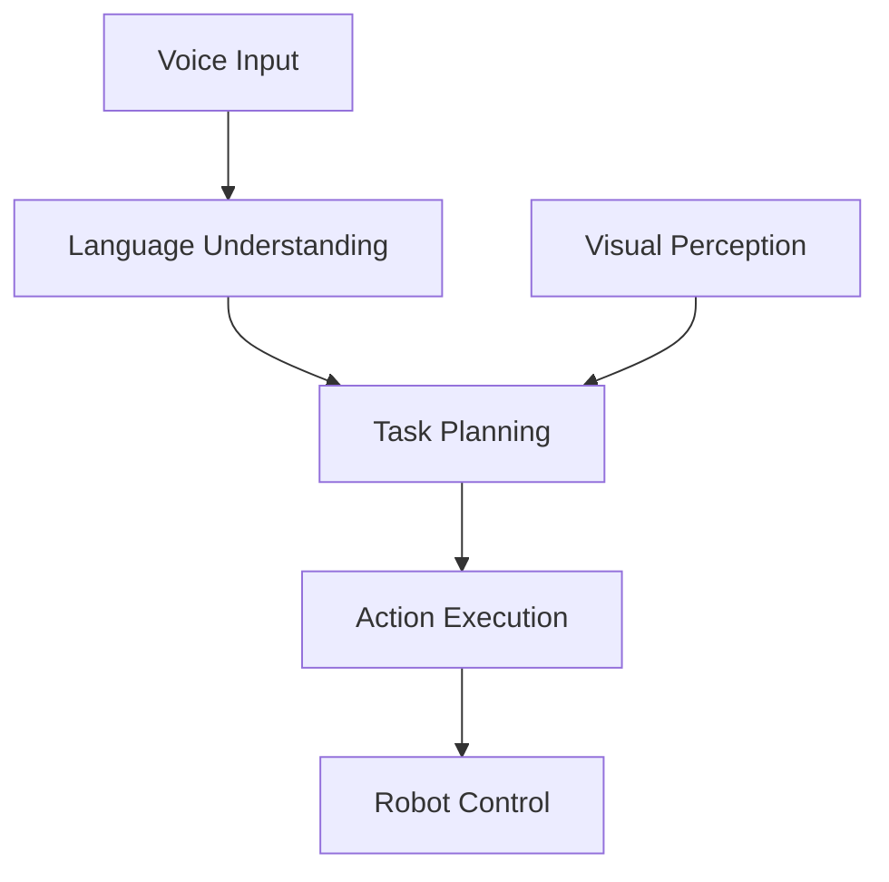
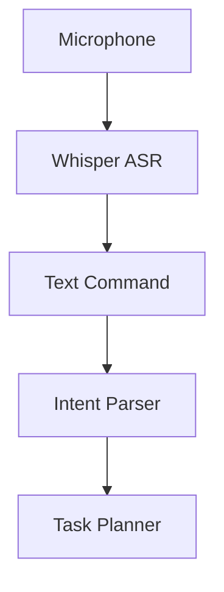
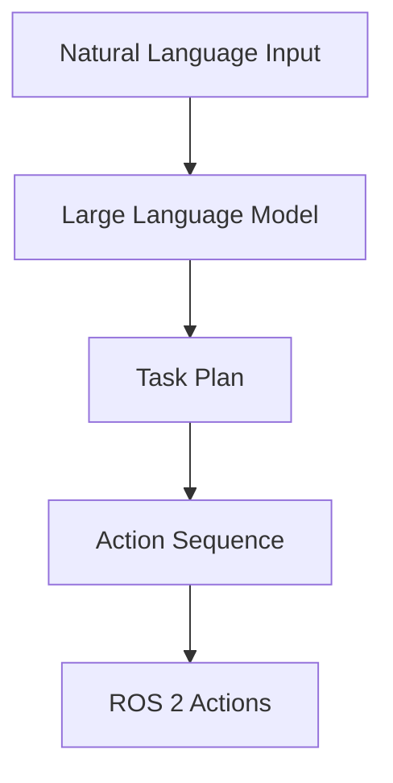
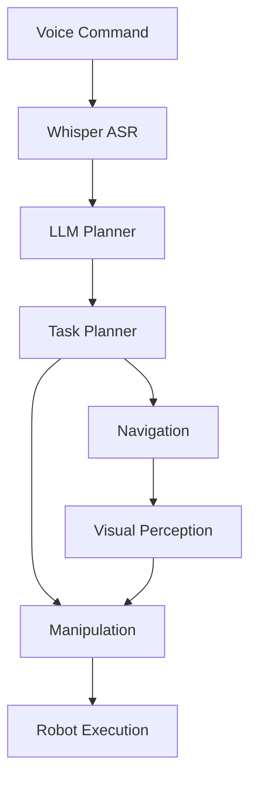

# Implementation Plan: Module 4 – Vision-Language-Action (VLA)

**Version**: 1.0.0
**Status**: Draft
**Created**: 2025-12-19
**Feature**: module-4-vla
**Input**: spec.md

---

## Overview

This plan outlines the implementation approach for Module 4 content in the existing Docusaurus site. The module covers Vision-Language-Action systems, integrating LLMs with robot perception and control.

### Goals

1. Initialize Module 4 folder structure in Docusaurus
2. Create 4 chapter Markdown files with Mermaid diagrams
3. Register module in sidebar and navbar navigation
4. Validate build and content rendering

---

## Phase 1: Setup – Initialize Module 4 in Docusaurus

**Purpose**: Create folder structure and update site navigation

### 1.1 Create Module Folder

**Action**: Create docs folder for Module 4 content

```
my-site/docs/module-4-vla/
```

**Rationale**: Uses short, descriptive name following existing conventions

### 1.2 Update Sidebar Configuration

**File**: `my-site/sidebars.js`

**Action**: Add `module4Sidebar` configuration

```javascript
module4Sidebar: [
  {
    type: 'category',
    label: 'Module 4: Vision-Language-Action',
    collapsed: false,
    items: [
      'module-4-vla/introduction',
      'module-4-vla/chapter-1-vla-systems',
      'module-4-vla/chapter-2-voice-to-action',
      'module-4-vla/chapter-3-llm-planning',
      'module-4-vla/chapter-4-capstone',
    ],
  },
],
```

### 1.3 Update Navbar Configuration

**File**: `my-site/docusaurus.config.js`

**Action**: Add Module 4 to navbar items and footer

```javascript
// Navbar item
{
  type: 'docSidebar',
  sidebarId: 'module4Sidebar',
  position: 'left',
  label: 'Module 4: VLA',
},

// Footer link
{
  label: 'Module 4: VLA',
  to: '/docs/module-4-vla/introduction',
},
```

**Checkpoint**: Navigation configured for Module 4

---

## Phase 2: Content Creation – Add Chapters and Diagrams

**Purpose**: Implement all chapter content with Mermaid diagrams

### 2.1 Introduction Page

**File**: `my-site/docs/module-4-vla/introduction.md`

**Content Structure**:
- Front matter (sidebar_position: 1)
- Module overview
- Prerequisites (Modules 1-3)
- Learning outcomes
- Chapter list with links

**Spec Coverage**: General module introduction

### 2.2 Chapter 1: Vision-Language-Action Systems

**File**: `my-site/docs/module-4-vla/chapter-1-vla-systems.md`

**Content Structure**:
- Front matter (sidebar_position: 2)
- Learning objectives
- Introduction to VLA paradigm
- The VLA Architecture
- Connecting Language, Vision, and Control
- Role of LLMs in Robotic Reasoning
- VLA vs. Traditional Robot Programming
- Summary and Key Takeaways

**Mermaid Diagram** (FR-002):


**Spec Coverage**: FR-001, FR-002, FR-003

### 2.3 Chapter 2: Voice-to-Action with Speech Recognition

**File**: `my-site/docs/module-4-vla/chapter-2-voice-to-action.md`

**Content Structure**:
- Front matter (sidebar_position: 3)
- Learning objectives
- Introduction to Voice Control
- Speech Recognition with OpenAI Whisper
- Intent Parsing and Command Extraction
- Voice-to-ROS 2 Bridge
- Handling Ambiguity and Errors
- Summary and Key Takeaways

**Mermaid Diagram** (FR-005):


**Spec Coverage**: FR-004, FR-005, FR-006

### 2.4 Chapter 3: Cognitive Planning with LLMs

**File**: `my-site/docs/module-4-vla/chapter-3-llm-planning.md`

**Content Structure**:
- Front matter (sidebar_position: 4)
- Learning objectives
- Introduction to Cognitive Planning
- LLMs as Robot Task Planners
- Prompt Engineering for Robotics
- Task Decomposition and Sequencing
- LLM-to-ROS 2 Action Translation
- Grounding Language in Robot Capabilities
- Summary and Key Takeaways

**Mermaid Diagram** (FR-008):


**Spec Coverage**: FR-007, FR-008, FR-009

### 2.5 Chapter 4: Capstone Project – The Autonomous Humanoid

**File**: `my-site/docs/module-4-vla/chapter-4-capstone.md`

**Content Structure**:
- Front matter (sidebar_position: 5)
- Learning objectives
- Capstone Project Overview
- System Architecture Design
- Voice Input and Language Processing
- LLM Planning and Task Decomposition
- Navigation and Visual Perception Integration
- Manipulation and Task Execution
- End-to-End Demo Walkthrough
- Summary and Module Conclusion

**Mermaid Diagram** (FR-011):


**Spec Coverage**: FR-010, FR-011

**Checkpoint**: All chapters created with Mermaid diagrams

---

## Phase 3: Validation

**Purpose**: Ensure content meets quality gates

### 3.1 Build Verification

**Command**: `cd my-site && npm run build`

**Success Criteria**:
- Build completes without errors
- No broken links reported
- All pages generated

### 3.2 Content Verification

| Check | Method | Expected |
|-------|--------|----------|
| Mermaid diagrams | Visual inspection | All 4 diagrams render |
| Syntax highlighting | Visual inspection | Python, YAML, bash blocks styled |
| Sidebar navigation | Click through | 5 files in correct order |
| Navbar | Click through | Module 4 accessible |
| Cross-module links | Click through | Modules 1, 2, 3, 4 all accessible |

### 3.3 Spec Requirement Traceability

| Requirement | Chapter | Status |
|-------------|---------|--------|
| FR-001: VLA architecture overview | Ch1 | Pending |
| FR-002: Voice→Language→Planning→Action diagram | Ch1 | Pending |
| FR-003: Role of LLMs in robotic reasoning | Ch1 | Pending |
| FR-004: Speech recognition with Whisper | Ch2 | Pending |
| FR-005: Microphone→Whisper→Command diagram | Ch2 | Pending |
| FR-006: Intent parsing and command extraction | Ch2 | Pending |
| FR-007: LLM-based cognitive planning | Ch3 | Pending |
| FR-008: NaturalLanguage→LLM→TaskPlan diagram | Ch3 | Pending |
| FR-009: Prompt engineering for robotics | Ch3 | Pending |
| FR-010: Capstone integration | Ch4 | Pending |
| FR-011: End-to-end VLA pipeline diagram | Ch4 | Pending |
| FR-012: Mermaid diagrams | All | Pending |
| FR-013: Chapter structure | All | Pending |

**Checkpoint**: Module 4 complete and ready for deployment

---

## File Structure

After implementation, the module folder structure will be:

```
my-site/
├── docs/
│   ├── module-1-ros2/           # Existing
│   ├── module-2-digital-twin/   # Existing
│   ├── module-3-nvidia-isaac/   # Existing
│   └── module-4-vla/            # New
│       ├── introduction.md
│       ├── chapter-1-vla-systems.md
│       ├── chapter-2-voice-to-action.md
│       ├── chapter-3-llm-planning.md
│       └── chapter-4-capstone.md
├── sidebars.js                  # Updated
└── docusaurus.config.js         # Updated
```

---

## Technical Decisions

### TD-001: Folder Naming Convention

**Decision**: Use `module-4-vla` as folder name

**Rationale**:
- Short and memorable
- VLA is the standard acronym for Vision-Language-Action
- Consistent with previous module naming length

**Alternatives Considered**:
- `module-4-vision-language-action` – Too long
- `module-4-llm-robotics` – Less accurate

### TD-002: Chapter File Naming

**Decision**: Use descriptive chapter names matching content

| File | Topic |
|------|-------|
| `chapter-1-vla-systems.md` | VLA architecture overview |
| `chapter-2-voice-to-action.md` | Speech recognition pipeline |
| `chapter-3-llm-planning.md` | LLM cognitive planning |
| `chapter-4-capstone.md` | Integration project |

**Rationale**: Clear, descriptive names aid navigation and maintenance

### TD-003: Code Examples Focus

**Decision**: Focus on Python examples with ROS 2 integration

**Rationale**:
- Python is the primary language for LLM/AI development
- Whisper and OpenAI APIs have excellent Python support
- rclpy provides ROS 2 Python integration

---

## Dependencies

### Build Dependencies

- Docusaurus 3.x (existing)
- @docusaurus/theme-mermaid (existing)
- Node.js 18+ (existing)

### Content Dependencies

| Dependency | Source | Usage |
|------------|--------|-------|
| ROS 2 concepts | Module 1 | Nodes, topics, actions |
| Simulation | Module 2 | Testing VLA systems |
| Perception | Module 3 | Visual input for VLA |
| Navigation | Module 3 | Nav2 integration |

### External API Dependencies

| API | Purpose | Notes |
|-----|---------|-------|
| OpenAI Whisper | Speech recognition | Local or API |
| OpenAI GPT | LLM planning | API-based |
| Local LLMs | Alternative planning | Ollama, llama.cpp |

---

## Risks and Mitigations

| Risk | Mitigation |
|------|------------|
| Complex Mermaid diagrams may not render | Test each diagram incrementally |
| API cost concerns for readers | Provide local alternatives |
| LLM output variability | Show prompt engineering techniques |
| Integration complexity | Modular architecture in capstone |

---

## Execution Summary

| Phase | Tasks | Est. Tasks |
|-------|-------|------------|
| Phase 1: Setup | Folder, sidebar, navbar | 3 |
| Phase 2: Content | Introduction + 4 chapters | 5 |
| Phase 3: Validation | Build, verify, trace | 7 |
| **Total** | | **15** |

---

## Revision History

| Version | Date | Author | Changes |
|---------|------|--------|---------|
| 1.0.0 | 2025-12-19 | AI Assistant | Initial plan |
