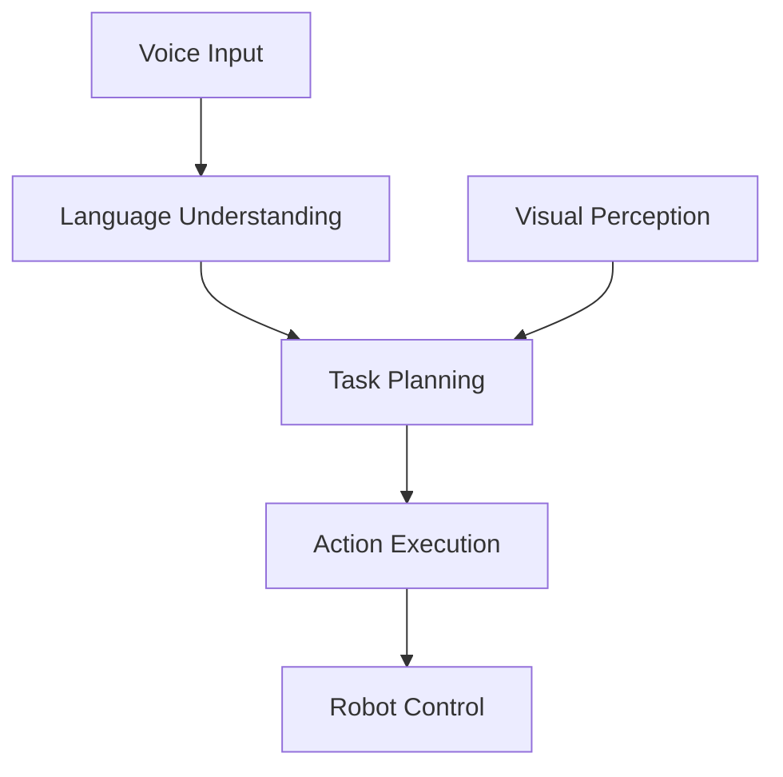
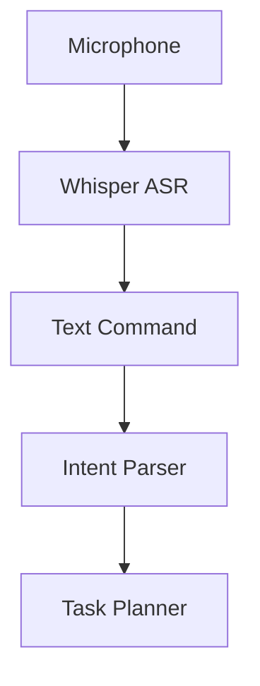
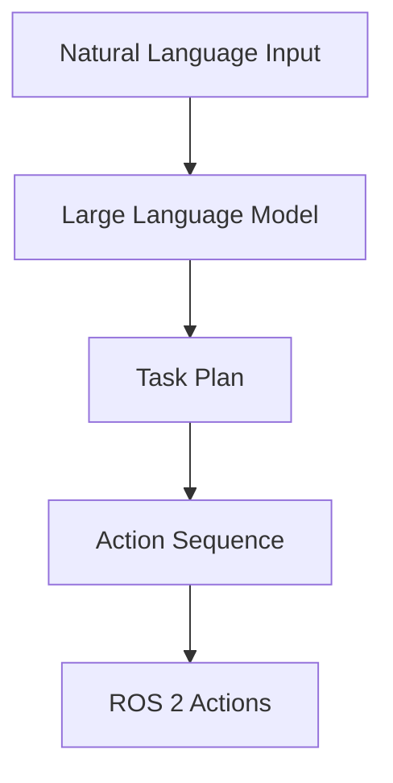
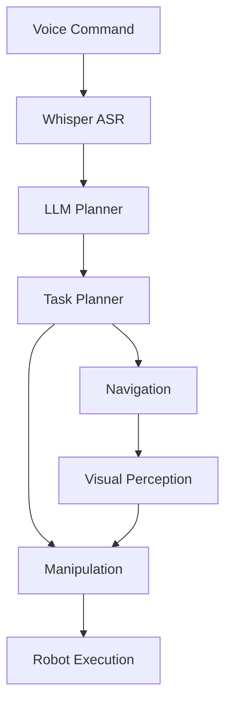
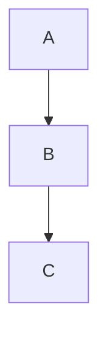

# Specification: Module 4 – Vision-Language-Action (VLA)

**Version**: 1.0.0
**Status**: Draft
**Created**: 2025-12-19
**Feature**: module-4-vla

---

## Overview

This module focuses on **Vision-Language-Action (VLA)** systems, where large language models (LLMs) are integrated with perception and control to enable humanoid robots to understand instructions, reason about tasks, and act in the physical world. Students learn how voice, language, vision, and action converge in autonomous robotic systems.

### Target Audience

- AI and robotics engineers
- Developers working with LLM-driven robotics
- Students building autonomous humanoid systems

### Prerequisites

- Module 1: ROS 2 fundamentals (nodes, topics, actions)
- Module 2: Digital twin concepts (simulation)
- Module 3: NVIDIA Isaac (perception, navigation)
- Basic understanding of LLMs and transformer architectures
- Familiarity with Python and async programming

---

## User Stories

### US1: Understand Vision-Language-Action Architecture (Priority: P1)

**As a** robotics engineer,
**I want to** understand the VLA paradigm,
**So that** I can design systems that connect language understanding, visual perception, and robot control.

**Acceptance Criteria**:
- Can explain the VLA architecture and data flow
- Can describe how LLMs enable robotic reasoning
- Can identify the components connecting language, vision, and action

---

### US2: Convert Voice Commands to Robot Actions (Priority: P2)

**As a** robotics developer,
**I want to** convert voice commands into robot actions,
**So that** users can control robots through natural speech.

**Acceptance Criteria**:
- Can explain the speech-to-text pipeline (Whisper)
- Can describe intent parsing and command extraction
- Can understand the voice-to-ROS 2 action bridge

---

### US3: Implement Cognitive Planning with LLMs (Priority: P3)

**As a** robotics engineer,
**I want to** use LLMs for high-level cognitive planning,
**So that** robots can reason about complex tasks and generate action sequences.

**Acceptance Criteria**:
- Can explain LLM-based task planning
- Can describe prompt engineering for robotics
- Can understand the LLM-to-ROS 2 action translation

---

### US4: Build an Autonomous Humanoid Capstone (Priority: P4)

**As a** robotics developer,
**I want to** integrate perception, navigation, and manipulation,
**So that** I can build a complete autonomous humanoid system.

**Acceptance Criteria**:
- Can explain end-to-end VLA system architecture
- Can describe the integration of all previous modules
- Can understand the complete voice-to-manipulation pipeline

---

## Functional Requirements

### Chapter Content Requirements

| ID | Requirement | Priority | User Story |
|----|-------------|----------|------------|
| FR-001 | VLA architecture overview with language, vision, and action components | Must | US1 |
| FR-002 | Mermaid diagram: Voice → Language → Planning ← Vision → Action → Robot | Must | US1 |
| FR-003 | Role of LLMs in robotic reasoning and task decomposition | Must | US1 |
| FR-004 | Speech recognition pipeline with Whisper | Must | US2 |
| FR-005 | Mermaid diagram: Microphone → Whisper → TextCommand → Planner | Must | US2 |
| FR-006 | Intent parsing and command extraction from natural language | Must | US2 |
| FR-007 | LLM-based cognitive planning for robotics | Must | US3 |
| FR-008 | Mermaid diagram: NaturalLanguage → LLM → TaskPlan → ROS2Actions | Must | US3 |
| FR-009 | Prompt engineering techniques for robot task planning | Must | US3 |
| FR-010 | Capstone project integrating voice, LLM, navigation, and manipulation | Must | US4 |
| FR-011 | Mermaid diagram: Voice → Whisper → LLM → Planner → Nav → Vision → Manipulation | Must | US4 |
| FR-012 | All diagrams use Mermaid syntax | Must | All |
| FR-013 | Each chapter includes learning objectives, examples, and summary | Must | All |

---

## Chapter Structure

### Chapter 1: Vision-Language-Action Systems

**Learning Objectives**:
- Understand the VLA paradigm and its importance for humanoid robotics
- Explain how language, vision, and action connect in autonomous systems
- Describe the role of LLMs in robotic reasoning

**Content Outline**:
1. Introduction to Vision-Language-Action
2. The VLA Architecture
3. Connecting Language, Vision, and Control
4. Role of LLMs in Robotic Reasoning
5. VLA vs. Traditional Robot Programming
6. Summary and Key Takeaways

**Mermaid Diagram**:


---

### Chapter 2: Voice-to-Action with Speech Recognition

**Learning Objectives**:
- Understand speech recognition for robotics
- Implement voice command processing with Whisper
- Connect speech recognition to robot action systems

**Content Outline**:
1. Introduction to Voice Control in Robotics
2. Speech Recognition with OpenAI Whisper
3. Intent Parsing and Command Extraction
4. Voice-to-ROS 2 Bridge
5. Handling Ambiguity and Errors
6. Summary and Key Takeaways

**Mermaid Diagram**:


---

### Chapter 3: Cognitive Planning with LLMs

**Learning Objectives**:
- Understand LLM-based task planning for robotics
- Design effective prompts for robot task generation
- Translate LLM outputs to ROS 2 actions

**Content Outline**:
1. Introduction to Cognitive Planning
2. LLMs as Robot Task Planners
3. Prompt Engineering for Robotics
4. Task Decomposition and Sequencing
5. LLM-to-ROS 2 Action Translation
6. Grounding Language in Robot Capabilities
7. Summary and Key Takeaways

**Mermaid Diagram**:


---

### Chapter 4: Capstone Project – The Autonomous Humanoid

**Learning Objectives**:
- Integrate all previous modules into a complete system
- Build an end-to-end voice-to-manipulation pipeline
- Understand system architecture for autonomous humanoids

**Content Outline**:
1. Capstone Project Overview
2. System Architecture Design
3. Voice Input and Language Processing
4. LLM Planning and Task Decomposition
5. Navigation and Visual Perception Integration
6. Manipulation and Task Execution
7. End-to-End Demo Walkthrough
8. Summary and Module Conclusion

**Mermaid Diagram**:


---

## Non-Functional Requirements

### NFR-001: Content Quality

- All content must be technically accurate and verifiable
- Code examples must be syntactically correct (Python, YAML)
- Diagrams must render correctly in Docusaurus with Mermaid

### NFR-002: Accessibility

- Content must be accessible to readers with Module 1-3 prerequisites
- Technical terms must be defined on first use
- Complex concepts must include analogies or visual aids

### NFR-003: Consistency

- Follow established chapter structure from Modules 1-3
- Use consistent terminology across chapters
- Maintain consistent code style

### NFR-004: API Considerations

- Reference OpenAI API for Whisper and LLMs
- Note rate limits and cost considerations
- Provide local/open-source alternatives where possible

---

## Content Guidelines

### Diagram Requirements

All diagrams must use Mermaid syntax compatible with Docusaurus:

```markdown

```

### Code Block Requirements

- Python code blocks: Use `python` language tag
- YAML configurations: Use `yaml` language tag
- Shell commands: Use `bash` language tag
- JSON API responses: Use `json` language tag

### Chapter Template

Each chapter must include:

1. **Front Matter**: sidebar_position, title, description
2. **Learning Objectives**: 3-5 bullet points
3. **Main Content**: Structured with H2 headings
4. **Mermaid Diagrams**: At least one per chapter
5. **Code Examples**: Where applicable
6. **Summary**: Key takeaways section
7. **What's Next**: Link to next chapter

---

## Dependencies

### External Dependencies

| Dependency | Purpose | Documentation |
|------------|---------|---------------|
| OpenAI Whisper | Speech recognition | [Whisper Docs](https://github.com/openai/whisper) |
| OpenAI API | LLM for planning | [OpenAI API Docs](https://platform.openai.com/docs) |
| ROS 2 Humble | Robot middleware | [ROS 2 Docs](https://docs.ros.org/en/humble/) |
| rclpy | ROS 2 Python client | [rclpy Docs](https://docs.ros2.org/latest/api/rclpy/) |

### Internal Dependencies

| Dependency | Source | Usage |
|------------|--------|-------|
| ROS 2 concepts | Module 1 | Nodes, topics, actions |
| Simulation | Module 2 | Testing VLA systems |
| Perception | Module 3 | Visual input for planning |
| Navigation | Module 3 | Nav2 integration |

---

## Risks and Mitigations

| Risk | Impact | Mitigation |
|------|--------|------------|
| API costs for OpenAI | May limit experimentation | Suggest local Whisper, open-source LLMs |
| LLM hallucinations | Robot may attempt unsafe actions | Implement action validation layer |
| Latency in voice pipeline | Poor user experience | Discuss streaming and optimization |
| Integration complexity | Difficult to debug | Modular architecture with clear interfaces |

---

## Success Metrics

| Metric | Target | Measurement |
|--------|--------|-------------|
| Chapter completeness | 100% | All 4 chapters implemented |
| Diagram rendering | 100% | All Mermaid diagrams render |
| Build success | Pass | `npm run build` succeeds |
| Spec coverage | 100% | All FR requirements addressed |

---

## Revision History

| Version | Date | Author | Changes |
|---------|------|--------|---------|
| 1.0.0 | 2025-12-19 | AI Assistant | Initial specification |
